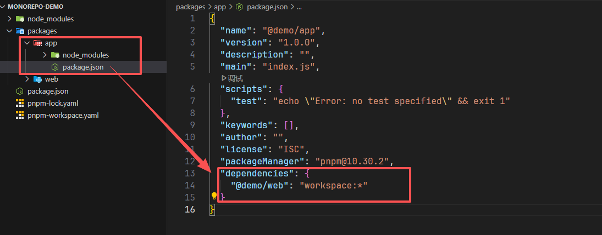

# Monorepo

## 1. 什么是 Monorepo

`Monorepo` 是指在一个仓库中管理多个项目，这些项目可以是前端项目、后端项目、工具库等等。`Monorepo` 有很多优点，比如：

- 代码复用：不同项目之间可以共享代码，减少重复代码
- 统一管理：可以统一管理依赖、构建、测试等
- 代码可见性：可以更方便地查看不同项目的代码
- 依赖管理：可以统一管理依赖，减少依赖冲突
- 一致性：可以保证不同项目的一致性

`Monorepo` 也有一些缺点，比如：

- 仓库体积：随着项目数量的增加，仓库体积会变得很大
- 构建时间：随着项目数量的增加，构建时间会变得很长
- 依赖管理：依赖管理会变得复杂
- 代码可见性：不同项目之间的代码可见性会变得很差

`Monorepo` 适合于中小型团队，大型团队可能会因为仓库体积、构建时间等问题而不适合使用 `Monorepo`。

## 2. 快速开始

`pnpm` 是一个快速、强大的包管理工具，支持 `monorepo` 管理。

```bash
mkdir monorepo-demo
cd monorepo-demo
pnpm init
```

创建 `pnpm-workspace.yaml` 文件，配置 `monorepo` 管理。

```yaml
packages:
  - packages/*
```

安装一个全局依赖：

```bash
pnpm add typescript -D -w
```

### 2.1 创建 @demo/web 包：

```bash
mkdir packages
cd packages
mkdir web
cd web
pnpm init
```

然后编辑 `package.json` 文件的`name`包名为 `@demo/web`。

安装一个局部依赖：

```bash
# 1.确保在 Monorepo 根目录：
cd monorepo-demo
# 2.执行安装局部依赖的命令
pnpm add vue -r --filter @demo/web
# 验证依赖是否安装成功：
# 检查 packages/web/package.json 文件中是否新增了 vue 依赖项。
# 检查 node_modules/.pnpm 目录中是否有 vue 的相关文件。
```

1. `-r` 参数的作用：

- `-r` 表示递归操作，会作用于整个 `workspace`（即所有被 `pnpm-workspace.yaml` 中 `packages` 字段定义的包）。
- 如果不在根目录执行，`pnpm` 无法识别 `workspace` 结构，也就无法找到 `@demo/web` 这个包。

2. `--filter` 参数的作用：

- `--filter` `@demo/web` 指定了操作的目标包是 `@demo/web`。
- 同样需要在根目录下执行，才能正确解析包名并定位到对应的包。

### 2.1 创建 @demo/app 包：

返回到 `packages` 目录：

```bash
cd ../..
mkdir app
cd app
pnpm init
```

编辑 `package.json` 文件的 `name` 包名为 `@demo/app`。

### 2.3 包间引用

在 `@demo/app` 中引用 `@demo/web`：

```bash
# 1.确保在 Monorepo 根目录：
cd monorepo-demo
# 2.执行安装局部依赖的命令
pnpm add @demo/web -r --filter @demo/app --workspace
```

说明：`--workspace` 参数会让 `pnpm` 自动识别这是一个本地工作区包，并将其以 `workspace:*` 形式添加到依赖中。

这样 `@demo/app` 就可以引用 `@demo/web` 了。



## 3. 依赖管理

### 3.1 添加依赖

- 为所有包添加公共依赖（例如 `lodash`）：

```bash
pnpm add lodash -w
```

`-w` 表示在根目录添加，该依赖会被安装在`根 node_modules`，所有包都可以直接引用。

- 为某个特定包添加依赖（例如为 `@demo/web` 添加 `axios`）：

```bash
pnpm add axios --filter @demo/web
```

- 为多个包添加依赖（例如为 `@demo/web` 和 `@demo/app` 添加 `dayjs`）：

```bash
pnpm add dayjs --filter @demo/web --filter @demo/app
```

- 添加开发依赖：加上 `-D` 参数即可，如：

```bash
pnpm add -D prettier --filter @demo/web
```

### 3.2 移除依赖

- 移除某个包的依赖：

```bash
pnpm remove axios --filter @demo/web
```

- 移除根目录的公共依赖：

```bash
pnpm remove lodash -w
```

### 3.3 更新依赖

- 更新所有包的某个依赖（例如将 `vue` 升级到最新版）：

```bash
pnpm update vue -r
```

- 更新特定包的依赖：

```bash
pnpm update vue --filter @demo/web
```

### 3.4 查看依赖关系

- 列出工作区中所有包的依赖关系树：

```bash
pnpm list -r
```

- 查看某个包的依赖：

```bash
pnpm list --filter @demo/web
```

## 4. 运行脚本

在 `Monorepo` 中，脚本可以在根目录执行，也可以针对特定的包执行。`pnpm` 提供了灵活的命令来管理这些场景。

### 4.1 在根目录运行脚本

根目录的 `package.json` 中定义的脚本通常用于管理整个仓库的任务，例如启动所有开发服务器、构建所有包、运行所有测试等。

示例：`根 package.json`

```json
{
  "scripts": {
    "dev": "pnpm -r run dev",
    "build": "pnpm -r run build",
    "test": "pnpm -r run test"
  }
}
```

- `pnpm -r run dev` 中的 `-r` 表示递归执行，即对工作区中所有包（`packages/*` 下的每个包）执行它们各自的 `dev` 脚本。
- 运行 `pnpm dev` 就会启动所有包的开发服务。

适用场景：当你需要一次性操作所有项目时，比如全局构建、全局测试。

### 4.2 在特定包中运行脚本

如果只想操作某一个或某几个包，可以使用 `--filter` 参数指定包名（包名需与对应 `package.json` 的 `name` 字段一致）。

运行单个包的脚本

```bash
pnpm run dev --filter @demo/web
```

这条命令只会执行 `@demo/web` 包中的 `dev` 脚本。

同时运行多个包的脚本

```bash
pnpm run build --filter @demo/web --filter @demo/app
```

这会依次（或并行）执行 `@demo/web` 和 `@demo/app` 的 `build` 脚本。

使用路径过滤
除了包名，`--filter` 也支持相对路径：

```bash
pnpm run dev --filter ./packages/web
```

过滤依赖关系

`--filter` 还支持更高级的语法，例如：

- `--filter ...{packages/web}`：执行 `web` 包及其所有依赖项的脚本（常用于构建顺序）。

- `--filter "{packages/*}"`：匹配所有一级子包。

### 4.3 并行与串行执行

`pnpm` 默认并行执行多个脚本（当同时运行多个包或使用 `-r` 时），这样可以充分利用 `CPU` 资源，加快执行速度。但在某些情况下，你可能需要脚本按顺序执行，例如当某个包依赖于另一个包构建后的产物时。

并行执行（默认）

```bash
pnpm -r run build
```

所有包的 `build` 脚本会同时启动，谁先完成不一定。

串行执行（顺序执行）

```bash
pnpm -r run test --sequential
```

添加 `--sequential` 参数后，`pnpm` 会按照包在文件系统中的顺序（或依赖关系）依次执行 `test` 脚本，前一个完成后再开始下一个。

何时使用串行：

- 测试之间可能相互干扰，需要隔离运行。

- 资源有限，避免同时占用过多内存或端口。

- 包之间存在构建依赖，需要按特定顺序构建（此时更推荐使用 `--filter` 结合依赖关系来精确控制顺序，而不是简单的串行）。

- 更精细的顺序控制：利用依赖关系
  如果你的包之间有明确的依赖关系（例如 `@demo/app` 依赖 `@demo/web`），你可以通过 `--filter` 的依赖过滤来确保构建顺序：

```bash
pnpm run build --filter "...{@demo/app}"
```

这条命令会先构建 `@demo/app` 的所有依赖（包括 `@demo/web`），然后再构建 `@demo/app` 本身。这是比全局串行更高效且安全的方式。

### 4.4 常见脚本示例

假设你有以下包结构：

- `packages/shared`：公共工具函数

- `packages/web`：`Vue` 前端项目

- `packages/app`：`React` 前端项目

你可以在每个包的 `package.json` 中定义自己的脚本：

```json
// packages/shared/package.json
{
  "scripts": {
    "build": "tsc",
    "test": "jest"
  }
}

// packages/web/package.json
{
  "scripts": {
    "dev": "vite",
    "build": "vite build",
    "preview": "vite preview"
  }
}

// packages/app/package.json
{
  "scripts": {
    "dev": "next dev",
    "build": "next build",
    "start": "next start"
  }
}
```

然后在根目录的 `package.json` 中聚合常用命令：

```json
{
  "scripts": {
    "dev": "pnpm -r run dev",
    "build": "pnpm run build:shared && pnpm run build:web && pnpm run build:app",
    "build:shared": "pnpm --filter @demo/shared run build",
    "build:web": "pnpm --filter @demo/web run build",
    "build:app": "pnpm --filter @demo/app run build"
  }
}
```

这样，你就可以通过根目录的 `pnpm dev` 同时启动所有开发服务器，或者通过 `pnpm build` 按顺序构建所有包（先 `shared`，再 `web` 和 `app`）。

### 4.5 脚本执行的小技巧

查看可运行的脚本：在任意包目录下运行 `pnpm run` 可以列出该包 `package.json` 中定义的所有脚本。

传递参数给脚本：如果脚本需要接收参数，可以在命令后加上 `--` 分隔符，例如：

```bash
pnpm run build --filter @demo/web -- --mode production
```

这会将 `--mode production` 传递给 `@demo/web` 的 `build` 脚本。

使用 `npm` 生命周期钩子：`pre` 和 `post` 钩子同样适用于 `pnpm`，例如 `prebuild` 会在 `build` 之前自动运行。

通过以上方式，你可以高效地在 `Monorepo` 中管理各种任务，既保持灵活性，又避免混乱。

## 5. 发布包

### 5.1 版本管理

推荐使用 `changesets` 或 `pnpm` 自带的 `pnpm publish -r` 来管理版本和发布。

使用 `changesets`（推荐）
安装 `@changesets/cli`：

```bash
pnpm add -Dw @changesets/cli
```

初始化：

```bash
pnpm changeset init
```

每次有改动时，运行 `pnpm changeset` 生成变更描述。

更新版本：

```bash
pnpm changeset version
```

发布：

```bash
pnpm changeset publish
```

使用 `pnpm publish`
发布所有有变更的包：

```bash
pnpm -r publish
```

发布指定包：

```bash
pnpm publish --filter @demo/web
```

### 5.2 发布前的准备

确保包已经构建（例如运行 `pnpm build`）。

检查包的 `package.json` 中的 `main`、`module`、`types` 等字段是否正确指向构建后的文件。

如果使用 `workspace:*` 依赖，发布时 `pnpm` 会自动将其转换为实际版本号（例如 `workspace:^1.0.0` 会变成 `^1.0.0`）。


## 6.总结
通过 `pnpm` 搭建的 `monorepo` 可以高效管理多个项目，实现代码复用和统一流程。本文档涵盖了从初始化到日常开发、构建、发布的常见操作，希望能帮助你快速上手。随着项目规模的增长，还可以结合 `changesets`、`turbo` 等工具进一步优化工作流。