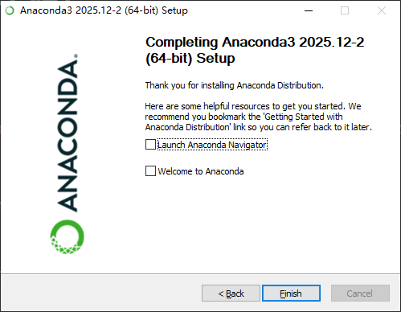
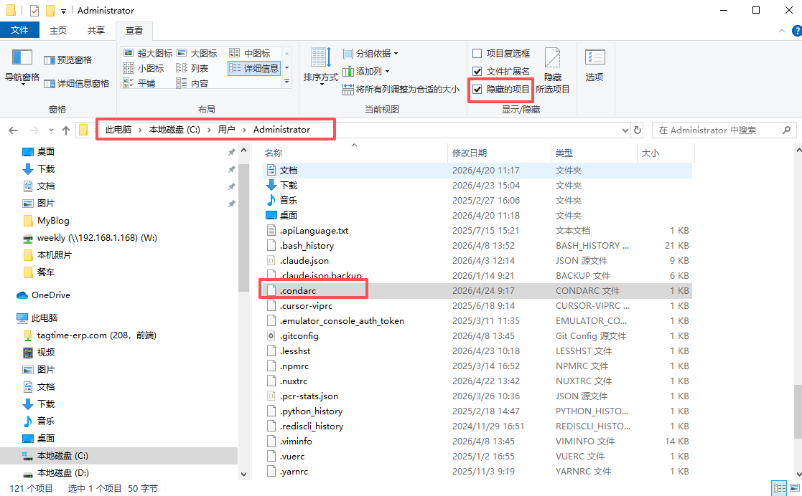
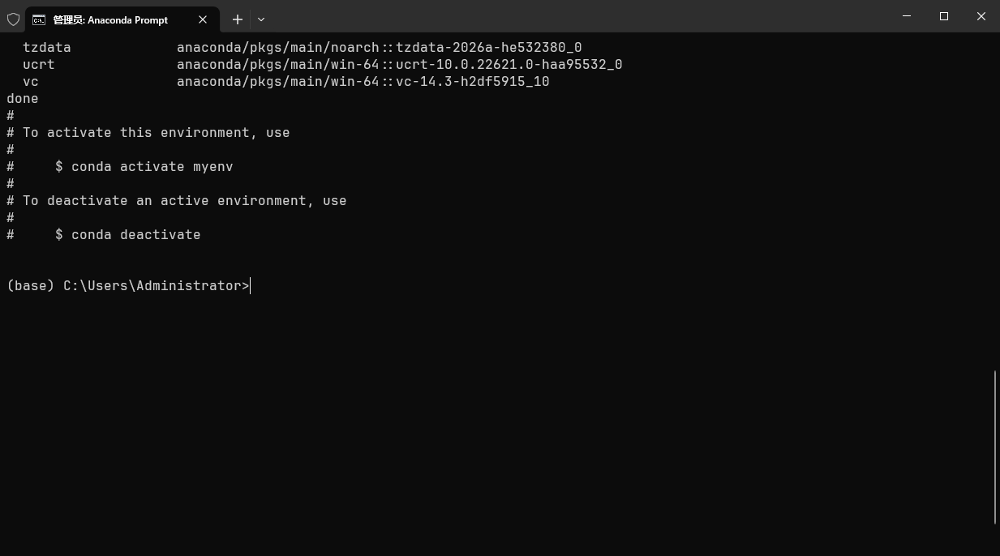
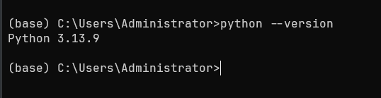
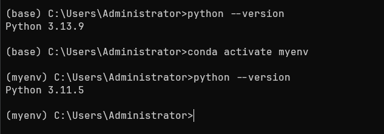
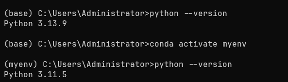
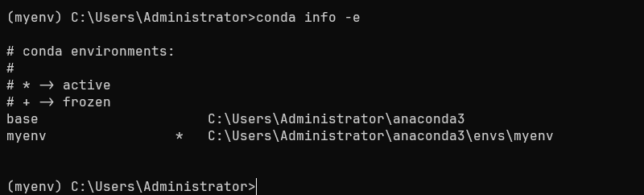
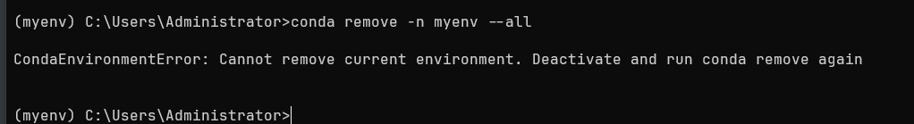

下载地址
https://www.anaconda.com/


然后install 



## 验证 conda 是否安装成功

1、同时按住快捷键 `win` + `r` ，调出 `cmd` 命令行，点击 `确定` 按钮：


2、调用命令行后，执行命令 `conda --version` , 若输出了 conda 的版本号，则表示 conda 安装成功。


# Conda 换源（国内清华源）


## 开始

编辑用户目录下的 `.condarc` 文件即可更换 conda 默认源。下面分别讲解 Windows / Linux / MacOS 三种系统是如何修改的：

### Windows 系统

Windows 用户无法直接创建名为 `.condarc` 的文件，需要先执行如下命令，生成该文件后再修改。

```cmd
conda config --set show_channel_urls yes
```

> PS: 生成的文件在用户目录下 `C:\Users\用户名\`, 比如下面：




### Linux 系统 & Mac 系统

可通过 `vi` 命令来修改：

```shell
vi  ~/.condarc
```

### 更换清华源

在 `.condarc` 文件中添加清华源：

```cmd
channels:
  - defaults
show_channel_urls: true
default_channels:
  - https://mirrors.tuna.tsinghua.edu.cn/anaconda/pkgs/main
  - https://mirrors.tuna.tsinghua.edu.cn/anaconda/pkgs/r
  - https://mirrors.tuna.tsinghua.edu.cn/anaconda/pkgs/msys2
custom_channels:
  conda-forge: https://mirrors.tuna.tsinghua.edu.cn/anaconda/cloud
  msys2: https://mirrors.tuna.tsinghua.edu.cn/anaconda/cloud
  bioconda: https://mirrors.tuna.tsinghua.edu.cn/anaconda/cloud
  menpo: https://mirrors.tuna.tsinghua.edu.cn/anaconda/cloud
  pytorch: https://mirrors.tuna.tsinghua.edu.cn/anaconda/cloud
  pytorch-lts: https://mirrors.tuna.tsinghua.edu.cn/anaconda/cloud
  simpleitk: https://mirrors.tuna.tsinghua.edu.cn/anaconda/cloud
```

> 注意：由于清华源更新过快，不同步`pytorch-nightly`, `pytorch-nightly-cpu`, `ignite-nightly`这三个包。

### 其他源

- 中国科学技术大学 USTC Mirror

```python
channels:
  - https://mirrors.ustc.edu.cn/anaconda/pkgs/main/
  - https://mirrors.ustc.edu.cn/anaconda/pkgs/free/
  - https://mirrors.ustc.edu.cn/anaconda/cloud/conda-forge/
ssl_verify: true
```

- 上海交通大学开源镜像站

```python
channels:
  - https://mirrors.sjtug.sjtu.edu.cn/anaconda/pkgs/main/
  - https://mirrors.sjtug.sjtu.edu.cn/anaconda/pkgs/free/
  - https://mirrors.sjtug.sjtu.edu.cn/anaconda/cloud/conda-forge/
ssl_verify: true
```

### 切换回默认源

如果需要换回 conda 的默认源，直接删除 `channels` 即可，命令如下：

```text
conda config --remove-key channels
```


# Conda 创建虚拟环境


将 conda 的默认源更新为[国内源](https://www.quanxiaoha.com/conda/conda-update-channel.html) 后，接下来，我们上手创建一个虚拟环境。

## 开始创建

创建虚拟环境命令如下：

```python
conda create -n myenv python=3.11.5
```

- `-n` : 指定虚拟环境名为 `myenv`；
- `python=3.11.5`: 指定虚拟环境的 Python 版本为 3.11.5;

执行后，当出现询问是否安装相关包时，输入 `y` 回车即可。


创建过程需要等待数秒，若出现如下 `done` 图示，则表示虚拟环境创建成功




# Conda 激活虚拟环境


上小节中，我们通过 conda创建了 python=3.11.5，但是，想要使用这个虚拟环境，还需我们手动激活。

## 开始

为了验证等会环境是否真的激活成功了，我们先确认当前 Python 版本：

```python
python --version
```




可以看到，当前 Python 版本为 `3.13.9`。

然后，我们激活指定的虚拟环境。

### Windows 系统

命令如下

```shell
conda activate myenv
```

> `myenv` 是我们上小节中创建的 Python 3.7 版本的虚拟环境的名称。

命令执行成功后，可看到命令行前面带有 `myenv` 环境名称提示：




### Linux & MacOS 系统

```shell
source conda activate myenv
```

## 验证虚拟环境是否真的激活成功了

若环境激活成功，则当前环境的 Python 版本应该由 `3.13.9`变更为 `3.11.5` 版本才对，接下来，我们验证一下：



可以看到，环境激活成功啦~


# Conda 删除虚拟环境


本小节中，我们学习 conda 如何删除已经创建的虚拟环境。

## 开始

删除虚拟环境前，先查看一下本地的虚拟环境都有哪些，命令如下：

```bash
conda info -e
# 或者 conda env list ，都可以用来列出当前的所有环境
conda env list 
```



可以看到有两个虚拟环境：

- `base` : conda 默认自带的环境；
- `myenv` : 上小节中，我们手动创建的虚拟环境；

语法：

```bash
conda env remove --name 环境名称
```


接下来，我们删除 `myenv` 这个虚拟环境，命令如下：

```shell
conda remove -n myenv --all
```




当你运行 *conda remove --name myenv--all* 并出现 ***CondaEnvironmentError: cannot remove current environment. deactivate and run conda remove again\*** 时，说明你正试图删除当前已激活的环境，而 Conda 出于安全性不允许这样做。

要解决此问题，首先需要退出当前环境。

```bash
conda deactivate
```

再次运行

```bash
conda remove -n myenv --all
```


# Anaconda 更新升级、库安装、库更新

## Anaconda 更新升级

### 一、先以管理员身份启动 Anaconda Prompt

在 Windows 菜单中，以管理员身份启动 Anaconda Prompt：


### 二、更新升级 Anaconda

升级 Anaconda 之前，需要先升级 conda :

```python
# 升级 conda
conda update conda
```

然后，升级 Anaconda :

```python
# 升级 anaconda
conda update anaconda
```

> 注意: 若 Anaconda 升级更新速度较慢，可尝试先更新为国内源再升级

## 库安装

通常情况下，我们需要为某个虚拟环境安装自己想要的库，安装前，需激活该虚拟环境，比如：

```python
conda activate myenv
```

激活后，即可安装、更新单个库，这里以 `scipy` 为例：

```python
# 安装 scipy
conda intall scipy
# 更新 scipy
conda update scipy
```

安装、更新所有库：

```python
conda update --all
```

## 更新升级某个库

比如升级 Python 版本，也是同理，需先激活指定的虚拟环境，然后执行更新命令：

```python
# 更新升级 python
conda update python
```

升级 spyder :

```python
conda update spyder
```

## 查看当前已安装的库

```python
conda list
```


# Conda 常用命令汇总


| 命令                                           | 说明                                  |
| ---------------------------------------------- | ------------------------------------- |
| `conda create -n myenv python=3.7`             | 创建一个 Python 版本为 3.7 的虚拟环境 |
| `conda activate myenv`                         | 激活 myenv 虚拟环境                   |
| `conda env list`                               | 列出当前 conda 管理的所有虚拟环境     |
| `conda list`                                   | 列出当前环境的所有包                  |
| `conda search --full-name <package_full_name>` | 搜索包                                |
| `conda install requests`                       | 安装 requests 包                      |
| `conda install -n root conda=4.6`              | 将 conda 的版本回退到 4.6             |
| `conda remove requests`                        | 卸载 requests 包                      |
| `conda remove -n myenv --all`                  | 删除 myenv 环境以及环境中的所有包     |
| `conda update requests`                        | 更新 requests 包                      |
| `conda env export > environment.yaml`          | 出当前环境的包信息                    |
| `conda env create -f environment.yaml`         | 用配置文件创建新的虚拟环境            |


# Conda 查看虚拟环境已安装的包


## 先激活虚拟环境

想要查看虚拟环境已安装的包，需要先激活该虚拟环境：

```undefined
conda activate myenv
```

## 查看已安装的包

然后执行 `pip` 如下命令即可查看：

```shell
pip list
```