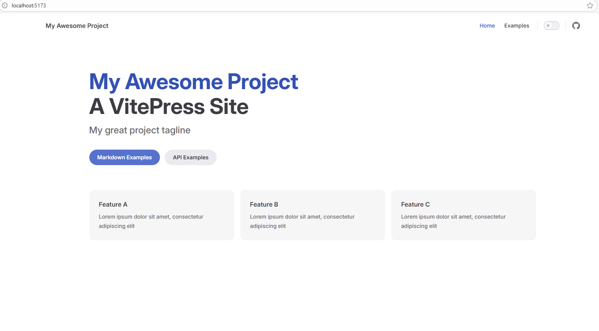
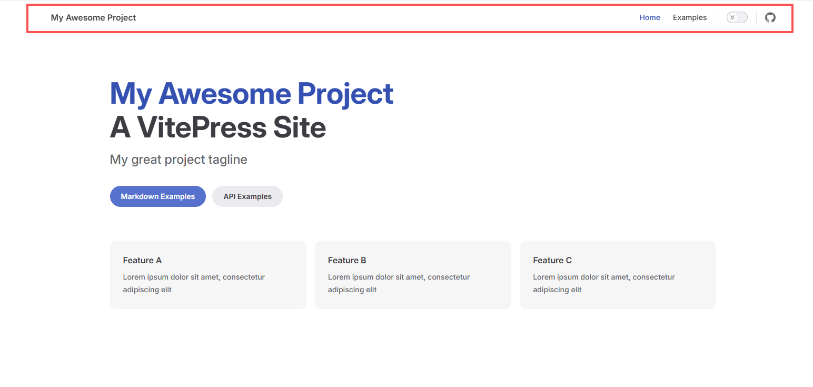
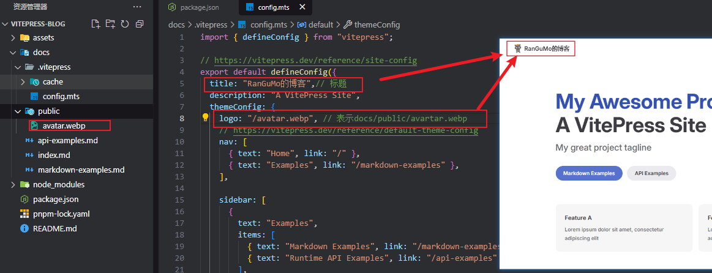
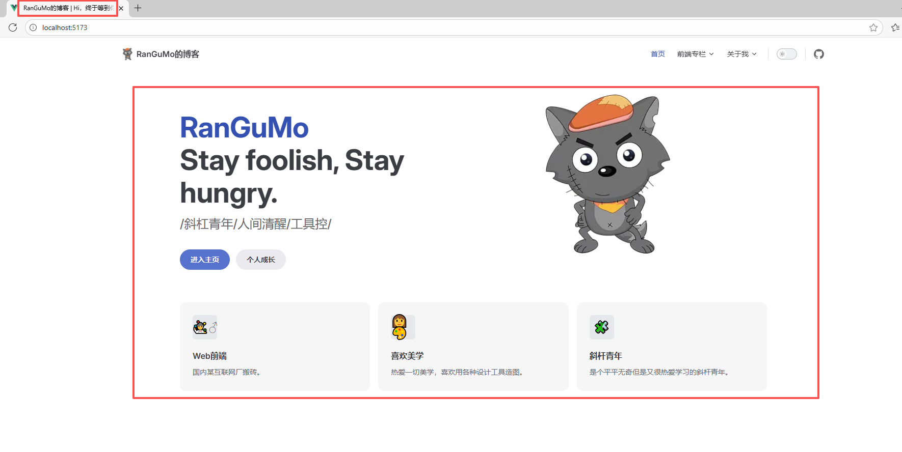
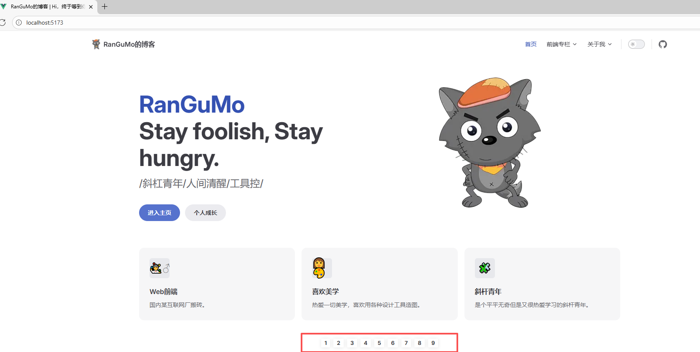
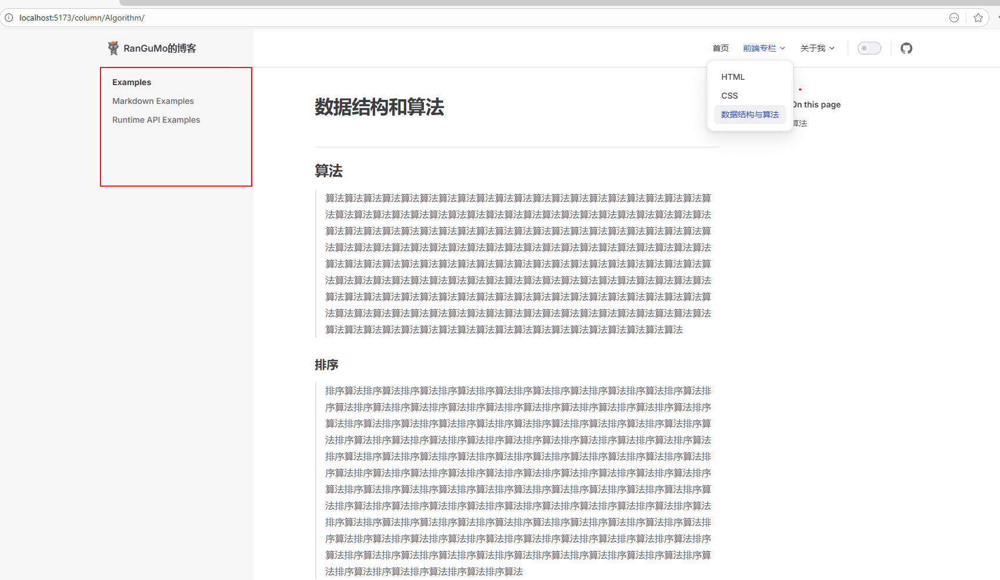
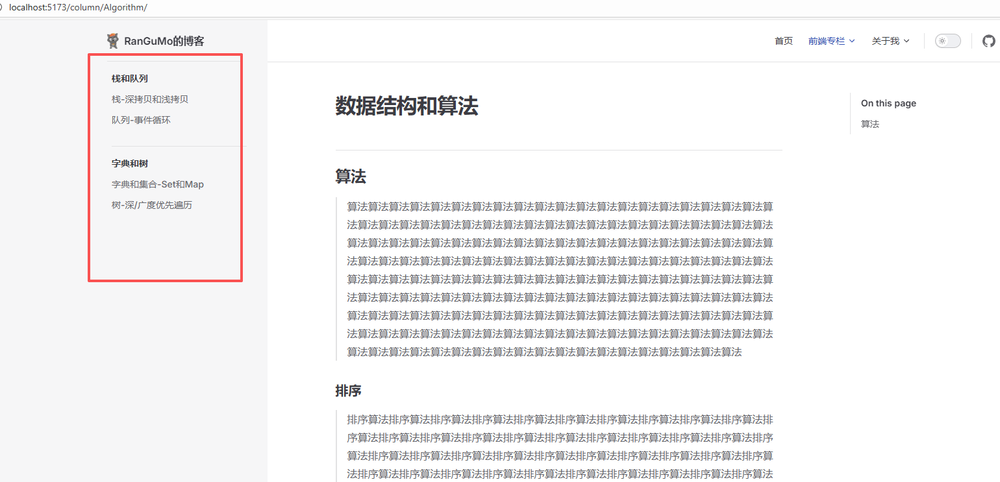
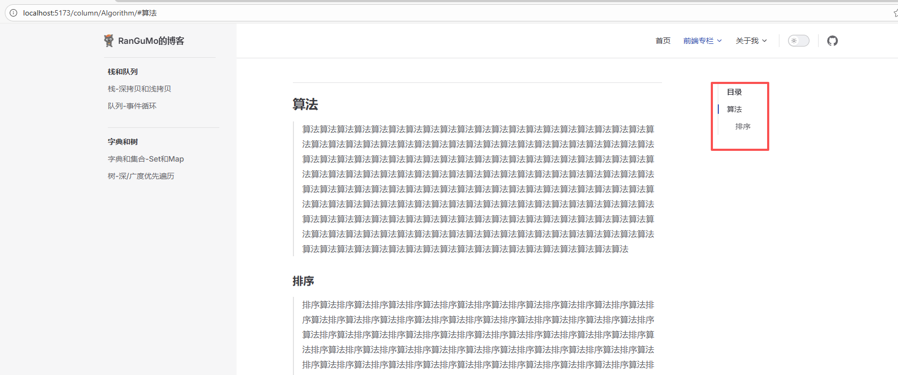
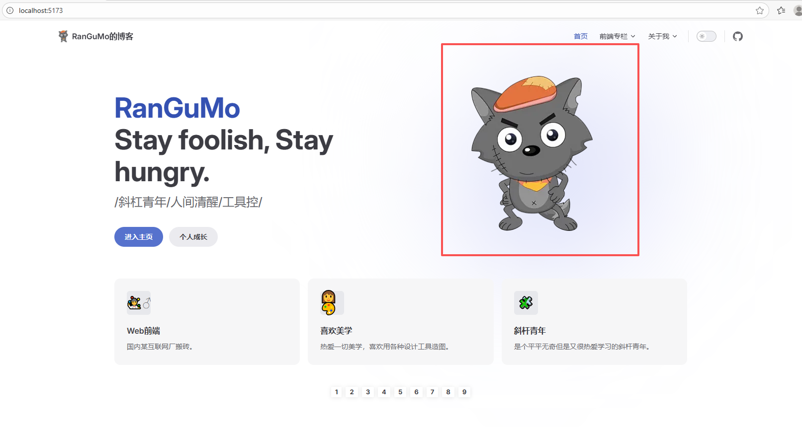
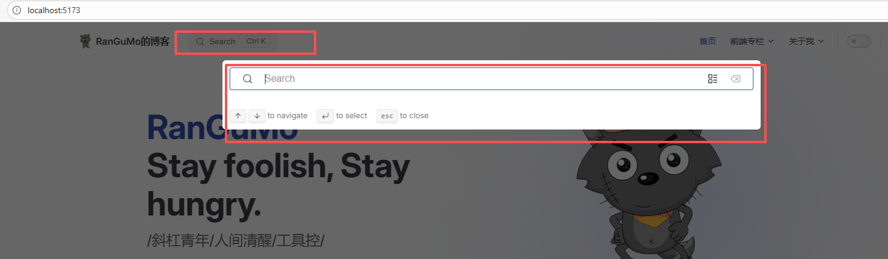

## 安装

### 前置准备

- [Node.js](https://nodejs.org/) 18 及以上版本。


```bash
pnpm add -D vitepress@next
```

首先创建并进入一个新目录：

```bash
mkdir vitepress-blog && cd vitepress-blog
```

```bash
pnpm vitepress init
```

```bash
┌  Welcome to VitePress!
│
◇  Where should VitePress initialize the config?
│  ./docs
│
◇  Where should VitePress look for your markdown files?
│  ./docs
│
◇  Site title:
│  My Awesome Project
│
◇  Site description:
│  A VitePress Site
│
◇  Theme:
│  Default Theme
│
◇  Use TypeScript for config and theme files?
│  Yes
│
◇  Add VitePress npm scripts to package.json?
│  Yes
│
◇  Add a prefix for VitePress npm scripts?
│  Yes
│
◇  Prefix for VitePress npm scripts:
│  docs
│
└  Done! Now run pnpm run docs:dev and start writing.
```

生成的目录如下：

```bash
├─ docs
│  ├─ .vitepress
│  │  └─ config.mts
│  ├─ api-examples.md
│  ├─ markdown-examples.md
│  └─ index.md #入口文件
├─ package.json
└─ pnpm-lock.yaml
```

`vitepress`项目的初始化完成。运行 `pnpm run docs:dev` 来打开项目。效果如下:



## 导航条美化navbar：




### 左上角-logo和名称自定义

docs/config.mts

```js
export default defineConfig({
    title: 'RanGuMo的博客', // 标题
    themeConfig: {
        logo: "/avatar.webp", // 表示docs/public/avartar.webp
    }
})
```



### 右上角-导航内容自定义

接下来美化右上角部分，首先先确定nav在`docs/.vitepress/config.ts`文件的位置，具体如下👇🏻：

```
export default defineConfig({
    themeConfig: {
        nav: [] // 这里传入一个数组，将相关的导航栏信息传递进来
    }
})
```

位置有了，接下来我们来定义`navbar`的内容。具体代码如下：

```js
// docs/.vitepress/realConfig/index.ts 配置内容较多，单独起个文件
export * from './navbar';
```

```js
// docs/.vitepress/realConfig/navbar.ts
import { DefaultTheme } from 'vitepress';

export const nav: DefaultTheme.NavItem[] = [
  {
    text: '首页',
    link: '/' // 表示docs/index.md
  },
  {
    text: '前端专栏',
    items: [
      {
        text: 'HTML',
        link: '/column/HTML/' // 表示docs/column/HTML/index.md
      },
      {
        text: 'CSS',
        link: '/column/HTML/' // 表示docs/column/CSS/index.md
      }
    ]
  },
  {
    text: '关于我',
    items: [
      { text: 'Github', link: 'https://github.com/RanGuMo' },
      {
        text: 'CSDN',
        link: 'https://blog.csdn.net/qq_43322436?spm=1010.2135.3001.5343'
      }
    ]
  }
];
```


```js
// 在config.ts中引用
import { defineConfig } from 'vitepress';
import { nav } from './realConfig';

export default defineConfig({
    themeConfig: {
        nav: nav, // 把定义的nav给替换进来
        socialLinks: [
          { icon: 'github', link: 'https://github.com/RanGuMo' } // 右上角github图标
        ]
    }
})
```


到这里，我们就完成了`navbar`的美化。具体来看下效果：


## 首页美化home

### layout选择

首页部分的配置在`docs/index.md`文件，具体来看下面这些配置项：

```markdown
---
# 提供三种布局，doc、page和home
# 官方文档相关配置：https://vitepress.dev/reference/default-theme-layout


# 官方文档相关配置： https://vitepress.dev/reference/default-theme-home-page
layout: home

title: RanGuMo的博客
titleTemplate: Hi，终于等到你
editLink: true
lastUpdated: true

hero:
  name: "RanGuMo"
  text: "Stay foolish, Stay hungry."
  tagline: /斜杠青年/人间清醒/工具控/
  # actions:
  #   - theme: brand
  #     text: Markdown Examples
  #     link: /markdown-examples
  #   - theme: alt
  #     text: API Examples
  #     link: /api-examples
  image:
    # 首页右边的图片
    src: /avatar.webp
    # 图片的描述
    alt: avatar
  # 按钮相关
  actions:
    - theme: brand
      text: 进入主页
      link: /column/views/guide
    - theme: alt
      text: 个人成长
      link: /column/Growing/

# 按钮下方的描述
features:
  - icon: 🤹‍♂️♂
    title: Web前端
    details: 国内某互联网厂搬砖。
    link: /column/views/guide
  - icon: 🎨
    title: 喜欢美学
    details: 热爱一切美学，喜欢用各种设计工具造图。
  - icon: 🧩
    title: 斜杆青年
    details: 是个平平无奇但是又很热爱学习的斜杆青年。
---


```

**效果：**



到此，一个像模像样的首页就有了。但有些同学会觉得，自定义力度还不够，比如说想在页面的下方再加点图片或者图标之类的，那下面我们就来说说，在vitepress中如何自定义组件。

### 自定义组件


首先，我们在`docs/.vitepress/components`文件夹下定义一个文件，名为`home.vue`。然后在里面写些想要展示的内容所对应的代码，**比如：**

```vue
<template>
  <div class="home-wrapper">
    <div v-for="item in list" :key="item" class="home-item">{{ item }}</div>
  </div>
</template>

<script lang="ts" setup>
const list = [1, 2, 3, 4, 5, 6, 7, 8, 9];
</script>

<style scoped>
.home-wrapper {
  display: flex;
  justify-content: center;
  margin-top: 40px;
}
.home-item {
  vertical-align: middle;
  margin: 4px 4px 10px;
  padding: 4px 8px;
  font-weight: bolder;
  display: inline-block;
  cursor: pointer;
  border-radius: 2px;
  line-height: 13px;
  font-size: 13px;
  box-shadow: 0 1px 8px 0 rgba(0, 0, 0, 0.1);
  transition: all 0.5s;
}
</style>
```


接着，在`docs/index.md`中引入，具体如下：

```
---
#
#
#
---

<!-- 自定义组件 -->
<script setup>
import home from './components/home.vue';
</script>

<home />
```


下面来看实现后的效果：



## 侧边栏美化Sidebar

### 定义入口


假设说我们现在有一个专栏，叫**数据结构与算法**。那么我们会先去`navbar`定义入口。入口代码在`docs/realConf/navbar.ts`，定义内容如下：

```
export const nav: DefaultTheme.NavItem[] = [
   {
    text: '前端专栏',
    items: [
      {
        text: 'HTML',
        link: '/column/HTML/' // 表示docs/column/HTML/index.md
      },
      {
        text: 'CSS',
        link: '/column/HTML/' // 表示docs/column/CSS/index.md
      },
       {
        text: '数据结构与算法',
        link: '/column/Algorithm/' // 对应docs/column/Algorithm下的index.md文件
      }
    ]
  },
]
```

创建 `docs/column/Algorithm/index.md` 文件

```markdown

# 数据结构和算法

## 算法
> 算法算法算法算法算法算法算法算法算法算法算法算法算法算法算法算法算法算法算法算法算法算法算法算法算法算法算法算法算法算法算法算法算法算法算法算法算法算法算法算法算法算法算法算法算法算法算法算法算法算法算法算法算法算法算法算法算法算法算法算法算法算法算法算法算法算法算法算法算法算法算法算法算法算法算法算法算法算法算法算法算法算法算法算法算法算法算法算法算法算法算法算法算法算法算法算法算法算法算法算法算法算法算法算法算法算法算法算法算法算法算法算法算法算法算法算法算法算法算法算法算法算法算法算法算法算法算法算法算法算法算法算法算法算法算法算法算法算法算法算法算法算法算法算法算法算法算法算法算法算法算法算法算法算法算法算法算法算法算法算法算法算法算法算法算法算法算法算法算法算法算法算法算法算法算法算法算法算法算法算法算法算法算法
### 排序
> 排序算法排序算法排序算法排序算法排序算法排序算法排序算法排序算法排序算法排序算法排序算法排序算法排序算法排序算法排序算法排序算法排序算法排序算法排序算法排序算法排序算法排序算法排序算法排序算法排序算法排序算法排序算法排序算法排序算法排序算法排序算法排序算法排序算法排序算法排序算法排序算法排序算法排序算法排序算法排序算法排序算法排序算法排序算法排序算法排序算法排序算法排序算法排序算法排序算法排序算法排序算法排序算法排序算法排序算法排序算法排序算法排序算法排序算法排序算法排序算法排序算法排序算法排序算法排序算法排序算法排序算法排序算法排序算法排序算法排序算法排序算法排序算法排序算法排序算法排序算法排序算法排序算法排序算法排序算法排序算法排序算法排序算法排序算法排序算法排序算法排序算法排序算法排序算法排序算法排序算法排序算法排序算法排序算法排序算法排序算法排序算法排序算法排序算法排序算法排序算法排序算法排序算法排序算法排序算法排序算法排序算法排序算法排序算法排序算法排序算法排序算法排序算法排序算法排序算法排序算法排序算法排序算法排序算法
```


定义完成之后，来看下现在的效果：



此时大家会发现，左边的侧边栏莫名奇妙的。其实这是因为，在我们刚开始初始化项目的时候，脚手架给我们预置的侧边栏内容，对应 `docs/.vitepress/config.ts`中的`themeConfig.sidebar`。下面，我们来改造这个位置的内容。

### 侧边栏规范化

我们当前只是定义了“数据结构与算法”专栏的入口文件，那在这个页面中的侧边栏，我们要展示的是「数据结构与算法」这个专栏所要填充的文章。比如：栈、队列、字典和集合等等。

那接下来，我们先去专栏下面建立相关文章的md文件。在`docs/column/Algorithm`文件下定义以下几个文件：

```
|——— docs
  |——— column
    |——— Algorithm
      |——— 001_stack.md // 里面可以先随意填充些可辨识的内容
      |——— 002_queue.md
      |——— 003_dictionary.md
      |——— 004_truee.md
      |——— index.md
```

想要生成侧边栏的内容有了，下面我们去给侧边栏做相应的配置。同样，考虑到以后会生成很多侧边栏，我们同样把`sidebar`单独抽离成文件。**具体代码如下：**

```js
// docs/.vitepress/relaConf/index.ts 配置内容较多，单独起个文件
export * from './sidebar';
```

```js
// docs/.vitepress/relaConf/navbar.ts
import { DefaultTheme } from 'vitepress';
export const sidebar: DefaultTheme.Sidebar = {
   // /column/Algothm/表示对这个文件夹下的所有md文件做侧边栏配置
  '/column/Algorithm/': [
     // 第一部分
    {
      text: '栈和队列',
      items: [
        {
          text: '栈-深拷贝和浅拷贝',
          link: '/column/Algorithm/001_stack'
        },
        {
          text: '队列-事件循环',
          link: '/column/Algorithm/002_queue'
        }
      ]
    },
    // 第二部分
    {
      text: '字典和树',
      items: [
        {
          text: '字典和集合-Set和Map',
          link: '/column/Algorithm/003_dictionary'
        },
        {
          text: '树-深/广度优先遍历',
          link: '/column/Algorithm/004_tree'
        }
      ]
    }
  ]
};
```

```js
// 在config.ts中引用
import { defineConfig } from 'vitepress';
import { nav, sidebar} from "./realConfig";

export default defineConfig({
    themeConfig: {
        nav: nav,
        sidebar: sidebar, // 把定义的sidebar给替换进来
    }
})
```


最终，我们来看下实现的效果。**具体如下图所示：**



## 锚点导航Anchor

`.vitepress/config.ts`文件，在`themeConfig`中配置`outline`。**具体如下代码所示：**

```
themeConfig: {
    outline: {
      level: [2, 6],
      label: '目录'
    }
  }
```

**具体展示效果如下：**



## 修改主题色

把`vitepress`项目中对应的全局变量的颜色给替换掉。**具体操作如下：**

```ts
// 在.vitepress/theme/index.ts文件
import DefaultTheme from 'vitepress/theme';
import './custom.css';

export default {
  ...DefaultTheme
};
```

```ts
// 在.vitepress/theme/custom.css文件
/* color vars: https://github.com/vuejs/vitepress/blob/main/src/client/theme-default/styles/vars.css */
/* purple brand color: https://coolors.co/palette/dec9e9-dac3e8-d2b7e5-c19ee0-b185db-a06cd5-9163cb-815ac0-7251b5-6247aa */

/* Color Base */
:root {
  /* 设置字体颜色 */
  /* --vp-home-hero-name-color: transparent; */
  /* --vp-home-hero-name-background: -webkit-linear-gradient(120deg, #bd34fe, #41d1ff); */

  /* 设置右图像渐变 */
  --vp-home-hero-image-background-image: linear-gradient( -45deg, #8e99ee 50%, #ffffff 50% );
  --vp-home-hero-image-filter: blur(150px);

}

```

效果如下：



## 搜索功能

**本地搜索**。本地搜索只需要这样处理即可：

```ts
// .vitepress/config.ts

import { defineConfig } from 'vitepress'

export default defineConfig({
  themeConfig: {
    search: {
      provider: 'local'
    }
  }
})
```



## 美化主题

更改搜索框的位置，修改代码块，给导航栏添加毛玻璃等效果：

```css
:root {
  --vp-c-brand-1: #5e3af2;
  --vp-c-brand-2: #694aea;
  --vp-c-brand-3: #7759f1;

  --vp-custom-block-info: #cccccc;
  --vp-custom-block-info-bg: #fdfdfe;

  --vp-custom-block-tip: #009400;
  --vp-custom-block-tip-bg: #e6f6e6;

  --vp-custom-block-warning: #e6a700;
  --vp-custom-block-warning-bg: #fff8e6;

  --vp-custom-block-danger: #e13238;
  --vp-custom-block-danger-bg: #ffebec;

  --vp-custom-block-note: #4cb3d4;
  --vp-custom-block-note-bg: #eef9fd;

  --vp-custom-block-important: #a371f7;
  --vp-custom-block-important-bg: #f4eefe;
  /* hero标题渐变色 */
  --vp-home-hero-name-color: transparent;
  --vp-home-hero-name-background: -webkit-linear-gradient(
    120deg,
    #5e3af2,
    #00f6c0
  );

  /*hero logo背景渐变色 */
  --vp-home-hero-image-background-image: linear-gradient(
    -45deg,
    #5f3af2c8 50%,
    #47cbff7e 50%
  );
  --vp-home-hero-image-filter: blur(76px);
}

.dark {
  --vp-custom-block-info: #cccccc;
  --vp-custom-block-info-bg: #474748;

  --vp-custom-block-tip: #009400;
  --vp-custom-block-tip-bg: #003100;

  --vp-custom-block-warning: #e6a700;
  --vp-custom-block-warning-bg: #4d3800;

  --vp-custom-block-danger: #e13238;
  --vp-custom-block-danger-bg: #4b1113;

  --vp-custom-block-note: #4cb3d4;
  --vp-custom-block-note-bg: #193c47;

  --vp-custom-block-important: #a371f7;
  --vp-custom-block-important-bg: #230555;

  --vp-c-brand-1: #9b85f5;
  --vp-c-brand-2: #7759f1;
  --vp-c-brand-3: #615ced;
}

/* 标题字体大小 */
.custom-block-title {
  font-size: 16px;
}

/* 注释容器:背景色、左侧 */
.custom-block.info {
  background-color: var(--vp-custom-block-info-bg);
  border-left: 5px solid var(--vp-custom-block-info);
}

/* 提示容器:边框色、背景色、左侧 */
.custom-block.tip {
  /* border-color: var(--vp-custom-block-tip); */
  background-color: var(--vp-custom-block-tip-bg);
  border-left: 5px solid var(--vp-custom-block-tip);
}

/* 警告容器:背景色、左侧 */
.custom-block.warning {
  background-color: var(--vp-custom-block-warning-bg);
  border-left: 5px solid var(--vp-custom-block-warning);
}

/* 危险容器:背景色、左侧 */
.custom-block.danger {
  background-color: var(--vp-custom-block-danger-bg);
  border-left: 5px solid var(--vp-custom-block-danger);
}

/* NOTE容器:背景色、左侧 */
.custom-block.note {
  background-color: var(--vp-custom-block-note-bg);
  border-left: 5px solid var(--vp-custom-block-note);
}

/* IMPORTANT容器:背景色、左侧 */
.custom-block.important {
  background-color: var(--vp-custom-block-important-bg);
  border-left: 5px solid var(--vp-custom-block-important);
}

/* CAUTION容器:背景色、左侧 */
.custom-block.caution {
  background-color: var(--vp-c-red-soft);
  border-left: 5px solid var(--vp-c-red-3);
}

/* 侧边栏 */
.group:has([role="button"]) .VPSidebarItem.level-0 .items {
  padding-left: 16px !important;
  border-radius: 2px;
  transition: background-color 0.25s;
}

/* 搜索框的位置 */
.VPNavBarSearch.search {
  justify-content: flex-end !important;
  padding-right: 32px !important;
}

.vp-doc blockquote {
  border-left: 4px solid var(--vp-c-divider);
}

/* .vitepress/theme/style/blur.css */
:root {
  /* 首页导航 */
  .VPNavBar {
    background-color: rgba(255, 255, 255, 0);
    backdrop-filter: blur(10px);
  }

  /* 文档页导航两侧 */
  .VPNavBar:not(.home) {
    background-color: rgba(255, 255, 255, 0);
    backdrop-filter: blur(10px);
  }

  @media (min-width: 960px) {
    /* 文档页导航两侧 */
    .VPNavBar:not(.home) {
      background-color: rgba(255, 255, 255, 0);
      backdrop-filter: blur(10px);
    }

    /* 首页下滑后导航两侧 */
    .VPNavBar:not(.has-sidebar):not(.home.top) {
      background-color: rgba(255, 255, 255, 0);
      backdrop-filter: blur(10px);
    }
  }

  @media (min-width: 960px) {
    /* 文档页导航中间 */
    .VPNavBar:not(.home.top) .content-body {
      background-color: rgba(255, 255, 255, 0);
      backdrop-filter: blur(10px);
    }

    /* 首页下滑后导航中间 */
    .VPNavBar:not(.has-sidebar):not(.home.top) .content-body {
      background-color: rgba(255, 255, 255, 0);
      backdrop-filter: blur(10px);
    }
  }

  /* 分割线 */

  @media (min-width: 960px) {
    /* 文档页分割线 */
    .VPNavBar:not(.home.top) .divider-line {
      background-color: rgba(255, 255, 255, 0);
      backdrop-filter: blur(10px);
    }

    /* 首页分割线 */
    .VPNavBar:not(.has-sidebar):not(.home.top) .divider {
      background-color: rgba(255, 255, 255, 0);
      backdrop-filter: blur(10px);
    }
  }

  /* 搜索框 VPNavBarSearchButton.vue */
  .DocSearch-Button {
    background-color: rgba(255, 255, 255, 0);
    backdrop-filter: blur(10px);
  }

  /* 移动端大纲栏 */
  .VPLocalNav {
    background-color: rgba(255, 255, 255, 0);
    backdrop-filter: blur(10px);
    /* 隐藏分割线 */
    /* border-bottom: 5px solid var(--vp-c-gutter); */
    border-bottom: 0px;
  }
}

/* .vitepress/theme/style/vp-code-group.css */

/* 代码块tab */
.vp-code-group .tabs {
  padding-top: 30px;
}

/* 代码块tab-顶部小圆点 */
.vp-code-group .tabs::before {
  background: #fc625d;
  border-radius: 50%;
  box-shadow: 20px 0 #fdbc40, 40px 0 #35cd4b;
  content: " ";
  height: 12px;
  width: 12px;
  left: 12px;
  margin-top: -15px;
  position: absolute;
}

/* 代码组 */
.vp-code-group {
  color: var(--vp-c-black-soft);
  border-radius: 8px;
  box-shadow: 0 10px 30px 0 rgb(0 0 0 / 40%);
}
```

## 插件：

### 首页添加`五彩纸屑`插件

```bash
pnpm add canvas-confetti
```

在`components`目录下创建组件 `confetti.vue`

```vue
<script setup lang="ts">
import confetti from "canvas-confetti";
import { inBrowser } from "vitepress";

if (inBrowser) {
  /* 纸屑 */
  confetti({
    particleCount: 100,
    spread: 170,
    origin: { y: 0.6 },
  });
}
</script>
```

在`index.md`中使用

```markdown
---
# 提供三种布局，doc、page和home
# 官方文档相关配置：https://vitepress.dev/reference/default-theme-layout


# 官方文档相关配置： https://vitepress.dev/reference/default-theme-home-page
layout: home

title: RanGuMo的博客
titleTemplate: Hi，终于等到你
editLink: true
lastUpdated: true # 最后更新时间 (全局开启)

hero:
  name: "RanGuMo"
  text: "Stay foolish, Stay hungry."
  tagline: /斜杠青年/人间清醒/工具控/
  # actions:
  #   - theme: brand
  #     text: Markdown Examples
  #     link: /markdown-examples
  #   - theme: alt
  #     text: API Examples
  #     link: /api-examples
  image:
    # 首页右边的图片
    src: /avatar.webp
    # 图片的描述
    alt: avatar
  # 按钮相关
  actions:
    - theme: brand
      text: 进入主页
      link: /markdown-examples
    - theme: alt
      text: 个人成长
      link: /api-examples

# 按钮下方的描述
features:
  - icon: 🤹‍♂️♂
    title: Web前端
    details: 国内某互联网厂搬砖。
    link: /column/views/guide
  - icon: 🎨
    title: 喜欢美学
    details: 热爱一切美学，喜欢用各种设计工具造图。
  - icon: 🧩
    title: 斜杆青年
    details: 是个平平无奇但是又很热爱学习的斜杆青年。
---

<!-- 自定义组件 -->
<script setup>
import home from './components/home.vue';
import confetti from "./components/confetti.vue";
</script>

<home />
<confetti />
```

或者通过 `.vitepress/theme/index.ts` 注册全局组件

```ts
import DefaultTheme from "vitepress/theme";
import confetti from "../../components/confetti.vue";
import "./custom.css";

export default {
  ...DefaultTheme,
  enhanceApp(ctx) {
    const { app } = ctx;
    app.component("confetti", confetti); // 注册全局组件
  },
};

```

## 📽Github Page部署

用`Github Page`来部署，那么需要在`git`上的仓库需要是`public`状态

首先，我们在Github上新建一个仓库，假设命名为`vitepress-blog`。之后，我们需要再去 `config.ts` 文件里，做相应的配置。具体如下：

```
export default defineConfig({
  	base: '/vitepress-blog/',  // 这里将会影响之后生成的根路径
  	title: 'RanGuMo的博客', 
  })
```


其次，在根目录下创建一个文件夹，名为`vitepress-starter`。之后，建立一个文件，名为`deploy.sh`。具体代码如下：

```
#!/usr/bin/env sh

# 确保脚本抛出遇到的错误
set -e

# 生成静态文件
npm run docs:build

# 进入生成的文件夹
cd docs/.vitepress/dist

git init
git add -A
git commit -m 'deploy'

# RanGuMo/vitepress-blog 替换为自己的用户名和对应的仓库名
# 意思为将构建后的代码合并到gh-pages分支上，然后在gh-pages分支上部署~(确保gh-pages分支存在)
git push -f  https://github.com/RanGuMo/vitepress-blog.git HEAD:gh-pages

```


之后，先把我们调试完成的代码，推到`github`上的`main`分支上，然后跑脚本，发布到生产环境。本地终端运行如下代码：

```
git add .
git commit -m "xxx"
git push origin HEAD:refs/for/main
sh ./vitepress-starter/deploy.sh
```

```bash
# 普通推送直接到分支
git push origin main
# Gerrit 方式：推送到代码审核系统
git push origin HEAD:refs/for/main
```

> 工作流程
> 使用这种方式推送代码会:
> 将代码推送到 Gerrit 而不是直接合并到 main分支
> 在 Gerrit 中创建一个新的代码审查请求 (Change)
> 其他开发者可以对代码进行审查、评论和批准
> 只有在审核通过后，代码才会真正合并到 main分支
> 这是代码协作中常见的做法，特别是在需要代码审查的企业环境中。

最后，可以在仓库的 `Setting → Pages` 中看到最后的地址：
