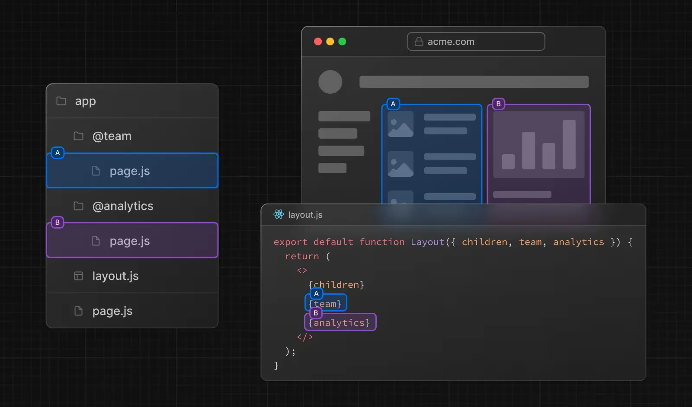
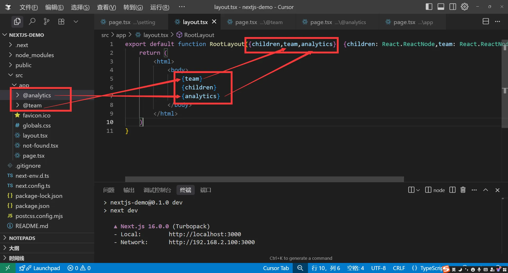
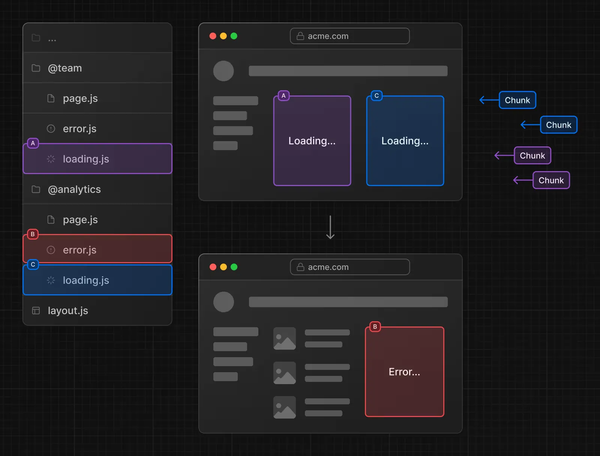
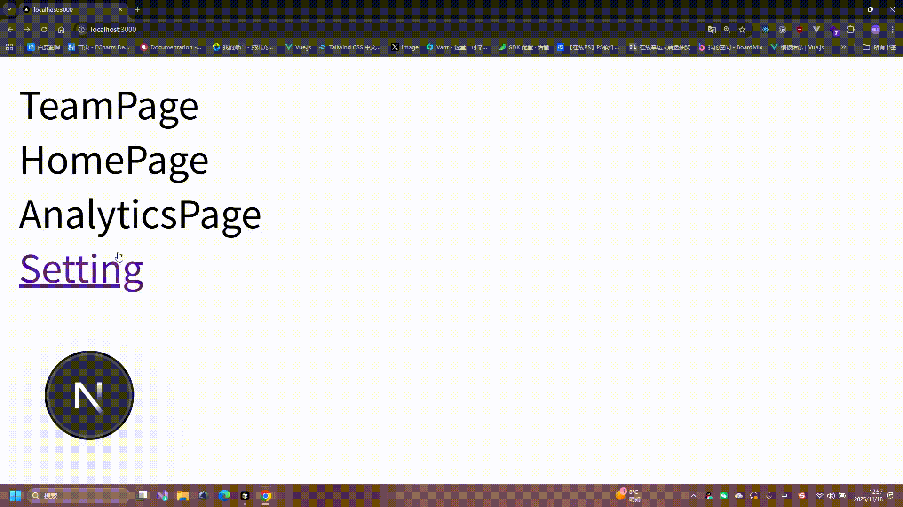
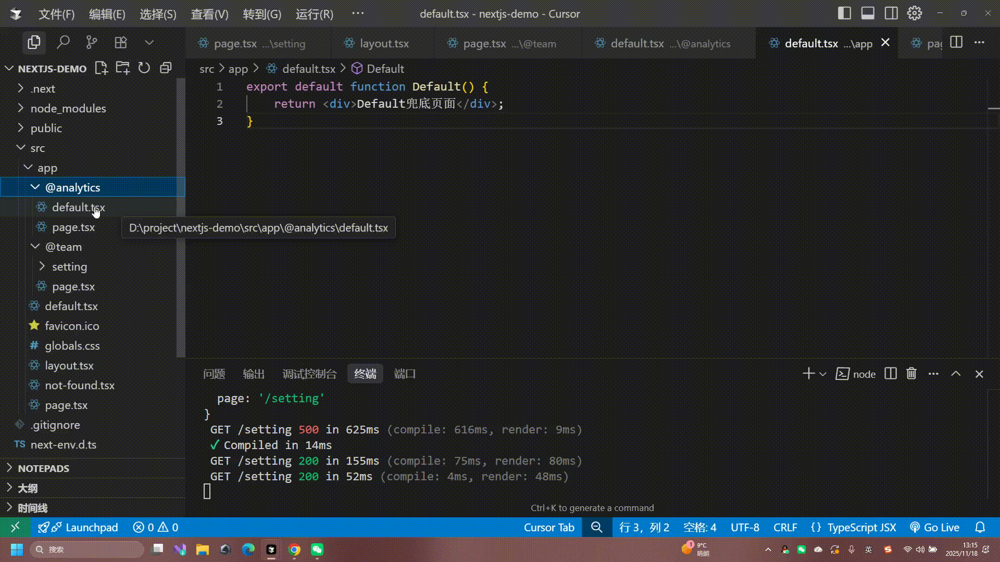
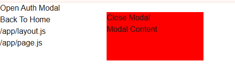
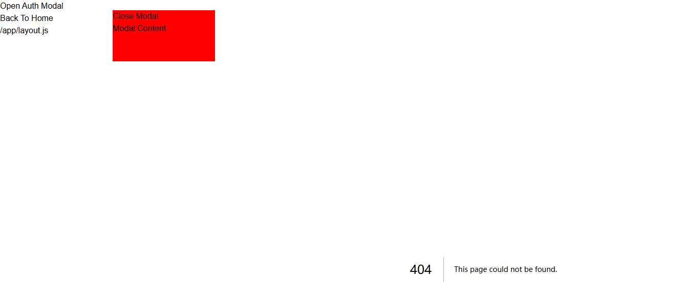

# 平行路由（Parallel Routes）

> 平行路由指的是在同一布局`layout.tsx`中，可以同时渲染多个页面，例如`team`，`analytics`等



## 基本用法

平行路由的使用方法就是通过`@ + 文件夹名`来定义，例如`@team`，`@analytics`等，名字可以自定义。

> 平行路由不会影响`URL`路径。



定义完成之后，我们就可以在`layout.tsx`中使用`team`和`analytics`来渲染对应的页面，他会自动注入 layout 的 props 里面

> 注意：例子中我们使用了解构的语法，这里面的名称`team`,`analytics`需跟文件夹名称一致。

```tsx
export default function RootLayout({
  children,
  team,
  analytics,
}: {
  children: React.ReactNode;
  team: React.ReactNode;
  analytics: React.ReactNode;
}) {
  return (
    <html>
      <body>
        {team}
        {children}
        {analytics}
      </body>
    </html>
  );
}
```

## 独立路由

> 当我们使用了平行路由之后，我们为其单独定义`loading`,`error`,等组件使其拥有独立加载和错误处理的能力。



## default.tsx

> 首先我们先认识一下子导航，每一个平行路由下面还可以接着创建对应的路由，例如`@team`下面可以接着创建`@team/setting`，`@team/user`等。

那我们的目录结构就是：

```text
├── @team
│   ├── page.tsx
│   ├── setting
│   │   └── page.tsx
└── @analytics
│    └── page.tsx
└── layout.tsx
└── page.tsx
```

然后我们使用`Link`组件跳转子导航`setting`页面

```tsx
import Link from "next/link";
export default function RootLayout({
  children,
  team,
  analytics,
}: {
  children: React.ReactNode;
  team: React.ReactNode;
  analytics: React.ReactNode;
}) {
  return (
    <html>
      <body>
        {team}
        {children}
        {analytics}
        <Link className="text-blue-500 block" href="/setting">
          Setting
        </Link>
      </body>
    </html>
  );
}
```



观察上图我们发现，子导航使用`Link`组件跳转`setting`页面时，是没有问题的，但是我们在`跳转之后刷新页面`，就出现`404`了，这是怎么回事?

- 当使用软导航`Link`组件跳转子页面的时候，这时候`@analytics` 和 `children` 依然保持活跃，所以他只会替代`@team`里面的内容。
- 而当我们使用硬导航浏览器页面刷新,此时`@analytics` 和 `children` 已经失活，因为它的底层原理其实是同时匹配`@team`和`@analytics`，`children` 目录下面的`setting` 页面，但是只有`@team` 有这个页面，其他两个没有，所以导致`404`。
  解决方案：使用`default.tsx`来进行兜底，确保不会`404`

- `@analytics/default.tsx` 定义`default.tsx`文件
- `app/default.tsx` 定义`default.tsx`文件



## 条件渲染

> 除了让它们同时展示，你也可以根据条件判断展示：


## 举例：实现 Modal

> 在实际开发中，平行路由可以用于渲染弹窗（`Modal`）。


实现的效果是，当跳转到 `/login` 的时候，渲染 `Modal`。

写个示例代码。项目目录如下：

```text
app
├─ layout.js
├─ page.js
└─ @auth
   ├─ page.js
   ├─ default.js
   └─ login
      └─ page.js

```

`app/layout.js`代码如下：

```jsx
// app/layout.js
import "./globals.css";
import Link from "next/link";

export default function RootLayout({ children, auth }) {
  return (
    <html>
      <body>
        <div>
          <Link href="/login">Open Auth Modal</Link>
        </div>
        <div>
          <Link href="/">Back To Home</Link>
        </div>
        <h1>/app/layout.js</h1>
        {children}
        {auth}
      </body>
    </html>
  );
}
```

`app/page.js` 代码如下：

```jsx
// app/page.js
export default function Page() {
  return <h1>/app/page.js</h1>;
}
```

如果没有 `@auth`下的代码，此时访问 `/`，效果应该是：


考虑到我们写的是一个 `Modal` 效果，当我们访问 `/` 的时候，`Modal` 应该是不被渲染的。当我们访问其他地址如`/about`的时候，`Modal` 也不应该被渲染。所以`app/@auth/page.js`和 `app/@auth/default.js`都应该 `return` 一个 `null`。

两个文件代码如下：

```jsx
// app/@auth/page.js
export default function Page() {
  return null;
}
```

```jsx
// app/@auth/default.js
export default function Default() {
  return null;
}
```

`app/@auth/login/page.js` 代码如下：

```jsx
// app/@auth/login/page.js
"use client";
import { useRouter } from "next/navigation";

export default function Page() {
  const router = useRouter();
  return (
    <div
      style={{
        width: "200px",
        height: "100px",
        backgroundColor: "red",
        position: "fixed",
        top: "20px",
        left: "220px",
      }}
    >
      <span onClick={() => router.back()}>Close Modal</span>
      <h1>Modal Content</h1>
    </div>
  );
}
```

最终效果如下：


当我们点击 `Open Auth Modal`的时候，路由跳转 `/login`，显示弹窗。点击弹窗里的 `Close Modal`，路由跳回 `/`，弹窗关闭。点击 `Back To Home`，从 `/login` 跳到 `/`，弹窗也会关闭。

之所以能实现这样一个功能，借助的就是平行路由的功能。当跳转到 `/login` 的时候，`app/@auth/login/page.js` 会作为 `app/layout.js` 中的 `auth` 参数传入，于是展示了弹窗。当跳转到 `/`的时候，展示 `app/@auth/page.js`，此时 `return null`，所以关闭了弹窗。

但是你可能发现一个问题，那就是当我们刷新 `/login`页面的时候，会出现 `404` 错误。刷新后的结果如下：



为什么会出现这样一个内容呢？

经过排查，这个 `404` 提示来自于 `app/layout.js` 中的 `children`。如果你把 `{children}`这行代码删除，就不会展示这个错误。(一般来说，不会这样做，只需加上 `default.js` 文件，就可以解决这个问题。)

```jsx
...

export default function RootLayout({ children, auth }) {
  return (
      ...
        <h1>/app/layout.js</h1>
        {children}
        {auth}
      ...
  )
}
```

其实你把 `children` 理解为另外一个插槽就方便理解了。`/app/page.js`相当于 `app/@children/page.js`。

当访问 `/login` 的时候，只匹配了 `/@auth/login/page.js` 这个插槽，但是 `/@children/page.js` 就没有匹配到了。

当重新刷新的时候，`Next.js` 会首先尝试渲染不匹配插槽的 `default.js` 文件，如果不可用，再渲染 `404`。

所以解决这个问题也很简单，在 `app` 下新建一个 `default.js` 文件，也 `return null` 就可以了：

```jsx
export default function Default() {
  return null;
}
```

此时再刷新 `/login` 页面，就没有 `404` 错误了：


