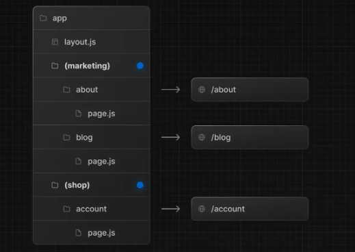
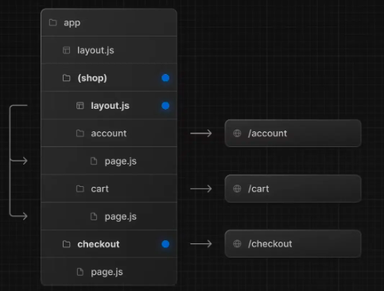
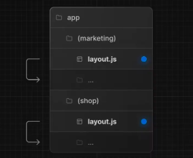

# 路由组（Route groups）

> 在 `app` 目录下，文件夹名称通常会被映射到 `URL` 中，但你可以将文件夹标记为`路由组`，阻止文件夹名称被映射到 `URL` 中。

使用路由组，你可以将路由和项目文件按照逻辑进行分组，但不会影响 `URL` 路径结构。路由组可用于比如：

- 按站点、意图、团队等将路由分组
- 在同一层级中创建多个布局，甚至是创建多个根布局
  那么该如何标记呢？把文件夹用括号括住就可以了，就比如 `(dashboard)`。

## 按逻辑分组

> 将路由按逻辑分组，但不影响 `URL` 路径：

你会发现，最终的 `URL` 中省略了带括号的文件夹（上图中的`(marketing)`和`(shop)`）。

## 创建不同布局

> 借助路由组，即便在同一层级，也可以创建不同的布局：

在这个例子中，`/account` 、`/cart`、`/checkout` 都在同一层级。

- 但是 `/account`和 `/cart`使用的是 `/app/(shop)/layout.js`布局和`app/layout.js`布局
- `/checkout`使用的是 `app/layout.js`

## 创建多个根布局

> 创建多个根布局：

创建多个根布局，你需要删除掉 `app/layout.js` 文件，然后在每组都创建一个 `layout.js`文件。创建的时候要注意，因为是根布局，所以要有 `<html>` 和 `<body>` 标签。

这个功能很实用，比如你将`前台购买页面`和`后台管理页面`都放在一个项目里，一个 `C 端`，一个 `B 端`，两个项目的布局肯定不一样，借助路由组，就可以轻松实现区分。

再多说几点：

- 路由组的命名除了用于组织之外并无特殊意义。它们不会影响 `URL` 路径。
- 注意不要解析为相同的 `URL` 路径。举个例子，因为路由组不影响 `URL` 路径，所以 `(marketing)/about/page.js`和 `(shop)/about/page.js`都会解析为 `/about`，这会导致报错。
- 创建多个根布局的时候，因为删除了顶层的 `app/layout.js`文件，访问 `/`会报错，所以`app/page.js`需要定义在其中一个路由组中。
- 跨根布局导航会导致页面完全重新加载，就比如使用 `app/(shop)/layout.js`根布局的 `/cart` 跳转到使用 `app/(marketing)/layout.js`根布局的 `/blog` 会导致页面重新加载（`full page load`）。
