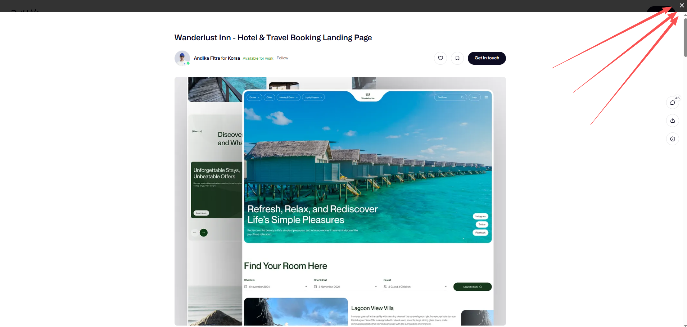
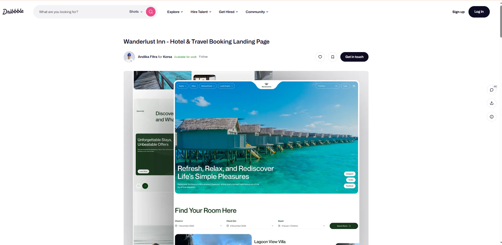
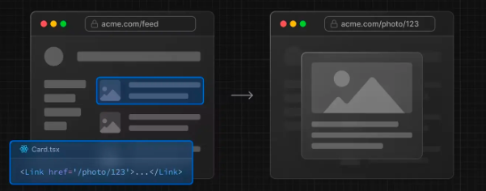
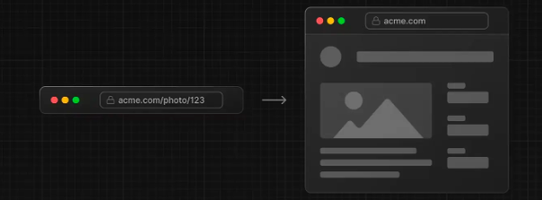
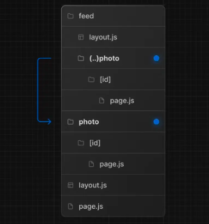
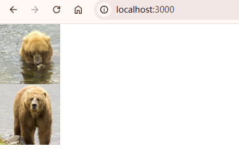
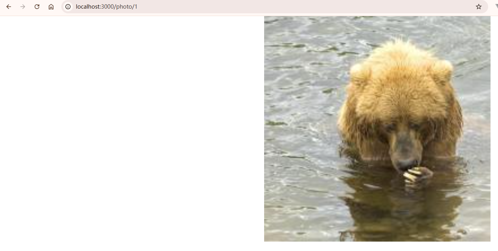
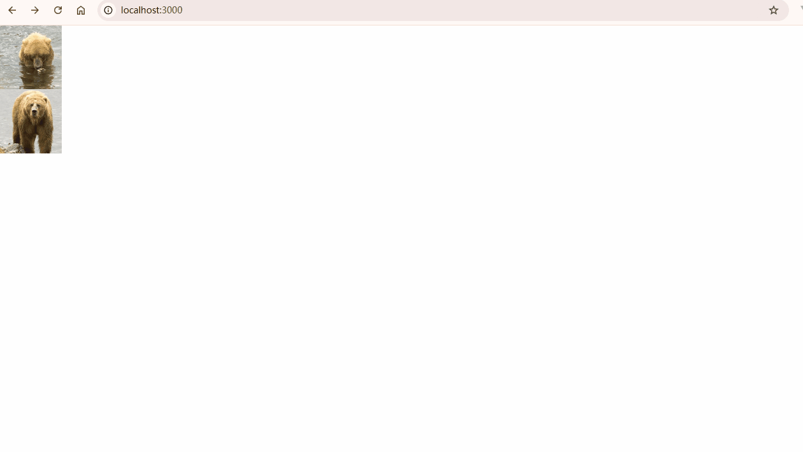

# 拦截路由（Intercepting Routes）

> 拦截路由允许你在当前布局内加载应用其他部分的路由。

## 效果展示

让我们直接看个案例，打开 [dribbble.com](dribbble.com) 这个网站，你可以看到很多美图：


现在点击任意一张图片：



此时页面弹出了一层 `Modal`，`Modal` 中展示了该图片的具体内容。如果你想要查看其他图片，点击右上角的关闭按钮，关掉 `Modal` 即可继续浏览。值得注意的是，此时路由地址也发生了变化，它变成了这张图片的具体地址。如果你喜欢这张图片，直接复制或者分享当前的地址给朋友即可。

而当你的朋友打开时，其实不再需要以 `Modal` 的形式展现，直接展示这张图片的具体内容即可。现在刷新下该页面，你会发现页面的样式不同了：



在这个样式里没有 `Modal`，就是这张图片的内容。

你看同样一个路由地址，却展示了不同的内容。这就是拦截路由的效果。如果你在 `dribbble.com` 想要访问 `dribbble.com/shots/xxxxx`，此时会拦截 `dribbble.com/shots/xxxxx` 这个路由地址，以 `Modal` 的形式展现。而当`直接访问` `dribbble.com/shots/xxxxx` 时，则是原本的样式。

示意图如下：





这是另一个拦截路由的 Demo 演示：[nextjs-app-route-interception.vercel.app](https://nextjs-app-route-interception.vercel.app/)

4.2 实现方式
那么这个效果该如何实现呢？在 `Next.js` 中，实现拦截路由需要你在命名文件夹的时候以 `(..)` 开头，其中：

- `(.)` 表示匹配同一层级
- `(..)` 表示匹配上一层级
- `(..)(..)` 表示匹配上上层级。
- `(...)` 表示匹配根目录

但是要注意的是，这个`匹配的是路由的层级`而`不是文件夹的层级`，就比如路由组、平行路由这些不会影响 `URL` 的文件夹就不会被计算层级。

看个例子：


`/feed/(..)photo`对应的路由是 `/feed/photo`，要拦截的路由是 `/photo`，两者只差了一个层级，所以使用 `(..)`。

我们写个 `demo` 来实现这个效果，目录结构如下：

```text
app
├─ layout.js
├─ page.js
├─ data.js
├─ default.js
├─ @modal
│  ├─ default.js
│  └─ (.)photo
│     └─ [id]
│        └─ page.js
└─ photo
   └─ [id]
      └─ page.js

```

每个文件代码都很简单。先 `Mock` 一下图片的数据，`app/data.js`代码如下：

```js
export const photos = [
  { id: "1", src: "http://placekitten.com/200/200" },
  { id: "2", src: "http://placebear.com/200/200" },
];
```

`app/page.js`代码如下：

```js
import Link from "next/link";
import { photos } from "./data";

export default function Home() {
  return (
    <main className="container">
      {photos.map(({ id, src }) => (
        <Link key={id} href={`/photo/${id}`}>
          
        </Link>
      ))}
    </main>
  );
}
```

`app/layout.js` 代码如下：

```js
export default function Layout({ children, modal }) {
  return (
    <html>
      <body>
        {children}
        {modal}
      </body>
    </html>
  );
}
```

此时访问 /，效果如下：



现在我们再来实现下单独访问图片地址时的效果：

`app/photo/[id]/page.js`代码如下：

```js
"use client";

import { photos } from "../../data";
import { useParams } from "next/navigation";
export default function PhotoPage() {
  const params = useParams();
  const photo = photos.find((p) => p.id === params.id);
  return (
    
  );
}
```

访问 `/photo/1`，效果如下：



现在我们开始实现拦截路由，为了和单独访问图片地址时的样式区分，我们声明另一种样式效果。`app/@modal/(.)photo/[id]/page.js`代码如下：

```js
"use client";

import { photos } from "../../../data";
import { useParams } from "next/navigation";

export default function PhotoModal() {
  const params = useParams();
  const photo = photos.find((p) => p.id === params.id);
  return (
    <div className="modal">
      
    </div>
  );
}
```

`@modal/default.js`的代码如下：

```js
export default function Default() {
  return null;
}
```

最终的效果如下：


你可以看到，在 `/`路由下，访问 `/photo/1`，路由会被拦截，采用 `@modal/(.)photo/[id]/page.js` 的样式。
