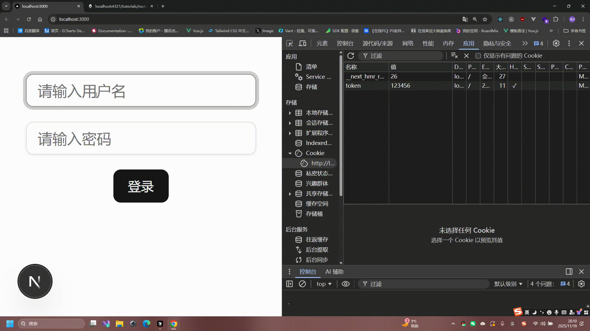

# 路由处理程序(Route Handlers)

> 路由处理程序，可以让我们在`Next.js`中编写`API`接口，并且支持与客户端组件的交互，真正做到了什么叫`前后端分离人不分离`。

## 文件结构

定义前端`路由页面`我们使用的 `page.tsx` 文件，而定义 `API 接口`我们使用的 `route.ts` 文件。

## 路由文件放置规则

`page.tsx` 文件：用于定义页面路由，文件路径直接映射到 `URL`
`route.ts` 文件：用于定义 `API 路由`，处理 `HTTP 请求`

## 重要说明

- `page.tsx` 和 `route.ts` 可以在同一目录下共存，它们处理不同的功能，不会冲突
- `API 路由文件`必须命名为 `route.ts`，而不是以 `route.ts` 结尾的其他文件名
  文件可以放置在 `app` 目录结构中的任何位置，根据需要创建对应的路由，一般`route.ts`文件放在`app/api/`目录下

## 目录结构示例

```text
app/
├── api/
│   ├── user/
│   │   └── route.ts      # /api/user
│   ├── login/
│   │   └── route.ts      # /api/login
│   └── register/
│       └── route.ts      # /api/register
├── users/
│   ├── page.tsx          # /users
│   └── [id]/
│       ├── page.tsx      # /users/[id]
│       └── route.ts      # /users/[id] (API endpoint)
└── page.tsx              # /
```

## 最佳实践

可以根据功能模块组织路由，将相关的页面和 `API` 路由放在一起，便于维护：

```text
app/
├── users/
│   ├── page.tsx          # /users
│   ├── [id]/
│   │   ├── page.tsx      # /users/[id]
│   │   └── route.ts      # /users/[id] (API endpoint)
│   └── api/
│       ├── create/
│       │   └── route.ts  # /users/api/create
└── page.tsx              # /
```

## 定义请求

`Next.js` 遵循 `RESTful API` 规范，可以通过导出特定的 `HTTP` 方法函数来定义请求处理器。

### 支持的 HTTP 方法

```typescript
export async function GET(request: NextRequest) {}

export async function HEAD(request: NextRequest) {}

export async function POST(request: NextRequest) {}

export async function PUT(request: NextRequest) {}

export async function DELETE(request: NextRequest) {}

export async function PATCH(request: NextRequest) {}

// 如果没有定义 OPTIONS 方法，Next.js 会自动实现 OPTIONS 方法
export async function OPTIONS(request: NextRequest) {}
```

## 重要说明

- **方法名称必须大写且不能修改**：这些是 `Next.js` 预定义的导出函数名称，必须严格按照大写形式定义，否则不会被识别为对应的 `HTTP` 方法处理器
- 每个 `route.ts` 文件可以导出一个或多个方法函数
- `Next.js` 会根据导出的函数名称自动映射到对应的 `HTTP` 方法

> 工具准备: 打开`vsCode` 找到插件市场搜索`REST Client`，安装完成后，我们可以使用`REST Client`来测试`API接口`。

## 定义 GET 请求

src/app/api/user/route.ts

```ts
import { NextRequest, NextResponse } from "next/server";
export async function GET(request: NextRequest) {
  const query = request.nextUrl.searchParams; //接受url中的参数
  console.log(query.get("id"));
  return NextResponse.json({ message: "Get request successful" }); //返回json数据
}
```

## REST client 测试 GET 请求:

在`src`目录新建`test.http`文件，编写测试请求

src/test.http

```http
GET http://localhost:3000/api/user?id=123 HTTP/1.1
```

# 在 Next.js 中定义 POST 请求

> 在 `Next.js` 应用中创建 `API` 路由来处理 `POST` 请求非常简单。下面是一个示例，展示如何定义一个处理用户数据的 `POST` 请求。

## API 路由实现

在 `src/app/api/user/route.ts` 文件中定义 `POST` 请求处理函数：

```typescript
import { NextRequest, NextResponse } from "next/server";

export async function POST(request: NextRequest) {
  // const body = await request.formData(); //接受formData数据
  // const body = await request.text(); //接受text数据
  // const body = await request.arrayBuffer(); //接受arrayBuffer数据
  // const body = await request.blob(); //接受blob数据
  const body = await request.json(); //接受json数据
  console.log(body); //打印请求体中的数据
  return NextResponse.json(
    { message: "Post request successful", body },
    { status: 201 }
  );
  //返回json数据
}
```

## 测试 API

在 `src/app/test.http` 文件中编写测试请求：

```http
POST http://localhost:3000/api/user HTTP/1.1
Content-Type: application/json

{
    "name": "张三",
    "age": 18
}
```

# 动态参数

我们可以在路由中使用方括号 `[]` 来定义动态参数，例如 `/api/user/[id]`，其中 `[id]` 就是动态参数，这个参数可以在请求中传递，这个跟前端路由的动态路由类似。

## API 路由实现

`src/app/api/user/[id]/route.ts`

接受动态参数，需要在第二个参数解构 `{ params }`，需注意这个参数是异步的，所以需要使用 `await` 来等待参数解析完成。

```typescript
import { NextRequest, NextResponse } from "next/server";

export async function GET(
  request: NextRequest,
  { params }: { params: Promise<{ id: string }> }
) {
  const { id } = await params;
  console.log(id);
  return NextResponse.json({ message: `Hello, ${id}!` });
}
```

## REST 客户端测试

`src/test.http`

```http
GET http://localhost:3000/api/user/886 HTTP/1.1
```

# Cookie 操作

`Next.js` 也内置了 `Cookie` 的操作可以方便让我们读写，接下来我们用一个登录的例子来演示如何使用 `Cookie`。

## 安装组件库

安装组件库 `shadcn/ui` [官网地址](https://ui.shadcn.com/)

```bash
npx shadcn@latest init
```

为什么使用这个组件库？因为这个组件库是把组件放入你项目的目录下面，这样做的好处是可以让你随时修改组件库样式，并且还能通过`AI`分析修改组件库

安装`button`,`input`组件

```bash
npx shadcn@latest add button
npx shadcn@latest add input
```

新建`login`接口 `src/app/api/login/route.ts`

```typescript
import { cookies } from "next/headers"; //引入cookies
import { NextRequest, NextResponse } from "next/server"; //引入NextRequest, NextResponse
//模拟登录成功后设置cookie
export async function POST(request: NextRequest) {
  const body = await request.json();
  if (body.username === "admin" && body.password === "123456") {
    const cookieStore = await cookies(); //获取cookie
    cookieStore.set("token", "123456", {
      httpOnly: true, //只允许在服务器端访问
      maxAge: 60 * 60 * 24 * 30, //30天
    });
    return NextResponse.json({ code: 1 }, { status: 200 });
  } else {
    return NextResponse.json({ code: 0 }, { status: 401 });
  }
}
//检查登录状态
export async function GET(request: NextRequest) {
  const cookieStore = await cookies();
  const token = cookieStore.get("token");
  if (token && token.value === "123456") {
    return NextResponse.json({ code: 1 }, { status: 200 });
  } else {
    return NextResponse.json({ code: 0 }, { status: 401 });
  }
}
```

src/app/page.tsx

```tsx
"use client";
import { useState } from "react";
import { Button } from "@/components/ui/button";
import { Input } from "@/components/ui/input";
import { useRouter } from "next/navigation";

export default function HomePage() {
  const router = useRouter();
  const [username, setUsername] = useState("");
  const [password, setPassword] = useState("");
  const handleLogin = () => {
    fetch("/api/login", {
      method: "POST",
      headers: {
        "Content-Type": "application/json",
      },
      body: JSON.stringify({ username, password }),
    })
      .then((res) => {
        return res.json();
      })
      .then((data) => {
        if (data.code === 1) {
          router.push("/home");
        }
      });
  };
  return (
    <div className="mt-10 flex flex-col items-center justify-center gap-4">
      <Input
        value={username}
        onChange={(e) => setUsername(e.target.value)}
        className="w-[250px]"
        placeholder="请输入用户名"
      />
      <Input
        value={password}
        onChange={(e) => setPassword(e.target.value)}
        className="w-[250px]"
        placeholder="请输入密码"
      />
      <Button onClick={handleLogin}>登录</Button>
    </div>
  );
}
```

src/app/home/page.tsx

```tsx
"use client";
import { useEffect } from "react";
import { redirect } from "next/navigation";
const checkLogin = async () => {
  const res = await fetch("/api/login");
  const data = await res.json();
  if (data.code === 1) {
    return true;
  } else {
    redirect("/");
  }
};
export default function HomePage() {
  useEffect(() => {
    checkLogin();
  }, []);
  return <div>你已经登录进入home页面</div>;
}
```


