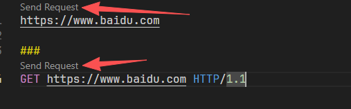
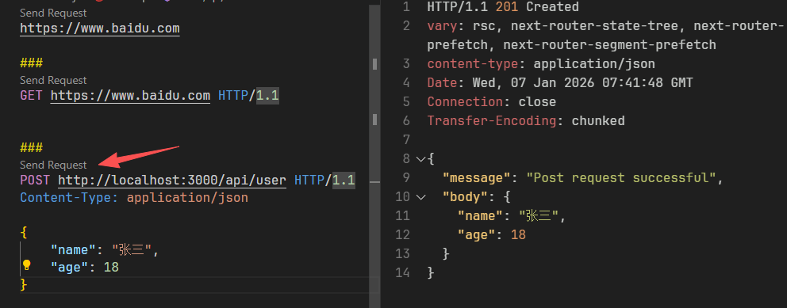
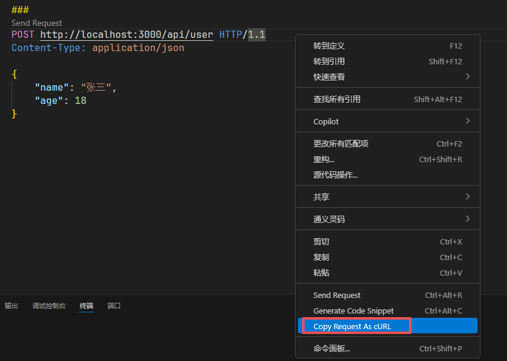
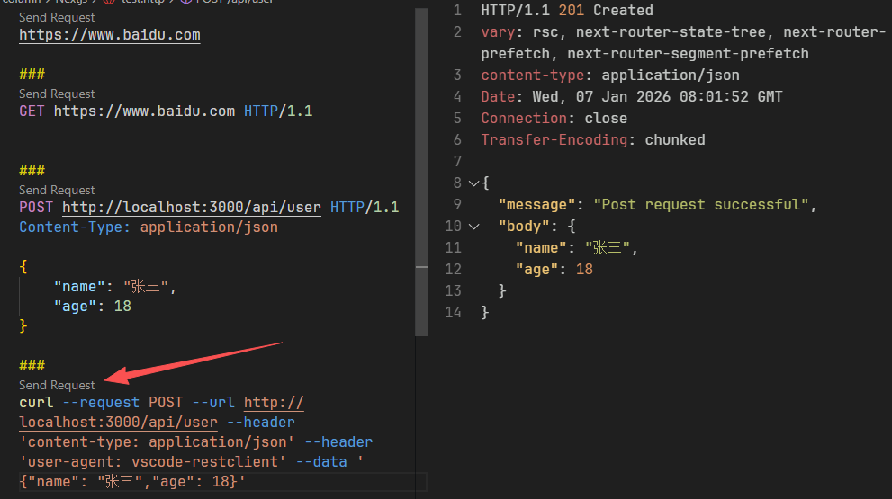
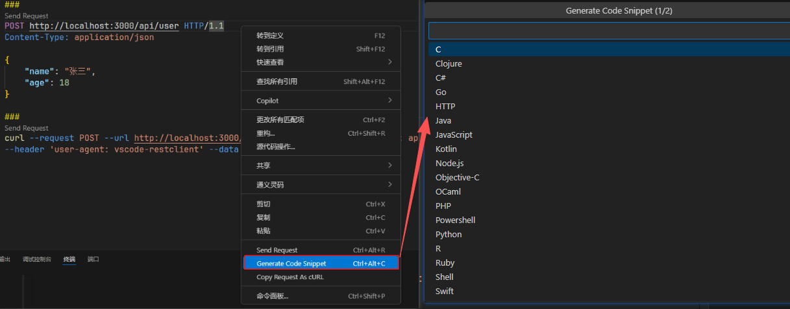

# 告别 Postman？VSCode REST Client 轻量级接口测试神器

## 简介

在 `Web` 开发中，调试 `HTTP` 接口是家常便饭。常用的工具如 `Postman` 功能全面但略显臃肿，`curl` 虽然灵活但编写复杂请求时不直观。
今天介绍一款我个人非常喜欢，且在开发效率上远超同类工具的神器 —— `VSCode REST Client`。
这是一款 `VSCode` 插件，它允许开发者在编辑器内直接发送 `HTTP` 请求并查看响应。它最大的优势在于将请求视为代码：你可以将 `API` 请求保存为 `.http` 文件，像管理代码一样管理你的接口测试脚本。

## 为什么选择它？

- 轻量高效：无需打开额外的软件，`VSCode` 里直接运行，无缝衔接开发工作流。
- `Git` 友好：测试脚本是纯文本，可以随项目代码一起提交，团队成员 `git pull` 下来就能直接用。
- 功能强大：
  - 支持 `cURL` 命令的运行与生成。
  - 支持多环境配置（开发/测试/生产环境一键切换）。
  - 支持生成多种语言（`Python`, `Java`, `Go`等）的调用代码。
  - 强大的变量引用：轻松处理接口依赖（如先登录获取 `Token` 再请求数据）。

它作为 `VSCode` 的一个插件，安装后即可使用，无需离开编辑器即可完成接口测试。

## 基础功能快速上手

安装插件后，新建一个文件，例如 `test.http`。注意：文件后缀必须是 `.http` 或 `.rest`，插件才能正确识别。

### 链接即请求

最简单的用法，只需输入一个 URL 即可。插件会自动在链接上方显示 **Send Request** 按钮，点击即可发送 GET 请求。

```http
https://www.baidu.com
```


### 多个请求

如果有多个请求，就通过`###`来分割。

```http
https://www.baidu.com

###
GET https://www.baidu.com HTTP/1.1
```



POST 请求发送

```http
###
POST http://localhost:3000/api/user HTTP/1.1
Content-Type: application/json

{
    "name": "张三",
    "age": 18
}
```


点击`Send Request`，会发送请求，`返回体`在右边显示。

## 将请求复制为 curl 命令

将光标放在请求行，点击 `Copy Request As CURL`，即可将请求复制为 `curl` 命令。


结果如下：

```curl
curl --request POST --url http://localhost:3000/api/user --header 'content-type: application/json' --header 'user-agent: vscode-restclient' --data '{"name": "张三","age": 18}'
```

## 支持发送 curl



## 将请求转化为客户端代码



选择`javascript` 的 `axios`，结果如下：

```javascript
import axios from "axios";

const options = {
  method: "POST",
  url: "http://localhost:3000/api/user",
  headers: {
    "user-agent": "vscode-restclient",
    "content-type": "application/json",
  },
  data: { name: "张三", age: 18 },
};

axios
  .request(options)
  .then(function (response) {
    console.log(response.data);
  })
  .catch(function (error) {
    console.error(error);
  });
```

## 进阶：极其强大的变量系统

> 变量管理是 `REST Client` 的核心竞争力，也是我选择它的主要原因。它支持`自定义变量`、`多环境切换`、`系统动态变量`，甚至能实现接口间的参数传递。

### 系统动态变量

插件内置了一些好用的动态变量，方便生成随机数据：

```http
{{$guid}}：生成 GUID
{{$randomInt min max}}：生成指定范围随机数
{{$timestamp}}：当前时间戳
{{$datetime iso8601}}：标准时间格式
```

### 文件级自定义变量

> 使用 `@` 符号定义变量，通过 `{{}}` 引用：
> 举例子说明：

```http
###
@Host = www.baidu.com

GET {{Host}} HTTP/1.1
```

### 多环境配置（开发/生产环境切换）

我们通常需要在`本地环境`（`Local`）和`生产环境`（`Prod`）之间切换，每次手动改 `URL` 很麻烦。`REST Client` 允许在 `VSCode` 的 `settings.json` 中配置多环境变量：

```json
"rest-client.environmentVariables": {
  "$shared": { // 公共变量
    "username": "admin",
    "password": "123456"
  },
  "local": { // 本地环境变量
    "hostname": "localhost:3000",
    "password": "{{$shared password}}" // 引用公共变量
  },
  "production": { // 生产环境变量
    "hostname": "localhost:3001",
    "password": "{{$shared password}}"
  }
}
```

使用方式：
在 `.http`文件中引用变量:

```http
###
POST http://{{hostname}}/api/user HTTP/1.1
Content-Type: application/json

{
    "username": "root",
    "password": {{password}}
}
```


配置完成后，点击 `VSCode` 右下角的状态栏（通常显示 `No Environment`），即可在 `Local` 和 `Production` 之间一键切换。

## 接口链式调用（引用上游接口响应）

这是最实用的场景：先调用登录接口获取 `Token`，再将 `Token` 放入 `Header` 调用其他接口。
`REST Client` 通过 `@name` 标签和引用语法完美解决了这个问题，无需手动复制粘贴。

### 第一步：登录并命名请求

```http
###
# @name loginAdmin
POST http://{{hostname}}/auth/login HTTP/1.1
Content-Type: application/json

{
    "username": "admin",
    "password": {{password}}
}
```

假设返回的 `Body` 为： {"token": "eyJhbGciOiJIUzI1NiJ9..."}

### 第二步：在后续请求中引用

语法格式为：
```http
{{requestName.response.body.path}}
```

```http
###
# 方式1：引用整个Body（如果返回就是纯字符串）
# 返回的 为： "eyJhbGciOiJIUzI1NiJ9..."
@token = {{loginAdmin.response.body.*}}

# 方式2：引用Body中的特定字段（推荐，支持 JSONPath）
# 返回的 `Body` 为： {"token": "eyJhbGciOiJIUzI1NiJ9..."}
# @token = {{loginAdmin.response.body.$.token}}

GET http://{{hostname}}/admin HTTP/1.1
Authorization: Bearer {{token}}
```

过这种方式，我们可以把一整套业务流程（登录 -> 获取列表 -> 获取详情）写在一个文件里，点击几次 `Send Request` 即可完成全链路测试。

## 总结

`VSCode REST Client` 以其轻量、贴近代码、易于版本控制（纯文本文件）的特点，成为了开发阶段接口调试的绝佳选择。特别是其强大的变量系统，足以应付大多数复杂的测试场景。如果你是 `VSCode` 的重度用户，不妨尝试一下，相信它能极大提升你的开发效率。
