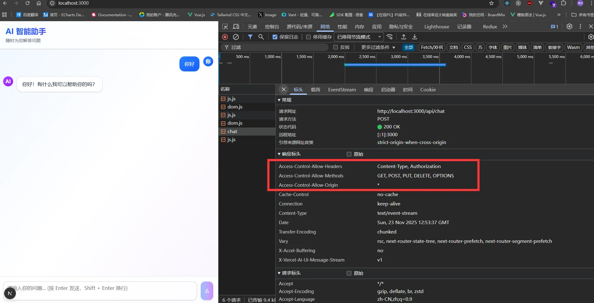

# Proxy代理

> 从 `Next.js 16` 开始，中间件`Middleware`更名为代理（`Proxy`），以更好地体现其用途。其功能保持不变

如果你想升级为`16.x`版本，`Next.js`提供了命令行工具来帮助你升级，只需要执行以下命令即可：

```bash
npx @next/codemod@canary middleware-to-proxy .
```

代码转换会将文件和函数名从`middleware`重命名为`proxy`。

```js
// middleware.ts -> proxy.ts

export function middleware() { // [!code --]
export function proxy() {   // [!code ++]
```

## 基本使用

应用场景：

- 处理跨域请求
- 接口转发例如`/api/user` -> (可能是其他服务器`java`/`go`/`python`等) -> `/api/user`
- 限流例如配合第三方服务做限流
- 鉴权/判断是否登录

`Prxoy`代理其实跟拦截器类似，它可以在请求完成之前进行拦截，然后进行一些处理，例如：修改请求头、修改请求体、修改响应体等。

`src/proxy.ts`

定义`proxy`函数导出即可，`Next.js`会自动调用这个函数。

```js
import { NextRequest, NextResponse } from "next/server";
export async function proxy(request: NextRequest) {
    console.log(request.url,'url');
}
```

但是你会发现，他会拦截项目中所有的请求，包括静态资源、`API`请求、页面请求等。

```bash
http://localhost:3000/.well-known/appspecific/com.chrome.devtools.json url
http://localhost:3000/_next/static/chunks/src_app_globals_91e4631d.css url
http://localhost:3000/_next/static/chunks/%5Bturbopack%5D_browser_dev_hmr-client_hmr-client_ts_cedd0592._.js url
http://localhost:3000/_next/static/chunks/node_modules_next_dist_compiled_react-dom_1e674e59._.js url
http://localhost:3000/_next/static/chunks/node_modules_next_dist_compiled_react-server-dom-turbopack_9212ccad._.js url
http://localhost:3000/_next/static/chunks/node_modules_next_dist_compiled_next-devtools_index_1dd7fb59.js url
http://localhost:3000/_next/static/chunks/node_modules_next_dist_compiled_a0e4c7b4._.js url
http://localhost:3000/_next/static/chunks/node_modules_next_dist_client_a38d7d69._.js url
http://localhost:3000/_next/static/chunks/node_modules_next_dist_4b2403f5._.js url
http://localhost:3000/_next/static/chunks/src_app_globals_91e4631d.css.map url
http://localhost:3000/_next/static/chunks/node_modules_%40swc_helpers_cjs_d80fb378._.js url
http://localhost:3000/_next/static/chunks/_a0ff3932._.js url
http://localhost:3000/api/login url
```

## 配置(config)

例如我们只想匹配`'/api'`下面的路径去做一些事情，我们可以使用`config`配置来实现。

```js
import { NextRequest, NextResponse } from "next/server";
export async function proxy(request: NextRequest) {
    console.log(request.url,'url');
}
//配置匹配路径
export const config = {
    matcher: '/api/:path*',
    //matcher: ['/api/:path*','/api/user/:path*'], 支持单个以及多个路径匹配
    //matcher: ['/((?!api|_next/static|_next/image|.*\\.png$).*)'], 同样支持正则表达式匹配
}
```

结合之前的案例,在`cookie`那一集，我们还需要单独定义`check`接口检查`cookie`，现在我们可以直接在`proxy`中实现。

```js
import { NextRequest, NextResponse } from "next/server";
export async function proxy(request: NextRequest) {
    const cookie = request.cookies.get('token');
    if (request.nextUrl.pathname.startsWith('/home') && !cookie) {
        console.log('redirect to login');
        return NextResponse.redirect(new URL('/', request.url));
    }
    if (cookie && cookie.value) {
        return NextResponse.next();
    }
    return NextResponse.redirect(new URL('/', request.url));
}

export const config = {
    matcher: ['/api/:path*', '/home/:path*'],
}
```

## 复杂匹配

- `source`: 表示匹配路径
- `has`: 表示匹配路径中必须(包含)某些条件
- `missing`: 表示匹配路径中(必须不包含)某些条件

`type` 只能匹配: `header`, `query`, `cookie`

```js
import { NextRequest, NextResponse } from "next/server";
import { ProxyConfig } from "next/server";
export async function proxy(request: NextRequest) {
   console.log('start proxy')
   return NextResponse.next();
}

export const config: ProxyConfig = {
    matcher: [
        {
            source: '/home/:path*',
            //表示匹配路径中必须(包含)Authorization头和userId查询参数
            has: [
                { type: 'header', key: 'Authorization', value: 'Bearer 123456' },
                { type: 'query', key: 'userId', value: '123' }
            ],
            //表示匹配路径中(必须不包含)cookie和userId查询参数
            missing: [
                { type: 'cookie', key: 'token', value: '123456' },
                { type: 'query', key: 'userId', value: '456' },
            ]
        },
    ]
}
```

访问`url`为：`http://localhost:3000/home?userId=123`

## 案例实战(处理跨域)

只要是`/api`下面的接口都可以被任意访问

```js
import { NextRequest, NextResponse } from "next/server";
import { ProxyConfig } from "next/server";
export async function proxy(request: NextRequest) {
    const response = NextResponse.next();
    Object.entries(corsHeaders).forEach(([key, value]) => {
        response.headers.set(key, value);
    })
    return response;
}

const corsHeaders = {
    'Access-Control-Allow-Origin': '*',
    'Access-Control-Allow-Methods': 'GET, POST, PUT, DELETE, OPTIONS',
    'Access-Control-Allow-Headers': 'Content-Type, Authorization',
}

export const config: ProxyConfig = {
   matcher:'/api/:path*',
}
```


