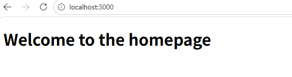
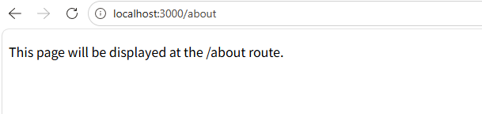
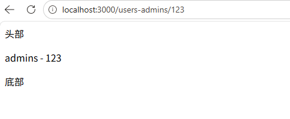
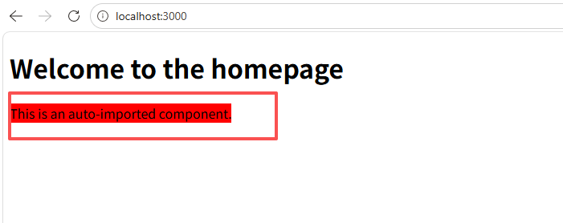
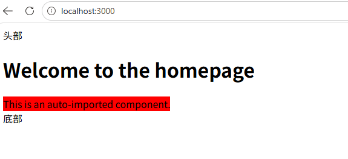
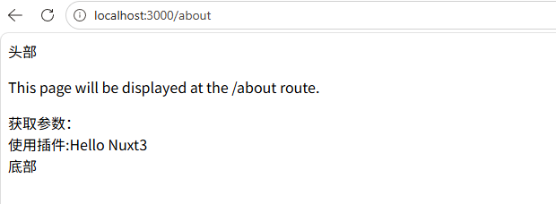
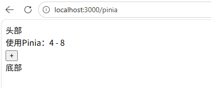
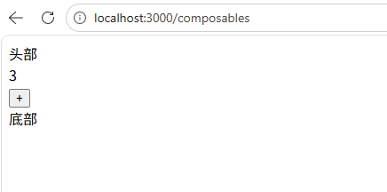

## 创建 Nuxt 项目

```bash
pnpm create nuxt@latest j-book-nuxt
```

## 启动 Nuxt 项目

```bash
pnpm dev
```

## Pages

在 `app` 目录下 创建 `pages` 目录，再创建 `index.vue` 文件

app/pages/index.vue

```vue
<template>
  <div>
    <h1>Welcome to the homepage</h1>
  </div>
</template>
```

然后 删除 `app/app.vue` 文件 或者 在 `app/app.vue` 文件中 添加 `<NuxtPage />`

app/app.vue

```vue
<template>
  <div>
    <NuxtPage />
  </div>
</template>
```

访问 `http://localhost:3000/` 就可以跳转到 `app/pages/index.vue` 页面了


访问 `http://localhost:3000/about` 路由，则需要创建 `app/pages/about.vue` 文件

```vue
<template>
  <section>
    <p>This page will be displayed at the /about route.</p>
  </section>
</template>
```



## 动态路由

如果您在方括号内放置任何内容，它将被转换为动态路由参数。您可以在文件名或目录中混合多个参数，甚至混合非动态文本。

如果您希望参数为可选，则必须使用双重方括号包裹，例如 `~/pages/[[slug]]/index.vue` 或 `~/pages/[[slug]].vue` 将匹配 `/` 和 `/test`。

Directory Structure

```bash
-| pages/
---| index.vue
---| users-[group]/
-----| [id].vue
```

基于上述示例，您可以在组件中通过 `$route` 对象访问 `group/id`：

app/pages/users-[group]/[id].vue

```vue
<template>
  <p>{{ $route.params.group }} - {{ $route.params.id }}</p>
</template>
```

导航到 `/users-admins/123` 将渲染：

```vue
<p>admins - 123</p>
```



如果您想使用组合式 `API` 访问路由，可以使用全局的 `useRoute` 函数，它允许您像在选项式 `API` 中使用 `this.$route` 一样访问路由。

```vue
<script setup lang="ts">
const route = useRoute();

if (route.params.group === "admins" && route.params.id) {
  console.log("验证通过");
}
</script>
```

> 命名的父路由会优先于嵌套的动态路由。对于 `/foo/hello` 路由，`~/pages/foo.vue` 会优先于 `~/pages/foo/[slug].vue`。
> 要使用不同页面分别匹配 `/foo` 和 `/foo/hello`，请使用 `~/pages/foo/index.vue` 和 `~/pages/foo/[slug].vue`。

## 路由跳转-NuxtLink

> `Nuxt` 提供 `<NuxtLink>` 组件来处理应用内的各种链接。
> `<NuxtLink>` 是 Vue Router 的 `<RouterLink>` 组件和 `HTML` 的 `<a>` 标签的直接替代品。它会智能判断链接是 内部 还是 外部，并根据可用的优化（预取、默认属性等）相应地渲染。

```vue
<template>
  <NuxtLink to="/about">About page</NuxtLink>
</template>
```

渲染为 html

```html
<!-- (Vue Router & Smart Prefetching) -->
<a href="/about">About page</a>
```

## 带参数的路由跳转以及编程式导航

app/pages/index.vue

```vue
<template>
  <div>
    <h1>Welcome to the homepage</h1>
  </div>
  <AppAlert> This is an auto-imported component. </AppAlert>
  <ul>
    <li>
      <NuxtLink to="/about">About</NuxtLink>
    </li>
    <li>
      <NuxtLink to="/users-admins/1">Users 1</NuxtLink>
    </li>
    <li>
      <NuxtLink :to="{ path: '/about', query: { msg: JSON.stringify(msg) } }">
        带参数跳转
      </NuxtLink>
    </li>
    <li>
      <button @click="goAbout">编程式导航</button>
    </li>
  </ul>
</template>
<script setup lang="ts">
const router = useRouter();
const msg = {
  id: 1,
  book: "nuxt3",
};

const goAbout = () => {
  router.push("/about?msg=" + JSON.stringify(msg));
};
</script>
```

app/pages/about.vue 获取参数

```vue
<template>
  <section>
    <p>This page will be displayed at the /about route.</p>
    <div>获取参数：{{ route.query.msg }}</div>
  </section>
</template>

<script setup lang="ts">
const route = useRoute();
</script>
```

## Components

> 在 `Nuxt` 中，你可以在 `app/components/` 目录中创建这些组件，它们会在应用中自动可用，无需显式导入。

app/components/AppAlert.vue

```vue
<template>
  <span style="background-color: red;">
    <slot />
  </span>
</template>
```

在 `app/pages/index.vue` 中使用 `AppAlert` 组件，无需 导入

app/pages/index.vue

```vue
<template>
  <div>
    <h1>Welcome to the homepage</h1>
  </div>
  <AppAlert> This is an auto-imported component. </AppAlert>
</template>
```



## Layouts

> 在 `Nuxt` 中，你可以在 `app/layouts/` 目录中创建布局文件

具体步骤可以参考官方文档：https://nuxt.zhcndoc.com/docs/4.x/directory-structure/app/layouts

简单使用：

1. 创建 `app/layouts/default.vue` 文件
   app/layouts/default.vue

```vue
<template>
  <div>
    <AppHeader />
    <slot />
    <AppFooter />
  </div>
</template>
```

2. 创建 `app/components/AppHeader.vue` 文件
   app/components/AppHeader.vue

```vue
<template>
  <div>头部</div>
</template>
```

3. 创建 `app/components/AppFooter.vue` 文件
   app/components/AppFooter.vue

```vue
<template>
  <div>底部</div>
</template>
```

4. 在 `app/app.vue` 中使用

app/app.vue

```vue
<template>
  <div>
    <NuxtLayout>
      <NuxtPage />
    </NuxtLayout>
  </div>
</template>
```

效果


## middleware （中间件）

`Nuxt` 提供一个可自定义的路由中间件（`route middleware`）框架，可在整个应用中使用，适合提取你希望在导航到特定路由之前运行的代码。

路由中间件有三种类型：

- 匿名（或内联）路由中间件，直接在页面内定义。
- 命名路由中间件，放置在 `app/middleware/` 中，使用时会通过异步导入自动加载。
- 全局路由中间件，放置在 `app/middleware/` 中并带有 `.global` 后缀，会在每次路由变化时运行。

前两种路由中间件可以在 `definePageMeta` 中定义。

例如，我们创建一个 `app/middleware/auth.ts` 文件，并添加以下内容：
app/middleware/auth.ts

```ts
export default defineNuxtRouteMiddleware((to, from) => {
  // 判断⽤户是否已经登录
  let authUser = false;
  if (!authUser) {
    return navigateTo("/login");
  }
});
```

当我们要使用这个中间件时，可以在页面中使用 `definePageMeta()` 并传入`middleware`
性，来添加路由中间件。
比如我们在`about.vue`页面使用:

app/pages/about.vue

```vue
<script setup lang="ts">
definePageMeta({
  middleware: "auth",
});
</script>
```

如果中间件有多个，你也可以使用阵列来传入多个中间件，并且会依序执行这些路由中间件。

```vue
<script setup lang="ts">
definePageMeta({
  middleware: ["auth", "other"],
});
</script>
```

### 匿名（或内联）路由中间件

直接在使用它们的页面中定义,例如，直接定义一个匿名的中间件在页面元件中使用:
app/pages/about.vue

```vue
<script setup lang="ts">
// definePageMeta({
//     middleware: 'auth'
// })
definePageMeta({
  middleware: defineNuxtRouteMiddleware(() => {
    let authUser = false;
    if (!authUser) {
      return navigateTo("/login");
    }
  }),
});
</script>
```

### 命名路由中间件

在 `app/middleware/` 中创建一个中间件文件，例如 `app/middleware/auth.ts`。

### 全局路由中间件

全局路由中间件，放置在`middleware/`目录中(带有`.global`后缀)，并将在每次路由更改时自动运行。

如下例子，我们在`middleware/`创建一个`01.run.global.ts`中间件:
app/middleware/01.run.global.ts

```ts
export default defineNuxtRouteMiddleware((to, from) => {
  console.log(`全局路由中间件 to: ${to.path}, from: ${from.path}`);
});
```

全局路由中间件，将会在每一次导航切换页面时执行。

中间件执行顺序等更多中间件内容请查看：https://nuxt.zhcndoc.com/docs/4.x/directory-structure/app/middleware

## plugins 插件

> `Nuxt` 有一个插件系统，可在创建 `Vue` 应用时使用 `Vue` 插件及其他功能。
> `Nuxt` 会自动读取 `app/plugins/` 目录下的文件，并在创建 Vue 应用时加载它们。
> 所有插件都会被自动注册，你不需要在 `nuxt.config` 中单独添加它们。
> 你可以在文件名中使用 `.server` 或 `.client` 后缀，仅在服务器或客户端加载插件。

### 已注册的插件

只有目录顶层的文件（或任意子目录内的 index 文件）会被自动注册为插件。

Directory structure

```bash
-| plugins/
---| foo.ts      // scanned
---| bar/
-----| baz.ts    // not scanned
-----| foz.vue   // not scanned
-----| index.ts  // currently scanned but deprecated
```

只有 `foo.ts` 和 `bar/index.ts` 会被注册。

要在子目录中添加插件，可以在 `nuxt.config.ts` 中使用 `app/plugins` 选项：

nuxt.config.ts

```ts
export default defineNuxtConfig({
  plugins: ["~/plugins/bar/baz", "~/plugins/bar/foz"],
});
```

### 创建插件

```ts
// app/plugins/myPlugin.ts
export default defineNuxtPlugin(() => {
  return {
    // 自动提供辅助函数，返回辅助函数
    provide: {
      myPlugin: (msg: string) => `Hello ${msg}`,
    },
  };
});
```

使用插件

```vue
<template>
  <section>
    <p>This page will be displayed at the /about route.</p>
    <div>获取参数：{{ route.query.msg }}</div>

    <div>使用插件:{{ $myPlugin("Nuxt3") }}</div>
  </section>
</template>

<script setup lang="ts">
const route = useRoute();

// definePageMeta({
//     middleware: 'auth'
// })
definePageMeta({
  middleware: defineNuxtRouteMiddleware(() => {
    let authUser = true;
    if (!authUser) {
      return navigateTo("/login");
    }
  }),
});

const { $myPlugin } = useNuxtApp();
</script>
```



## 安装模块 Pinia

模块商店：https://nuxt.zhcndoc.com/modules

一步到位

```bash
npx nuxt@latest module add pinia
```

或者 手动安装

```bash
pnpm add @pinia/nuxt pinia
```

配置 `nuxt.config.ts`

```ts
export default defineNuxtConfig({
  modules: ["@pinia/nuxt"],
});
```

数据持久化 (Persistedstate)

```bash
pnpm add @pinia-plugin-persistedstate/nuxt
```

启用配置

```ts
// nuxt.config.ts
export default defineNuxtConfig({
  modules: [
    '@pinia/nuxt',
    '@pinia-plugin-persistedstate/nuxt' // 引入持久化模块
  ],
}
```

在 `app`目录下创建 `stores/` 文件夹，并创建 `myStore.ts` 文件

```ts
import { defineStore } from "pinia";

export const useMyStore = defineStore("myStore", {
  state: () => ({
    counter: 1,
    token: "2423534543",
  }),
  getters: {
    doubleCounter: (state) => state.counter * 2,
  },
  actions: {
    add() {
      this.counter++;
    },
  },
});
```

使用pinia

app/pages/pinia.vue

```vue
<template>
  <div>
    <div>使用Pinia：{{ counter }} - {{ doubleCounter }}</div>
    <button @click="myStore.add()">+</button>
  </div>
</template>

<script setup>
import { storeToRefs } from "pinia";
import { useMyStore } from "~/stores/myStore";
const myStore = useMyStore();
const { counter, doubleCounter } = storeToRefs(myStore);
console.log("myStore", counter, doubleCounter);
</script>
```



### 持久化存储

`app/stores/myStore.ts` 文件

```ts
import { defineStore } from "pinia";

export const useMyStore = defineStore("myStore", {
  state: () => ({
    counter: 1,
    token: "2423534543",
  }),
  getters: {
    doubleCounter: (state) => state.counter * 2,
  },
  actions: {
    add() {
      this.counter++;
    },
  },
  persist: {
    // 默认是localStorage
    // storage: persistedState.localStorage,

    // 存到sessionStorage中
    // storage: persistedState.sessionStorage,
    // paths: ['token'],//选择要存储的字段

    // 存到cookie中
    storage: persistedState.cookiesWithOptions({
      sameSite: "strict",
    }),
    paths: ["token"],
  },
});
```

## composables 状态管理之 useState

在`Nuxt`中，通过 `useState()`，你可以像使用一个`ref()`一样来管理我们的应用状态，这种方式不仅简单方便，重点是它对`SSR`友好。通过 `useState()`存储的状态能在`server` 和`client` 之间共享保留。

可以跨组件创建响应性的、对`ssr`友好的共享状态。`useState`只能在组件的`setup`阶段或者生命周期钩子中使用，而不能在函数的内部、循环或条件语句中使用。

创建一个 `app/composables/state.ts` 文件

```ts
export const useCounter = () => useState("counter", () => 1);
```

在页面中使用：

app/pages/composables.vue

```vue
<template>
  <div>
    <div>{{ counter }}</div>
    <button @click="add">+</button>
  </div>
</template>

<script setup lang="ts">
const counter = useCounter();

const add = () => {
  counter.value++;
};
</script>
```



用户的登录状态、用户信息等都可以以此方式实现数据共享。

1. SSR 友好（服务端渲染同步） useState 的核心优势在于它能解决服务端和客户端的状态不一致问题。在 SSR 模式下，服务端获取的用户数据会通过 useState 序列化并注入到 HTML 中。当页面在浏览器加载（水合）时，客户端会直接复用服务端传来的状态，而不是重新初始化。这避免了页面闪烁（例如先显示“未登录”再跳变为“已登录”），确保了首屏内容的准确性。

2. 全局响应式共享 useState 创建的是全局单例状态。只要使用相同的 key（例如 useState('user')），无论是在布局文件、导航栏组件还是页面深处，获取到的都是同一个响应式对象。这意味着一旦用户信息更新，所有引用该状态的组件都会自动更新，无需复杂的 props 传递或事件总线。

3. 简化跨组件通信 相比于 Pinia 等外部状态管理库，useState 无需额外安装依赖或配置 store 文件，非常适合存储简单的全局状态（如当前用户信息、主题设置等）。它像 ref 一样易用，但具备了跨组件和跨服务端/客户端的生命周期管理能力。

注意：useState 本身不持久化数据到磁盘（如 LocalStorage）。刷新页面后数据“存在”是因为触发了新的 SSR 请求，服务端根据 Cookie/Session 重新获取了用户信息并再次通过 useState 传给客户端。如果需要浏览器关闭后依然保持登录，需配合 Cookie 或 LocalStorage 使用。


## useCookie 

Nuxt 提供了一个组合式函数 useCookie()来让我们可以读写 Cookie

```ts
const cookie = useCookie(name, options)
```
