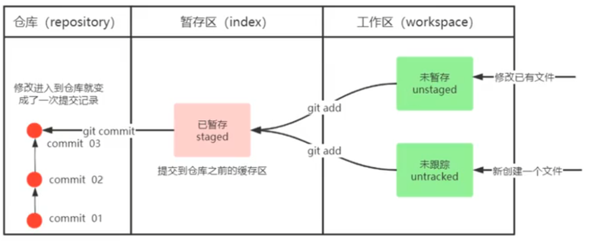

## git常用命令

```bash
git init  // 初始化一个本地仓库
git add .  // 将目录下的所有文件提交到暂存区
git commit -m 提交信息  // 提交到git本地仓库
git log // 打印提交信息
git reset --hard xxx // 快速回到其他提交节点
git push origin xxx // 推送到远程仓库 xxx为分支名
git status // 查看当前仓库状态
```

## 暂存区的作用？

在 `git` 中，暂存区（`Staging Area`） 是一个中间区域，用于存放你准备提交到本地仓库的文件变更。它的主要作用如下：

1. 选择性提交
   暂存区允许你选择哪些文件或文件的哪些部分要提交。例如，你可以将某些修改添加到暂存区，而保留其他修改不提交。

2. 分阶段提交
   通过 `git add` 命令，可以将文件逐步添加到暂存区，实现“分阶段提交”。这有助于保持提交记录清晰、有逻辑性。

3. 避免误提交
   在正式提交前，可以通过 `git status` 查看暂存区的内容，确认无误后再执行 `git commit`，从而减少错误提交的风险。

4. 支持大型项目管理
   对于大型项目，暂存区可以帮助开发者按功能模块或任务划分提交内容，提升协作效率和代码可追溯性。

## 工作区，暂存区，本地版本库



工作区 → 暂存区 `git add`

暂存区 → 本地库 `git commit`

查看状态 `git status`

查看提交记录 `git log`

美化输出

```bash
vim ~/.gitconfig
```

```bash
[alias]
  lg = log --color --graph --pretty=format:'%Cred%h%Creset -%C(yellow)%d%Creset %s %Cgreen(%cr) %C(bold blue)<%an>%Creset' --abbrev-commit --branches
```

版本回退

```bash
git reset --hard commitID
```

版本前进

```bash
git reflog  // 历史记录
git reset --hard commitID
```

## git忽略文件 .gitignore

前端常用`gitignore`

```bash
.DS_Store
node_modules
/dist


# local env files
.env.local
.env.*.local

# Log files
npm-debug.log*
yarn-debug.log*
yarn-error.log*
pnpm-debug.log*

# Editor directories and files
.idea
.vscode
*.suo
*.ntvs*
*.njsproj
*.sln
*.sw?

package-lock.json
yarn.lock
```
