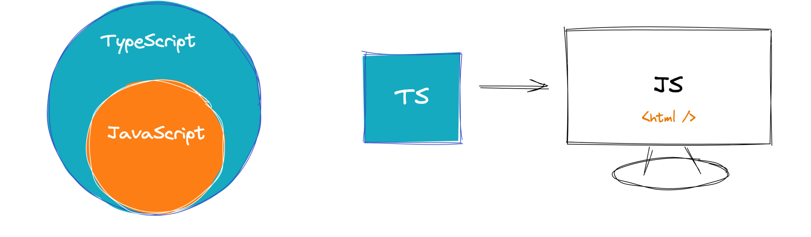
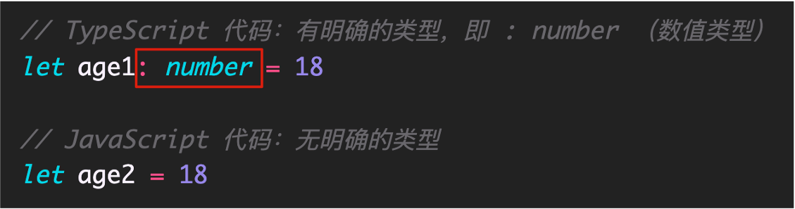

# TypeScript 起步

## 学习目标

- TypeScript 介绍 - 了解
- TypeScript 初体验 - 了解
- TypeScript 常用类型 - 掌握
- TypeScript 高级类型 - 掌握
- TypeScript 类型声明文件 - 掌握
- 在 Vue3 中使用 TypeScript - 掌握

## TypeScript 介绍

> 了解：`TS`是带类型语法的`JS`

官方网站：[https://www.typescriptlang.org/](https://www.typescriptlang.org/)

中文官网： [https://www.tslang.cn/](https://www.tslang.cn/)

## TypeScript 是什么

- `TypeScript` 简称：`TS`，是 `JavaScript` 的超集，简单来说就是：`JS` 有的 `TS` 都有
  
- `TypeScript` 是一种带有类型语法的 `JavaScript` 语言，简单来说就是：`type + js = ts`
  
- `TypeScript` 是微软开发的开源编程语言。可以在任何运行 `JavaScript` 的地方运行

> 注意：`TS` 需要编译才能在浏览器运行。

### 总结：

- `TS` 是 `JS` 的超集，支持`JS` 语法。
- `TS`自带类型系统，微软开发。

## TypeScript 作用

> 知道：`TS`作用是在编译时进行类型检查提示错误

### 发现：

- `JS` 存在“先天缺陷”，`JS` 中绝大部分错误都是类型错误（`Uncaught TypeError`）
- 这些错误，导致挺多的时间去定位和处理 `BUG`

### 原因：

- `JS` 是动态类型的编程语言，动态类型特点：只能在 `代码执行` 期间，做类型的相关检查，所以往往发现问题时，已经晚了。

### 方案：

- `TS` 是静态类型的编程语言，代码会先进行编译然后去执行，在 `代码编译` 期间做类型的相关检查，如果有问题编译是不通过的，也就暴露出了问题。
- 配合 `VSCode` 等开发工具，`TS` 可以提前到在 `编写代码` 的时候就能发现问题，更准确更快的处理错误。

### TS 优势：

- 更早发现错误，提高开发效率
- 随时随地提示，增强开发体验
- 强大类型系统，代码可维护性更好，重构代码更容易
- 趋势：`Vue3`源码`TS`重写，`React`和`TS`完美配合，`Angular`默认支持`TS`，大中型前端项目首选。

### 总结：

- `TypeScript` 属于静态类型的编程语，`JavaScript` 属于动态类型的编程语言。
- 开发效率高，开发体验好，前端流行趋势。

## TypeScript 编译

> 知道：如何使用 `tsc` 编译 `ts` 代码

### 全局安装：

```bash
# npm 安装
npm i -g typescript
# yarn 安装
yarn global add typescript
# 部分mac电脑安装需要sudo权限
# sudo npm i -g typescript
# sudo yarn global add typescript
```

### 查看版本：

```bash
tsc -v
```

### 编译 TS：

1. 新建 `hello.ts` 文件

2. 当前目录打开命令行窗口，执行 `tsc hello.ts` 命令，自动生成 `hello.js` 文件

3. 执行 `node hello.js` 验证一下

### 思考：

以后我们写 `ts` 都是手动的编译执行吗？
在开发中：一般使用 `webpack` `vite` 等工具自动构建编译。
