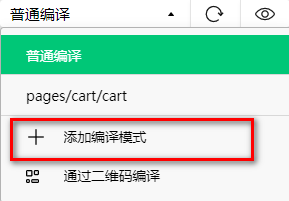
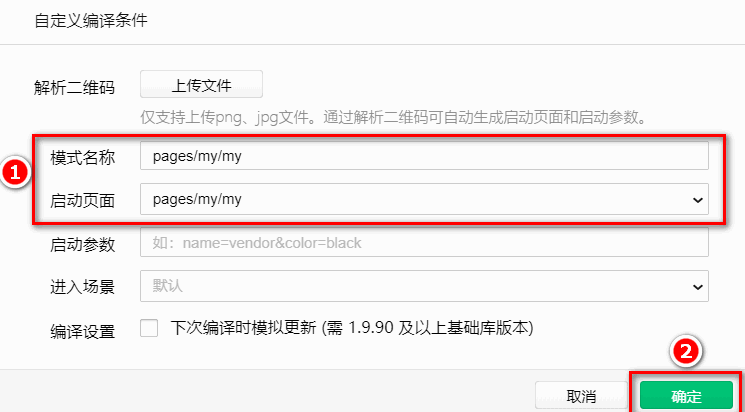
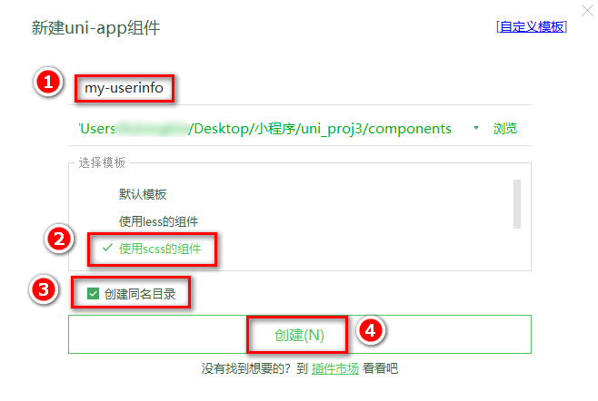

## 10. 登录与支付

### 10.0 创建 settle 分支

运行如下的命令，基于 `master` 分支在本地创建 `settle` 子分支，用来开发登录与支付相关的功能：

```bash
git checkout -b settle
```

### 10.1 点击结算按钮进行条件判断

说明：用户点击了结算按钮之后，需要先后判断 `是否勾选了要结算的商品`、`是否选择了收货地址`、`是否登录`。

在 `my-settle` 组件中，为结算按钮绑定点击事件处理函数：

```html
<!-- 结算按钮 -->
<view class="btn-settle" @click="settlement">结算({{checkedCount}})</view>
```

在 `my-settle` 组件的 `methods` 节点中声明 `settlement` 事件处理函数如下：

```js
// 点击了结算按钮
settlement() {
  // 1. 先判断是否勾选了要结算的商品
  if (!this.checkedCount) return uni.$showMsg('请选择要结算的商品！')

  // 2. 再判断用户是否选择了收货地址
  if (!this.addstr) return uni.$showMsg('请选择收货地址！')

  // 3. 最后判断用户是否登录了
  if (!this.token) return uni.$showMsg('请先登录！')
}
```

在 `my-settle` 组件中，使用 `mapGetters` 辅助函数，从 `m_user` 模块中将 `addstr` 映射到当前组件中使用：

```js{4-5}
export default {
  computed: {
    ...mapGetters("m_cart", ["total", "checkedCount", "checkedGoodsAmount"]),
    // addstr 是详细的收货地址
    ...mapGetters("m_user", ["addstr"]),
    isFullCheck() {
      return this.total === this.checkedCount;
    },
  },
};
```

在 `store/user.js` 模块的 `state` 节点中，声明 `token` 字符串：

```js{9-10}
export default {
  // 开启命名空间
  namespaced: true,

  // state 数据
  state: () => ({
    // 收货地址
    address: JSON.parse(uni.getStorageSync("address") || "{}"),
    // 登录成功之后的 token 字符串
    token: "",
  }),

  // 省略其它代码
};
```

在 `my-settle` 组件中，使用 `mapState` 辅助函数，从 `m_user` 模块中将 `token` 映射到当前组件中使用：

```js{8-9}
// 按需从 vuex 中导入 mapState 辅助函数
import { mapGetters, mapMutations, mapState } from "vuex";

export default {
  computed: {
    ...mapGetters("m_cart", ["total", "checkedCount", "checkedGoodsAmount"]),
    ...mapGetters("m_user", ["addstr"]),
    // token 是用户登录成功之后的 token 字符串
    ...mapState("m_user", ["token"]),
    isFullCheck() {
      return this.total === this.checkedCount;
    },
  },
};
```

### 10.2 登录

#### 10.2.1 定义 my 页面的编译模式

点击 `微信开发者工具` 工具栏上的编译模式下拉菜单，选择 `添加编译模式`：


勾选启动页面的路径之后，点击确定按钮：


#### 10.2.2 实现登录和用户信息组件的按需展示

在 `components` 目录中新建登录组件(`my-login`)：

在 `components` 目录中新建用户信息组件(`my-userinfo`)：


在 `my.vue` 页面中，通过 `mapState` 辅助函数，导入需要的 `token` 字符串：

```js{2-3,8-9}
import badgeMix from "@/mixins/tabbar-badge.js";
// 1. 从 vuex 中按需导入 mapState 辅助函数
import { mapState } from "vuex";

export default {
  mixins: [badgeMix],
  computed: {
    // 2. 从 m_user 模块中导入需要的 token 字符串
    ...mapState("m_user", ["token"]),
  },
  data() {
    return {};
  },
};
```

在 `my.vue` 页面中，实现登录组件和用户信息组件的按需展示：

```html{3-4,6-7}
<template>
  <view>
    <!-- 用户未登录时，显示登录组件 -->
    <my-login v-if="!token"></my-login>

    <!-- 用户登录后，显示用户信息组件 -->
    <my-userinfo v-else></my-userinfo>
  </view>
</template>
```

#### 10.2.3 实现登录组件的基本布局

为 `my-login` 组件定义如下的 `UI` 结构：

```html
<template>
  <view class="login-container">
    <!-- 提示登录的图标 -->
    <uni-icons type="contact-filled" size="100" color="#AFAFAF"></uni-icons>
    <!-- 登录按钮 -->
    <button type="primary" class="btn-login">一键登录</button>
    <!-- 登录提示 -->
    <view class="tips-text">登录后尽享更多权益</view>
  </view>
</template>
```

美化登录组件的样式：

```scss
.login-container {
  // 登录盒子的样式
  height: 750rpx;
  display: flex;
  flex-direction: column;
  align-items: center;
  justify-content: center;
  background-color: #f8f8f8;
  position: relative;
  overflow: hidden;

  // 绘制登录盒子底部的半椭圆造型
  &::after {
    content: " ";
    display: block;
    position: absolute;
    width: 100%;
    height: 40px;
    left: 0;
    bottom: 0;
    background-color: white;
    border-radius: 100%;
    transform: translateY(50%);
  }

  // 登录按钮的样式
  .btn-login {
    width: 90%;
    border-radius: 100px;
    margin: 15px 0;
    background-color: #c00000;
  }

  // 按钮下方提示消息的样式
  .tips-text {
    font-size: 12px;
    color: gray;
  }
}
```

#### 10.2.4 点击登录按钮获取微信用户的基本信息

需求描述：需要获取微信用户的头像、昵称等基本信息。

为登录的 `button` 按钮绑定 `open-type="getUserInfo"` 属性，表示点击按钮时，希望获取用户的基本信息：

```html
<!-- 登录按钮 -->
<!-- 可以从 @getuserinfo 事件处理函数的形参中，获取到用户的基本信息 -->
<button
  type="primary"
  class="btn-login"
  open-type="getUserInfo"
  @getuserinfo="getUserInfo"
>
  一键登录
</button>
```

在 `methods` 节点中声明 `getUserInfo` 事件处理函数如下：

```js
methods: {
  // 获取微信用户的基本信息
  getUserInfo(e) {
    // 判断是否获取用户信息成功
    if (e.detail.errMsg === 'getUserInfo:fail auth deny') return uni.$showMsg('您取消了登录授权！')

    // 获取用户信息成功， e.detail.userInfo 就是用户的基本信息
    console.log(e.detail.userInfo)
  }
}
```

#### 10.2.5 将用户的基本信息存储到 vuex

在 `store/user.js` 模块的 `state` 节点中，声明 `userinfo` 的信息对象如下：

```js{8-9}
// state 数据
state: () => ({
  // 收货地址
  // address: {}
  address: JSON.parse(uni.getStorageSync('address') || '{}'),
  // 登录成功之后的 token 字符串
  token: '',
  // 用户的基本信息
  userinfo: JSON.parse(uni.getStorageSync('userinfo') || '{}')
}),
```

在 `store/user.js` 模块的 `mutations` 节点中，声明如下的两个方法：

```js{5-10,12-15}
// 方法
mutations: {
  // 省略其它代码...

  // 更新用户的基本信息
  updateUserInfo(state, userinfo) {
    state.userinfo = userinfo
    // 通过 this.commit() 方法，调用 m_user 模块下的 saveUserInfoToStorage 方法，将 userinfo 对象持久化存储到本地
    this.commit('m_user/saveUserInfoToStorage')
  },

  // 将 userinfo 持久化存储到本地
  saveUserInfoToStorage(state) {
    uni.setStorageSync('userinfo', JSON.stringify(state.userinfo))
  }
}
```

使用 `mapMutations` 辅助函数，将需要的方法映射到 `my-login` 组件中使用：

```js{1-2,9-10,19-20}
// 1. 按需导入 mapMutations 辅助函数
import { mapMutations } from "vuex";

export default {
  data() {
    return {};
  },
  methods: {
    // 2. 调用 mapMutations 辅助方法，把 m_user 模块中的 updateUserInfo 映射到当前组件中使用
    ...mapMutations("m_user", ["updateUserInfo"]),
    // 获取微信用户的基本信息
    getUserInfo(e) {
      // 判断是否获取用户信息成功
      if (e.detail.errMsg === "getUserInfo:fail auth deny")
        return uni.$showMsg("您取消了登录授权！");
      // 获取用户信息成功， e.detail.userInfo 就是用户的基本信息
      // console.log(e.detail.userInfo)

      // 3. 将用户的基本信息存储到 vuex 中
      this.updateUserInfo(e.detail.userInfo);
    },
  },
};
```

#### 10.2.6 登录获取 Token 字符串

需求说明：当获取到了微信用户的基本信息之后，还需要进一步调用登录相关的接口，从而换取登录成功之后的 `Token` 字符串。

在 `getUserInfo` 方法中，预调用 `this.getToken()` 方法，同时把获取到的用户信息传递进去：

```js{9-10}
// 获取微信用户的基本信息
getUserInfo(e) {
  // 判断是否获取用户信息成功
  if (e.detail.errMsg === 'getUserInfo:fail auth deny') return uni.$showMsg('您取消了登录授权！')

  // 将用户的基本信息存储到 vuex 中
  this.updateUserInfo(e.detail.userInfo)

  // 获取登录成功后的 Token 字符串
  this.getToken(e.detail)
}
```

在 `methods` 中定义 `getToken` 方法，调用登录相关的 `API`，实现登录的功能：

```js
// 调用登录接口，换取永久的 token
async getToken(info) {
  // 调用微信登录接口
  // const [err, res] = await uni.login().catch(err => err)
  // 判断是否 uni.login() 调用失败
  // if (err || res.errMsg !== 'login:ok') return uni.$showError('登录失败！')
  const res = await uni.login().catch(err => err)
    // 判断是否 uni.login() 调用失败
    if (res.errMsg !== 'login:ok') return uni.$showError('登录失败！')

  // 准备参数对象
  const query = {
    code: res.code,
    encryptedData: info.encryptedData,
    iv: info.iv,
    rawData: info.rawData,
    signature: info.signature
  }

  // 换取 token
  const { data: loginResult } = await uni.$http.post('/api/public/v1/users/wxlogin', query)
  if (loginResult.meta.status !== 200) return uni.$showMsg('登录失败！')
  uni.$showMsg('登录成功')
}
```

#### 10.2.7 将 Token 存储到 vuex

在 `store/user.js` 模块的 `mutations` 节点中，声明如下的两个方法：

```js
mutations: {
  // 省略其它代码...

  // 更新 token 字符串
  updateToken(state, token) {
    state.token = token
    // 通过 this.commit() 方法，调用 m_user 模块下的 saveTokenToStorage 方法，将 token 字符串持久化存储到本地
    this.commit('m_user/saveTokenToStorage')
  },

  // 将 token 字符串持久化存储到本地
  saveTokenToStorage(state) {
    uni.setStorageSync('token', state.token)
  }
}
```

修改 `store/user.js` 模块的 `state` 节点如下：

```js{5-6}
// state 数据
state: () => ({
  // 收货地址
  address: JSON.parse(uni.getStorageSync('address') || '{}'),
  // 登录成功之后的 token 字符串
  token: uni.getStorageSync('token') || '',
  // 用户的基本信息
  userinfo: JSON.parse(uni.getStorageSync('userinfo') || '{}')
}),
```

在 `my-login` 组件中，把 `vuex` 中的 `updateToken` 方法映射到当前组件中使用：

```js{2-3,27-28}
methods: {
  // 1. 使用 mapMutations 辅助方法，把 m_user 模块中的 updateToken 方法映射到当前组件中使用
  ...mapMutations('m_user', ['updateUserInfo', 'updateToken'])

  // 省略其它代码...

  // 调用登录接口，换取永久的 token
  async getToken(info) {
    // 调用微信登录接口
    const [err, res] = await uni.login().catch(err => err)
    // 判断是否 uni.login() 调用失败
    if (err || res.errMsg !== 'login:ok') return uni.$showError('登录失败！')

    // 准备参数对象
    const query = {
      code: res.code,
      encryptedData: info.encryptedData,
      iv: info.iv,
      rawData: info.rawData,
      signature: info.signature
    }

    // 换取 token
    const { data: loginResult } = await uni.$http.post('/api/public/v1/users/wxlogin', query)
    if (loginResult.meta.status !== 200) return uni.$showMsg('登录失败！')

    // 2. 更新 vuex 中的 token
    this.updateToken(loginResult.message.token)
  }
}
```

### 10.3 用户信息

#### 10.3.1 实现用户头像昵称区域的基本布局

在 `my-userinfo` 组件中，定义如下的 `UI` 结构：

```html
<template>
  <view class="my-userinfo-container">
    <!-- 头像昵称区域 -->
    <view class="top-box">
      <image src="" class="avatar"></image>
      <view class="nickname">xxx</view>
    </view>
  </view>
</template>
```

美化当前组件的样式：

```scss
.my-userinfo-container {
  height: 100%;
  // 为整个组件的结构添加浅灰色的背景
  background-color: #f4f4f4;

  .top-box {
    height: 400rpx;
    background-color: #c00000;
    display: flex;
    flex-direction: column;
    align-items: center;
    justify-content: center;

    .avatar {
      display: block;
      width: 90px;
      height: 90px;
      border-radius: 45px;
      border: 2px solid white;
      box-shadow: 0 1px 5px black;
    }

    .nickname {
      color: white;
      font-weight: bold;
      font-size: 16px;
      margin-top: 10px;
    }
  }
}
```

在 `my.vue` 页面中，为最外层包裹性质的 `view` 容器，添加` class="my-container"` 的类名，并美化样式如下：

```scss
page,
.my-container {
  height: 100%;
}
```

#### 10.3.2 渲染用户的头像和昵称

在 `my-userinfo` 组件中，通过 `mapState` 辅助函数，将需要的成员映射到当前组件中使用：

```js{1-2,6-7}
// 按需导入 mapState 辅助函数
import { mapState } from "vuex";

export default {
  computed: {
    // 将 m_user 模块中的 userinfo 映射到当前页面中使用
    ...mapState("m_user", ["userinfo"]),
  },
  data() {
    return {};
  },
};
```

将用户的头像和昵称渲染到页面中：

```html{3-4}
<!-- 头像昵称区域 -->
<view class="top-box">
  <image :src="userinfo.avatarUrl" class="avatar"></image>
  <view class="nickname">{{userinfo.nickName}}</view>
</view>
```

#### 10.3.3 渲染第一个面板区域

在 `my-userinfo` 组件中，定义如下的 `UI` 结构：

```html
<!-- 面板的列表区域 -->
<view class="panel-list">
  <!-- 第一个面板 -->
  <view class="panel">
    <!-- panel 的主体区域 -->
    <view class="panel-body">
      <!-- panel 的 item 项 -->
      <view class="panel-item">
        <text>8</text>
        <text>收藏的店铺</text>
      </view>
      <view class="panel-item">
        <text>14</text>
        <text>收藏的商品</text>
      </view>
      <view class="panel-item">
        <text>18</text>
        <text>关注的商品</text>
      </view>
      <view class="panel-item">
        <text>84</text>
        <text>足迹</text>
      </view>
    </view>
  </view>

  <!-- 第二个面板 -->

  <!-- 第三个面板 -->
</view>
```

美化第一个面板的样式：

```scss
.panel-list {
  padding: 0 10px;
  position: relative;
  top: -10px;

  .panel {
    background-color: white;
    border-radius: 3px;
    margin-bottom: 8px;

    .panel-body {
      display: flex;
      justify-content: space-around;

      .panel-item {
        display: flex;
        flex-direction: column;
        align-items: center;
        justify-content: space-around;
        font-size: 13px;
        padding: 10px 0;
      }
    }
  }
}
```

#### 10.3.4 渲染第二个面板区域

定义第二个面板区域的 `UI` 结构：

```html
<!-- 第二个面板 -->
<view class="panel">
  <!-- 面板的标题 -->
  <view class="panel-title">我的订单</view>
  <!-- 面板的主体 -->
  <view class="panel-body">
    <!-- 面板主体中的 item 项 -->
    <view class="panel-item">
      <image src="/static/my-icons/icon1.png" class="icon"></image>
      <text>待付款</text>
    </view>
    <view class="panel-item">
      <image src="/static/my-icons/icon2.png" class="icon"></image>
      <text>待收货</text>
    </view>
    <view class="panel-item">
      <image src="/static/my-icons/icon3.png" class="icon"></image>
      <text>退款/退货</text>
    </view>
    <view class="panel-item">
      <image src="/static/my-icons/icon4.png" class="icon"></image>
      <text>全部订单</text>
    </view>
  </view>
</view>
```

对之前的 `SCSS` 样式进行改造，从而美化第二个面板的样式：

```scss{11-16,30-33}
.panel-list {
  padding: 0 10px;
  position: relative;
  top: -10px;

  .panel {
    background-color: white;
    border-radius: 3px;
    margin-bottom: 8px;

    .panel-title {
      line-height: 45px;
      padding-left: 10px;
      font-size: 15px;
      border-bottom: 1px solid #f4f4f4;
    }

    .panel-body {
      display: flex;
      justify-content: space-around;

      .panel-item {
        display: flex;
        flex-direction: column;
        align-items: center;
        justify-content: space-around;
        font-size: 13px;
        padding: 10px 0;

        .icon {
          width: 35px;
          height: 35px;
        }
      }
    }
  }
}
```

#### 10.3.5 渲染第三个面板区域

定义第三个面板区域的 `UI` 结构：

```html
<!-- 第三个面板 -->
<view class="panel">
  <view class="panel-list-item">
    <text>收货地址</text>
    <uni-icons type="arrowright" size="15"></uni-icons>
  </view>
  <view class="panel-list-item">
    <text>联系客服</text>
    <uni-icons type="arrowright" size="15"></uni-icons>
  </view>
  <view class="panel-list-item">
    <text>退出登录</text>
    <uni-icons type="arrowright" size="15"></uni-icons>
  </view>
</view>
```

美化第三个面板区域的样式：

```scss
.panel-list-item {
  height: 45px;
  display: flex;
  justify-content: space-between;
  align-items: center;
  font-size: 15px;
  padding: 0 10px;
}
```

#### 10.3.6 实现退出登录的功能

为第三个面板区域中的 `退出登录` 项绑定 `click` 点击事件处理函数：

```html{1}
<view class="panel-list-item" @click="logout">
  <text>退出登录</text>
  <uni-icons type="arrowright" size="15"></uni-icons>
</view>
```

在 `my-userinfo` 组件的 `methods` 节点中定义 `logout` 事件处理函数：

```js
// 退出登录
async logout() {
  // 询问用户是否退出登录
  const [err, succ] = await uni.showModal({
    title: '提示',
    content: '确认退出登录吗？'
  }).catch(err => err)

  if (succ && succ.confirm) {
     // 用户确认了退出登录的操作
     // 需要清空 vuex 中的 userinfo、token 和 address
     this.updateUserInfo({})
     this.updateToken('')
     this.updateAddress({})
  }
}
```

使用 `mapMutations` 辅助方法，将需要用到的 `mutations` 方法映射到当前组件中：

```js{1-2,6-10}
// 按需导入辅助函数
import { mapState, mapMutations } from "vuex";

export default {
  methods: {
    ...mapMutations("m_user", [
      "updateUserInfo",
      "updateToken",
      "updateAddress",
    ]),
  },
};
```

### 10.4 三秒后自动跳转

#### 10.4.1 三秒后自动跳转到登录页面

需求描述：在购物车页面，当用户点击 `“结算”` 按钮时，如果用户没有登录，则 `3 秒`后自动跳转到登录页面

在 `my-settle` 组件的 `methods` 节点中，声明一个叫做 `showTips` 的方法，专门用来展示倒计时的提示消息：

```js
// 展示倒计时的提示消息
showTips(n) {
  // 调用 uni.showToast() 方法，展示提示消息
  uni.showToast({
    // 不展示任何图标
    icon: 'none',
    // 提示的消息
    title: '请登录后再结算！' + n + ' 秒后自动跳转到登录页',
    // 为页面添加透明遮罩，防止点击穿透
    mask: true,
    // 1.5 秒后自动消失
    duration: 1500
  })
}
```

在 `data` 节点中声明倒计时的秒数：

```js{3-4}
data() {
  return {
    // 倒计时的秒数
    seconds: 3
  }
}
```

改造 `结算` 按钮的 `click` 事件处理函数，如果用户没有登录，则预调用一个叫做 `delayNavigate` 的方法，进行倒计时的导航跳转：

```js{9-11}
// 点击了结算按钮
settlement() {
  // 1. 先判断是否勾选了要结算的商品
  if (!this.checkedCount) return uni.$showMsg('请选择要结算的商品！')

  // 2. 再判断用户是否选择了收货地址
  if (!this.addstr) return uni.$showMsg('请选择收货地址！')

  // 3. 最后判断用户是否登录了，如果没有登录，则调用 delayNavigate() 进行倒计时的导航跳转
  // if (!this.token) return uni.$showMsg('请先登录！')
  if (!this.token) return this.delayNavigate()
},
```

定义 `delayNavigate` 方法，初步实现倒计时的提示功能：

```js
// 延迟导航到 my 页面
delayNavigate() {
  // 1. 展示提示消息，此时 seconds 的值等于 3
  this.showTips(this.seconds)

  // 2. 创建定时器，每隔 1 秒执行一次
  setInterval(() => {
    // 2.1 先让秒数自减 1
    this.seconds--
    // 2.2 再根据最新的秒数，进行消息提示
    this.showTips(this.seconds)
  }, 1000)
},
```

上述代码的问题：定时器不会自动停止，此时秒数会出现`等于 0` 或`小于 0` 的情况！

在 `data` 节点中声明定时器的 `Id` 如下：

```js{5-6}
data() {
  return {
    // 倒计时的秒数
    seconds: 3,
    // 定时器的 Id
    timer: null
  }
}
```

改造 `delayNavigate` 方法如下：

```js{5-21}
// 延迟导航到 my 页面
delayNavigate() {
  this.showTips(this.seconds)

  // 1. 将定时器的 Id 存储到 timer 中
  this.timer = setInterval(() => {
    this.seconds--

    // 2. 判断秒数是否 <= 0
    if (this.seconds <= 0) {
      // 2.1 清除定时器
      clearInterval(this.timer)

      // 2.2 跳转到 my 页面
      uni.switchTab({
        url: '/pages/my/my'
      })

      // 2.3 终止后续代码的运行（当秒数为 0 时，不再展示 toast 提示消息）
      return
    }

    this.showTips(this.seconds)
  }, 1000)
},
```

上述代码的问题：`seconds` 秒数不会被重置，导致`第 2 次`，`3 次`，`n 次` 的倒计时跳转功能无法正常工作

进一步改造 `delayNavigate` 方法，在执行此方法时，立即将 `seconds` 秒数重置为 `3` 即可：

```js{3-4}
// 延迟导航到 my 页面
delayNavigate() {
  // 把 data 中的秒数重置成 3 秒
  this.seconds = 3
  this.showTips(this.seconds)

  this.timer = setInterval(() => {
    this.seconds--

    if (this.seconds <= 0) {
      clearInterval(this.timer)
      uni.switchTab({
        url: '/pages/my/my'
      })
      return
    }

    this.showTips(this.seconds)
  }, 1000)
}
```

#### 10.4.2 登录成功之后再返回之前的页面

核心实现思路：在自动跳转到登录页面成功之后，把返回页面的信息存储到 `vuex` 中，从而方便登录成功之后，根据返回页面的信息重新跳转回去。

返回页面的信息对象，主要包含 `{ openType, from }` 两个属性，其中 `openType` 表示以哪种方式导航回之前的页面；`from` 表示之前页面的 `url` 地址；

在 `store/user.js` 模块的 `state` 节点中，声明一个叫做 `redirectInfo` 的对象如下：

```js{9-10}
// state 数据
state: () => ({
  // 收货地址
  address: JSON.parse(uni.getStorageSync('address') || '{}'),
  // 登录成功之后的 token 字符串
  token: uni.getStorageSync('token') || '',
  // 用户的基本信息
  userinfo: JSON.parse(uni.getStorageSync('userinfo') || '{}'),
  // 重定向的 object 对象 { openType, from }
  redirectInfo: null
}),
```

在 `store/user.js` 模块的 `mutations` 节点中，声明一个叫做 `updateRedirectInfo` 的方法：

```js{2-5}
mutations: {
  // 更新重定向的信息对象
  updateRedirectInfo(state, info) {
    state.redirectInfo = info
  }
}
```

在 `my-settle` 组件中，通过 `mapMutations` 辅助方法，把 `m_user` 模块中的 `updateRedirectInfo` 方法映射到当前页面中使用：

```js
methods: {
  // 把 m_user 模块中的 updateRedirectInfo 方法映射到当前页面中使用
  ...mapMutations('m_user', ['updateRedirectInfo']),
}
```

改造 `my-settle` 组件 `methods` 节点中的 `delayNavigate` 方法，当成功跳转到 `my` 页面 之后，将重定向的信息对象存储到 `vuex` 中：

```js{16-25}
// 延迟导航到 my 页面
delayNavigate() {
  // 把 data 中的秒数重置成 3 秒
  this.seconds = 3
  this.showTips(this.seconds)

  this.timer = setInterval(() => {
    this.seconds--

    if (this.seconds <= 0) {
      // 清除定时器
      clearInterval(this.timer)
      // 跳转到 my 页面
      uni.switchTab({
        url: '/pages/my/my',
        // 页面跳转成功之后的回调函数
        success: () => {
          // 调用 vuex 的 updateRedirectInfo 方法，把跳转信息存储到 Store 中
          this.updateRedirectInfo({
            // 跳转的方式
            openType: 'switchTab',
            // 从哪个页面跳转过去的
            from: '/pages/cart/cart'
          })
        }
      })

      return
    }

    this.showTips(this.seconds)
  }, 1000)
}
```

在 `my-login` 组件中，通过 `mapState` 和 `mapMutations` 辅助方法，将 `vuex` 中需要的数据和方法，映射到当前页面中使用：

```js{1-2,6-7,10-15}
// 按需导入辅助函数
import { mapMutations, mapState } from "vuex";

export default {
  computed: {
    // 调用 mapState 辅助方法，把 m_user 模块中的数据映射到当前用组件中使用
    ...mapState("m_user", ["redirectInfo"]),
  },
  methods: {
    // 调用 mapMutations 辅助方法，把 m_user 模块中的方法映射到当前组件中使用
    ...mapMutations("m_user", [
      "updateUserInfo",
      "updateToken",
      "updateRedirectInfo",
    ]),
  },
};
```

改造 `my-login` 组件中的 `getToken` 方法，当登录成功之后，预调用 `this.navigateBack()` 方法返回登录之前的页面：

```js{5-8}
// 调用登录接口，换取永久的 token
async getToken(info) {
  // 省略其它代码...

  // 判断 vuex 中的 redirectInfo 是否为 null
  // 如果不为 null，则登录成功之后，需要重新导航到对应的页面
  this.navigateBack()
}
```

在 `my-login` 组件中，声明 `navigateBack` 方法如下：

```js
// 返回登录之前的页面
navigateBack() {
  // redirectInfo 不为 null，并且导航方式为 switchTab
  if (this.redirectInfo && this.redirectInfo.openType === 'switchTab') {
    // 调用小程序提供的 uni.switchTab() API 进行页面的导航
    uni.switchTab({
      // 要导航到的页面地址
      url: this.redirectInfo.from,
      // 导航成功之后，把 vuex 中的 redirectInfo 对象重置为 null
      complete: () => {
        this.updateRedirectInfo(null)
      }
    })
  }
}
```

### 10.5 微信支付

#### 10.5.1 在请求头中添加 Token 身份认证的字段

原因说明：只有在登录之后才允许调用支付相关的接口，所以必须为有权限的接口添加身份认证的请求头字段

打开项目根目录下的 `main.js`，改造 `$http.beforeRequest` 请求拦截器中的代码如下：

```js{7-14}
// 请求开始之前做一些事情
$http.beforeRequest = function (options) {
  uni.showLoading({
    title: "数据加载中...",
  });

  // 判断请求的是否为有权限的 API 接口
  if (options.url.indexOf("/my/") !== -1) {
    // 为请求头添加身份认证字段
    options.header = {
      // 字段的值可以直接从 vuex 中进行获取
      Authorization: store.state.m_user.token,
    };
  }
};
```

#### 10.5.2 微信支付的流程

创建订单

请求创建订单的 `API` 接口：把（订单金额、收货地址、订单中包含的商品信息）发送到服务器

服务器响应的结果：订单编号

订单预支付

请求订单预支付的 `API` 接口：把（订单编号）发送到服务器

服务器响应的结果：订单预支付的参数对象，里面包含了订单支付相关的必要参数

发起微信支付

调用 `uni.requestPayment()` 这个 `API`，发起微信支付；把`步骤 2` 得到的 `“订单预支付对象”` 作为参数传递给 `uni.requestPayment()` 方法

监听 `uni.requestPayment()` 这个 `API` 的 `success，fail，complete` 回调函数

#### 10.5.3 创建订单

改造 `my-settle` 组件中的 `settlement` 方法，当前三个判断条件通过之后，调用实现微信支付的方法：

```js{13-14}
// 点击了结算按钮
settlement() {
  // 1. 先判断是否勾选了要结算的商品
  if (!this.checkedCount) return uni.$showMsg('请选择要结算的商品！')

  // 2. 再判断用户是否选择了收货地址
  if (!this.addstr) return uni.$showMsg('请选择收货地址！')

  // 3. 最后判断用户是否登录了
  // if (!this.token) return uni.$showMsg('请先登录！')
  if (!this.token) return this.delayNavigate()

  // 4. 实现微信支付功能
  this.payOrder()
},
```

在 `my-settle` 组件中定义 `payOrder` 方法如下，先实现创建订单的功能：

```js{3-17}
// 微信支付
async payOrder() {
  // 1. 创建订单
  // 1.1 组织订单的信息对象
  const orderInfo = {
    // 开发期间，注释掉真实的订单价格，
    // order_price: this.checkedGoodsAmount,
    // 写死订单总价为 1 分钱
    order_price: 0.01,
    consignee_addr: this.addstr,
    goods: this.cart.filter(x => x.goods_state).map(x => ({ goods_id: x.goods_id, goods_number: x.goods_count, goods_price: x.goods_price }))
  }
  // 1.2 发起请求创建订单
  const { data: res } = await uni.$http.post('/api/public/v1/my/orders/create', orderInfo)
  if (res.meta.status !== 200) return uni.$showMsg('创建订单失败！')
  // 1.3 得到服务器响应的“订单编号”
  const orderNumber = res.message.order_number

   // 2. 订单预支付

   // 3. 发起微信支付
 }
```

#### 10.5.4 订单预支付

改造 `my-settle` 组件的 `payOrder` 方法，实现订单预支付功能：

```js{19-25}
// 微信支付
async payOrder() {
  // 1. 创建订单
  // 1.1 组织订单的信息对象
  const orderInfo = {
    // 开发期间，注释掉真实的订单价格，
    // order_price: this.checkedGoodsAmount,
    // 写死订单总价为 1 分钱
    order_price: 0.01,
    consignee_addr: this.addstr,
    goods: this.cart.filter(x => x.goods_state).map(x => ({ goods_id: x.goods_id, goods_number: x.goods_count, goods_price: x.goods_price }))
  }
  // 1.2 发起请求创建订单
  const { data: res } = await uni.$http.post('/api/public/v1/my/orders/create', orderInfo)
  if (res.meta.status !== 200) return uni.$showMsg('创建订单失败！')
  // 1.3 得到服务器响应的“订单编号”
  const orderNumber = res.message.order_number

  // 2. 订单预支付
  // 2.1 发起请求获取订单的支付信息
  const { data: res2 } = await uni.$http.post('/api/public/v1/my/orders/req_unifiedorder', { order_number: orderNumber })
  // 2.2 预付订单生成失败
  if (res2.meta.status !== 200) return uni.$showError('预付订单生成失败！')
  // 2.3 得到订单支付相关的必要参数
  const payInfo = res2.message.pay

   // 3. 发起微信支付
 }
```

#### 10.5.5 发起微信支付

改造 `my-settle` 组件的 `payOrder` 方法，实现微信支付的功能：

```js{27-40}
// 微信支付
async payOrder() {
  // 1. 创建订单
  // 1.1 组织订单的信息对象
  const orderInfo = {
    // 开发期间，注释掉真实的订单价格，
    // order_price: this.checkedGoodsAmount,
    // 写死订单总价为 1 分钱
    order_price: 0.01,
    consignee_addr: this.addstr,
    goods: this.cart.filter(x => x.goods_state).map(x => ({ goods_id: x.goods_id, goods_number: x.goods_count, goods_price: x.goods_price }))
  }
  // 1.2 发起请求创建订单
  const { data: res } = await uni.$http.post('/api/public/v1/my/orders/create', orderInfo)
  if (res.meta.status !== 200) return uni.$showMsg('创建订单失败！')
  // 1.3 得到服务器响应的“订单编号”
  const orderNumber = res.message.order_number

   // 2. 订单预支付
   // 2.1 发起请求获取订单的支付信息
   const { data: res2 } = await uni.$http.post('/api/public/v1/my/orders/req_unifiedorder', { order_number: orderNumber })
   // 2.2 预付订单生成失败
   if (res2.meta.status !== 200) return uni.$showError('预付订单生成失败！')
   // 2.3 得到订单支付相关的必要参数
   const payInfo = res2.message.pay

   // 3. 发起微信支付
   // 3.1 调用 uni.requestPayment() 发起微信支付
   const [err, succ] = await uni.requestPayment(payInfo)
   // 3.2 未完成支付
   if (err) return uni.$showMsg('订单未支付！')
   // 3.3 完成了支付，进一步查询支付的结果
   const { data: res3 } = await uni.$http.post('/api/public/v1/my/orders/chkOrder', { order_number: orderNumber })
   // 3.4 检测到订单未支付
   if (res3.meta.status !== 200) return uni.$showMsg('订单未支付！')
   // 3.5 检测到订单支付完成
   uni.showToast({
     title: '支付完成！',
     icon: 'success'
   })
 }
```

### 10.6 分支的合并与提交

1. 将 `settle` 分支进行本地提交：

```bash
git add .
git commit -m "完成了登录和支付功能的开发"
```

2. 将本地的 `settle` 分支推送到码云：

```bash
git push -u origin settle
```

3. 将本地 `settle` 分支中的代码合并到 `master` 分支：

```bash
git checkout master
git merge settle
git push
```

4. 删除本地的 `settle` 分支：

```bash
git branch -d settle
```

