## 11. 发布

### 11.1 为什么要发布

1. 小程序只有发布之后，才能被用户搜索并使用

2. 开发期间的小程序为了便于调试，含有 `sourcemap` 相关的文件，并且代码没有被压缩，因此体积较大，不适合直接当作线上版本进行发布

3. 通过执行 `“小程序发布”`，能够优化小程序的体积，提高小程序的运行性能

### 11.2 发布小程序的流程

1. 点击 `HBuilderX` 菜单栏上的 发行 -> 小程序-微信(仅适用于`uni-app`)：

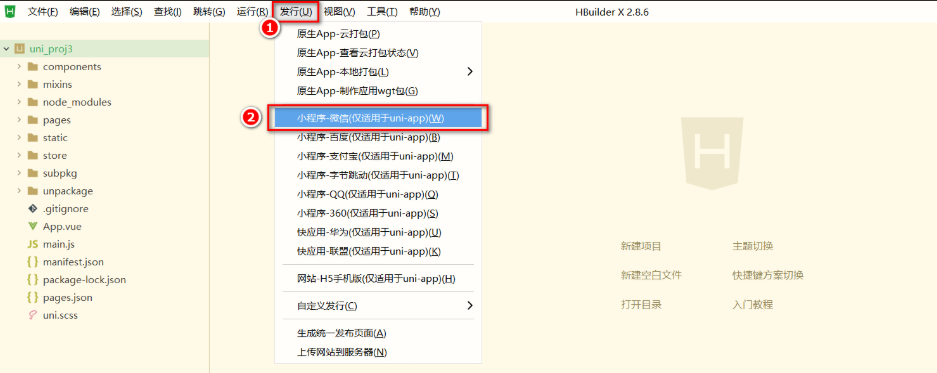

2. 在弹出框中填写要发布的小程序的名称和`AppId`之后，点击发行按钮：

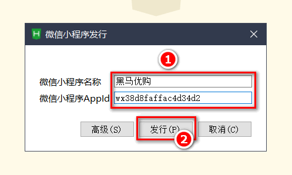

3. 在 `HBuilderX` 的控制台中查看小程序发布编译的进度：
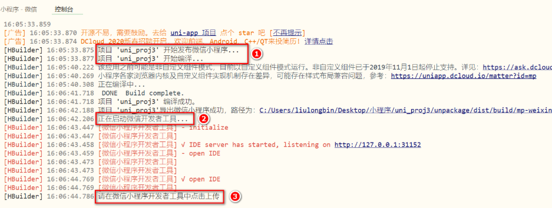

4. 发布编译完成之后，会自动打开一个新的微信开发者工具界面，此时，点击工具栏上的上传按钮：
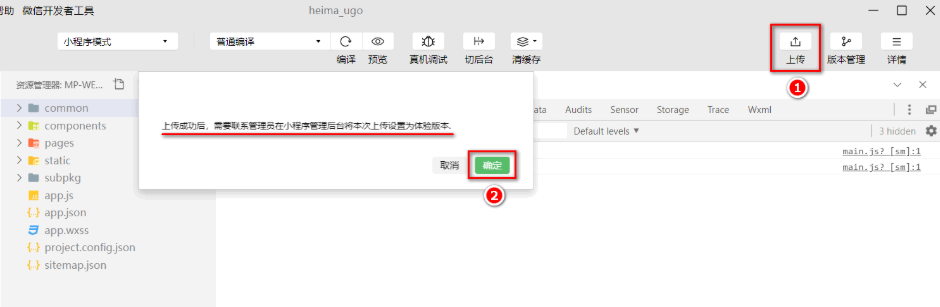

5. 填写版本号和项目备注之后，点击上传按钮：
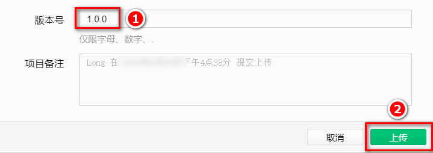

6. 上传完成之后，会出现如下的提示消息，直接点击确定按钮即可：
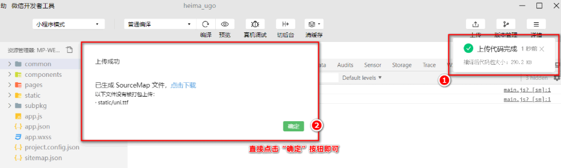

通过微信开发者工具上传的代码，默认处于版本管理的开发版本列表中，如图所示：
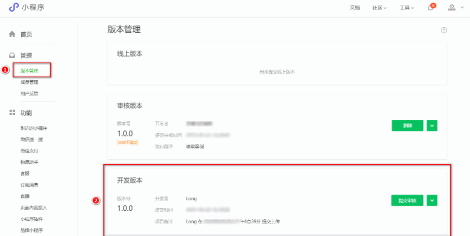

将 开发版本提交审核 -> 再将 审核通过的版本发布上线，即可实现小程序的发布和上线：
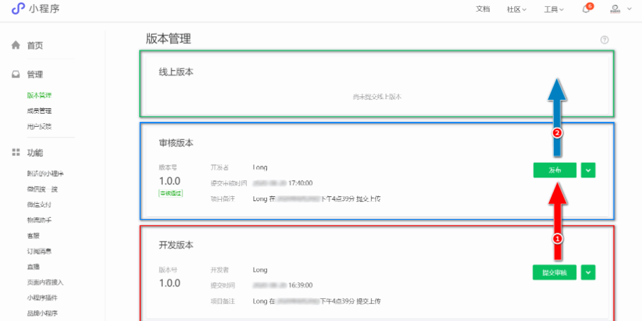

### 11.3 发布为 Android App 的流程

1. 点击 `HBuilderX` 状态栏左侧的未登录按钮，弹出登录的对话框：
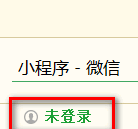

2. 在弹出的登录对话框中，填写账号和密码之后，点击登录即可：
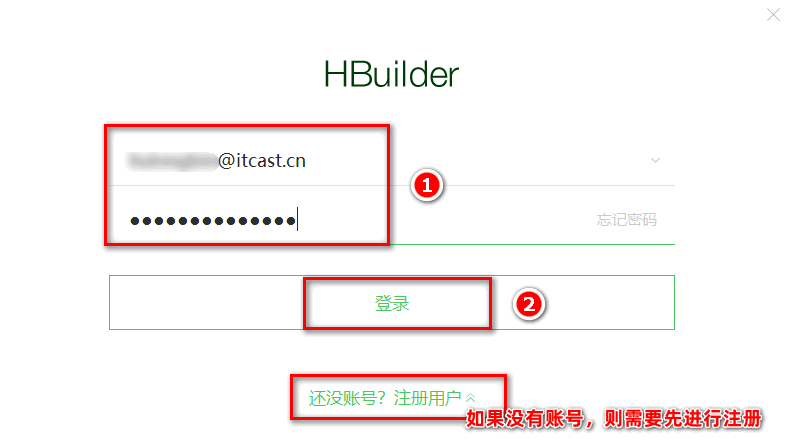

3. 打开项目根目录中的 `manifest.json` 配置文件，在基础配置面板中，获取`uni-app` 应用标识，并填写应用名称：
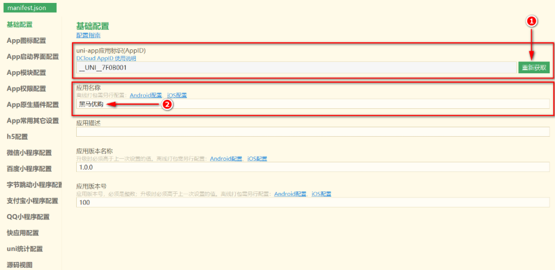

4. 切换到 `App` 图标配置面板，点击浏览按钮，选择合适的图片之后，再点击自动生成所有图标并替换即可：
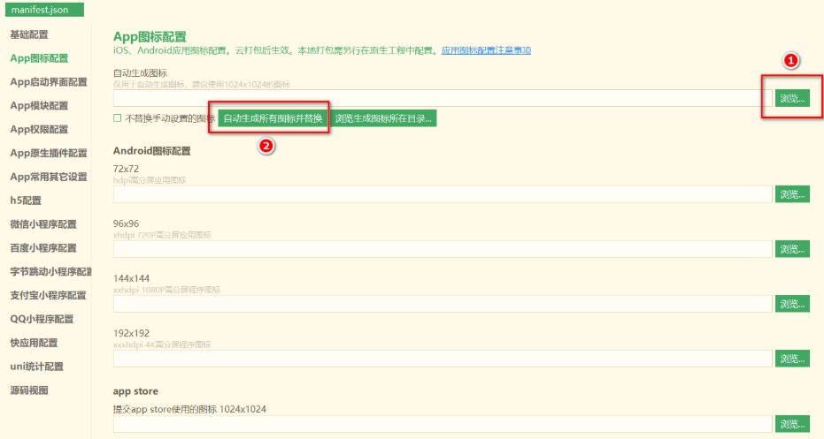

5. 点击菜单栏上的 `发行` -> `原生 App-云打包`：
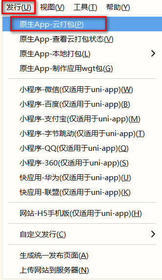

6. 勾选打包配置如下：
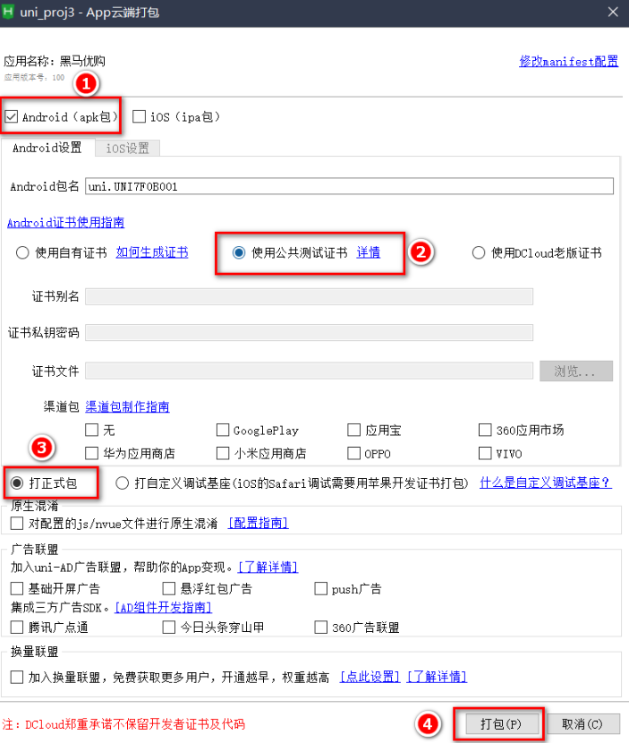

7. 在控制台中查看打包的进度信息：
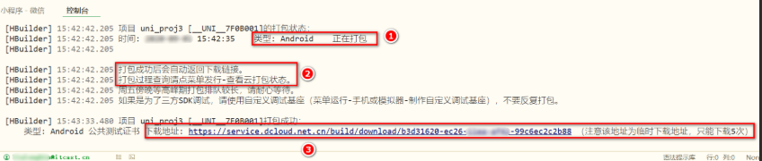

8. 点击链接下载 `apk` 的安装包，并安装到 `Android` 手机中查看打包的效果。

> 注意：由于开发期间没有进行多端适配，所以有些功能在 `App` 中无法正常运行，例如：选择收货地址、微信登录、微信支付

