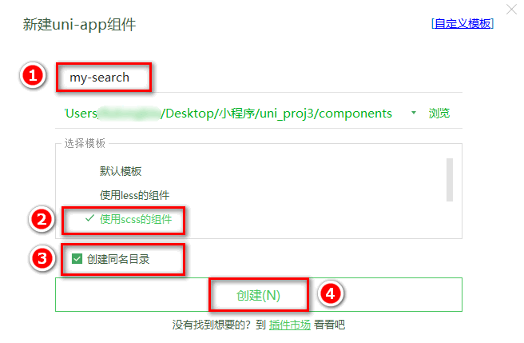
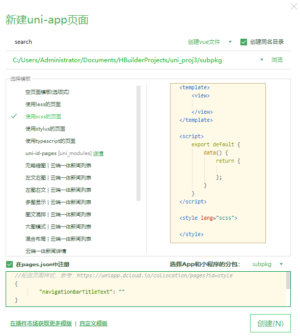

## 5. 搜索

### 5.0 创建 search 分支

运行如下的命令，基于 `master` 分支在本地创建 `search` 子分支，用来开发搜索相关的功能：

```bash
git checkout -b search
```

### 5.1 自定义搜索组件

#### 5.1.1 自定义 my-search 组件

在项目根目录的 `components` 目录上，鼠标右键，选择 `新建组件`，填写组件信息后，最后点击 `创建` 按钮：


在分类页面的 `UI` 结构中，直接以标签的形式使用 `my-search` 自定义组件：

```html
<!-- 使用自定义的搜索组件 -->
<my-search></my-search>
```

定义 `my-search` 组件的 `UI` 结构如下：

```html
<template>
  <view class="my-search-container">
    <!-- 使用 view 组件模拟 input 输入框的样式 -->
    <view class="my-search-box">
      <uni-icons type="search" size="17"></uni-icons>
      <text class="placeholder">搜索</text>
    </view>
  </view>
</template>
```

注意：在当前组件中，我们使用 `view` 组件模拟 `input` 输入框的效果；并不会在页面上渲染真正的 `input` 输入框

美化自定义 `search` 组件的样式：

```scss
.my-search-container {
  background-color: #c00000;
  height: 50px;
  padding: 0 10px;
  display: flex;
  align-items: center;
}

.my-search-box {
  height: 36px;
  background-color: #ffffff;
  border-radius: 15px;
  width: 100%;
  display: flex;
  align-items: center;
  justify-content: center;

  .placeholder {
    font-size: 15px;
    margin-left: 5px;
  }
}
```

由于自定义的 `my-search` 组件高度为 `50px`，因此，需要重新计算分类页面窗口的可用高度：

```js{3-4}
onLoad() {
  const sysInfo = uni.getSystemInfoSync()
  // 可用高度 = 屏幕高度 - navigationBar高度 - tabBar高度 - 自定义的search组件高度
  this.wh = sysInfo.windowHeight - 50
}
```

#### 5.1.2 通过自定义属性增强组件的通用性

为了增强组件的通用性，我们允许使用者自定义搜索组件的 背景颜色 和 圆角尺寸。

通过 `props` 定义 `bgcolor` 和 `radius` 两个属性，并指定值类型和属性默认值：

```js
props: {
  // 背景颜色
  bgcolor: {
    type: String,
    default: '#C00000'
  },
  // 圆角尺寸
  radius: {
    type: Number,
    // 单位是 px
    default: 18
  }
}
```

通过属性绑定的形式，为 `.my-search-container` 盒子和 `.my-search-box` 盒子动态绑定 `style` 属性：

```html{1-2}
<view class="my-search-container" :style="{'background-color': bgcolor}">
  <view class="my-search-box" :style="{'border-radius': radius + 'px'}">
    <uni-icons type="search" size="17"></uni-icons>
    <text class="placeholder">搜索</text>
  </view>
</view>
```

移除对应 `scss` 样式中的 背景颜色 和 圆角尺寸：

```scss{2-3,13-14}
.my-search-container {
  // 移除背景颜色，改由 props 属性控制
  // background-color: #C00000;
  height: 50px;
  padding: 0 10px;
  display: flex;
  align-items: center;
}

.my-search-box {
  height: 36px;
  background-color: #ffffff;
  // 移除圆角尺寸，改由 props 属性控制
  // border-radius: 15px;
  width: 100%;
  display: flex;
  align-items: center;
  justify-content: center;

  .placeholder {
    font-size: 15px;
    margin-left: 5px;
  }
}
```

#### 5.1.3 为自定义组件封装 click 事件

在 `my-search` 自定义组件内部，给类名为 `.my-search-box` 的 `view` 绑定 `click` 事件处理函数：

```html{4}
<view
  class="my-search-box"
  :style="{'border-radius': radius + 'px'}"
  @click="searchBoxHandler"
>
  <uni-icons type="search" size="17"></uni-icons>
  <text class="placeholder">搜索</text>
</view>
```

在 `my-search` 自定义组件的 `methods` 节点中，声明事件处理函数如下：

```js
methods: {
  // 点击了模拟的 input 输入框
  searchBoxHandler() {
  // 触发外界通过 @click 绑定的 click 事件处理函数
  this.$emit('click')
  }
}
```

在分类页面中使用 `my-search` 自定义组件时，即可通过 `@click` 为其绑定点击事件处理函数：

```html{2}
<!-- 使用自定义的搜索组件 -->
<my-search @click="gotoSearch"></my-search>
```

同时在分类页面中，定义 `gotoSearch` 事件处理函数如下：

```js
methods: {
  // 跳转到分包中的搜索页面
  gotoSearch() {
    uni.navigateTo({
      url: '/subpkg/search/search'
    })
  }
}
```

#### 5.1.4 实现首页搜索组件的吸顶效果

在 `home` 首页定义如下的 `UI` 结构：

```html
<!-- 使用自定义的搜索组件 -->
<view class="search-box">
  <my-search @click="gotoSearch"></my-search>
</view>
```

在 `home` 首页定义如下的事件处理函数：

```js
gotoSearch() {
  uni.navigateTo({
    url: '/subpkg/search/search'
  })
}
```

通过如下的样式实现吸顶的效果：

```scss
.search-box {
  // 设置定位效果为“吸顶”
  position: sticky;
  // 吸顶的“位置”
  top: 0;
  // 提高层级，防止被轮播图覆盖
  z-index: 999;
}
```

### 5.2 搜索建议

#### 5.2.1 渲染搜索页面的基本结构

新建 `search` 页面


在 项目中 导入 `uni-ui`的组件， `uni-search-bar` 组件：

定义如下的 `UI` 结构：

```html
<view class="search-box">
  <!-- 使用 uni-ui 提供的搜索组件 -->
  <uni-search-bar
    @input="input"
    :radius="100"
    cancelButton="none"
  ></uni-search-bar>
</view>
```

修改 `components` -> `uni-search-bar` -> `uni-search-bar.vue` 组件，将默认的白色搜索背景改为 `#C00000 `的红色背景：

```scss
.uni-searchbar {
  /* #ifndef APP-NVUE */
  display: flex;
  /* #endif */
  flex-direction: row;
  position: relative;
  padding: 16rpx;
  /* 将默认的 #FFFFFF 改为 #C00000 */
  background-color: #c00000;
}
```

实现搜索框的吸顶效果：

```scss
.search-box {
  position: sticky;
  top: 0;
  z-index: 999;
}
```

定义如下的 `input` 事件处理函数：

```js
methods: {
  input(e) {
    // e.value 是最新的搜索内容
    console.log(e.value)
  }
}
```

#### 5.2.2 实现搜索框自动获取焦点

修改 `components` -> `uni-search-bar` -> `uni-search-bar.vue` 组件，把 `data` 数据中的 `show` 和 `showSync` 的值，从默认的 `false` 改为 `true` 即可：

```js{3-4}
data() {
  return {
    show: true,
    showSync: true,
    searchVal: ""
  }
}
```

使用手机扫码预览，即可在真机上查看效果。

#### 5.2.3 实现搜索框的防抖处理

在 `data` 中定义防抖的延时器 `timerId` 如下：

```js
data() {
  return {
    // 延时器的 timerId
    timer: null,
    // 搜索关键词
    kw: ''
  }
}
```

修改 `input` 事件处理函数如下：

```js
input(e) {
  // 清除 timer 对应的延时器
  clearTimeout(this.timer)
  // 重新启动一个延时器，并把 timerId 赋值给 this.timer
  this.timer = setTimeout(() => {
    // 如果 500 毫秒内，没有触发新的输入事件，则为搜索关键词赋值
    this.kw = e
    console.log(this.kw)
  }, 500)
}
```

#### 5.2.4 根据关键词查询搜索建议列表

在 `data` 中定义如下的数据节点，用来存放搜索建议的列表数据：

```js
data() {
  return {
    // 搜索结果列表
    searchResults: []
  }
}
```

在防抖的 `setTimeout` 中，调用 `getSearchList` 方法获取搜索建议列表：

```js{3-4}
this.timer = setTimeout(() => {
  this.kw = e;
  // 根据关键词，查询搜索建议列表
  this.getSearchList();
}, 500);
```

在 `methods` 中定义 `getSearchList` 方法如下：

```js
// 根据搜索关键词，搜索商品建议列表
async getSearchList() {
  // 判断关键词是否为空
  if (this.kw === '') {
    this.searchResults = []
    return
  }
  // 发起请求，获取搜索建议列表
  const { data: res } = await uni.$http.get('/api/public/v1/goods/qsearch', { query: this.kw })
  if (res.meta.status !== 200) return uni.$showMsg()
  this.searchResults = res.message
}
```

#### 5.2.5 渲染搜索建议列表

定义如下的 `UI` 结构：

```html
<!-- 搜索建议列表 -->
<view class="sugg-list">
  <view
    class="sugg-item"
    v-for="(item, i) in searchResults"
    :key="i"
    @click="gotoDetail(item.goods_id)"
  >
    <view class="goods-name">{{item.goods_name}}</view>
    <uni-icons type="arrowright" size="16"></uni-icons>
  </view>
</view>
```

美化搜索建议列表：

```scss
.sugg-list {
  padding: 0 5px;

  .sugg-item {
    font-size: 12px;
    padding: 13px 0;
    border-bottom: 1px solid #efefef;
    display: flex;
    align-items: center;
    justify-content: space-between;

    .goods-name {
      // 文字不允许换行（单行文本）
      white-space: nowrap;
      // 溢出部分隐藏
      overflow: hidden;
      // 文本溢出后，使用 ... 代替
      text-overflow: ellipsis;
      margin-right: 3px;
    }
  }
}
```

点击搜索建议的 `Item` 项，跳转到商品详情页面：

```js
gotoDetail(goods_id) {
  uni.navigateTo({
    // 指定详情页面的 URL 地址，并传递 goods_id 参数
    url: '/subpkg/goods_detail/goods_detail?goods_id=' + goods_id
  })
}
```

### 5.3 搜索历史

#### 5.3.1 渲染搜索历史记录的基本结构

在 `data` 中定义搜索历史的假数据：

```js{3-4}
data() {
  return {
    // 搜索关键词的历史记录
    historyList: ['a', 'app', 'apple']
  }
}
```

渲染搜索历史区域的 `UI` 结构：

```html
<!-- 搜索历史 -->
<view class="history-box">
  <!-- 标题区域 -->
  <view class="history-title">
    <text>搜索历史</text>
    <uni-icons type="trash" size="17"></uni-icons>
  </view>
  <!-- 列表区域 -->
  <view class="history-list">
    <uni-tag :text="item" v-for="(item, i) in historyList" :key="i"></uni-tag>
  </view>
</view>
```

美化搜索历史区域的样式：

```scss
.history-box {
  padding: 0 5px;

  .history-title {
    display: flex;
    justify-content: space-between;
    align-items: center;
    height: 40px;
    font-size: 13px;
    border-bottom: 1px solid #efefef;
  }

  .history-list {
    display: flex;
    flex-wrap: wrap;

    .uni-tag {
      margin-top: 5px;
      margin-right: 5px;
    }
  }
}
```

#### 5.3.2 实现搜索建议和搜索历史的按需展示

当搜索结果列表的长度不为 0 的时候（`searchResults.length !== 0`），需要展示搜索建议区域，隐藏搜索历史区域

当搜索结果列表的长度等于 0 的时候（`searchResults.length === 0`），需要隐藏搜索建议区域，展示搜索历史区域

使用 `v-if` 和 `v-else` 控制这两个区域的显示和隐藏，示例代码如下：

```html{2,7}
<!-- 搜索建议列表 -->
<view class="sugg-list" v-if="searchResults.length !== 0">
  <!-- 省略其它代码... -->
</view>

<!-- 搜索历史 -->
<view class="history-box" v-else>
  <!-- 省略其它代码... -->
</view>
```

#### 5.3.3 将搜索关键词存入 historyList

直接将搜索关键词 `push` 到 `historyList` 数组中即可

```js{7,10-13}
methods: {
  // 根据搜索关键词，搜索商品建议列表
  async getSearchList() {
    // 省略其它不必要的代码...

    // 1. 查询到搜索建议之后，调用 saveSearchHistory() 方法保存搜索关键词
    this.saveSearchHistory()
  },
  // 2. 保存搜索关键词的方法
  saveSearchHistory() {
    // 2.1 直接把搜索关键词 push 到 historyList 数组中
    this.historyList.push(this.kw)
  }
}
```

上述实现思路存在的问题：

关键词前后顺序的问题（可以调用数组的 `reverse()` 方法对数组进行反转）

关键词重复的问题（可以使用 `Set` 对象进行去重操作）

#### 5.3.4 解决关键字前后顺序的问题

`data` 中的 `historyList` 不做任何修改，依然使用 `push` 进行末尾追加

定义一个计算属性 `historys`，将 `historyList` 数组 `reverse` 反转之后，就是此计算属性的值：

```js{5}
computed: {
  historys() {
    // 注意：由于数组是引用类型，所以不要直接基于原数组调用 reverse 方法，以免修改原数组中元素的顺序
    // 而是应该新建一个内存无关的数组，再进行 reverse 反转
    return [...this.historyList].reverse()
  }
}
```

页面中渲染搜索关键词的时候，不再使用 `data` 中的 `historyList`，而是使用计算属性 `historys`：

```html{2}
<view class="history-list">
  <uni-tag :text="item" v-for="(item, i) in historys" :key="i"></uni-tag>
</view>
```

#### 5.3.5 解决关键词重复的问题

修改 `saveSearchHistory` 方法如下：

```js
// 保存搜索关键词为历史记录
saveSearchHistory() {
  // this.historyList.push(this.kw)

  // 1. 将 Array 数组转化为 Set 对象
  const set = new Set(this.historyList)
  // 2. 调用 Set 对象的 delete 方法，移除对应的元素
  set.delete(this.kw)
  // 3. 调用 Set 对象的 add 方法，向 Set 中添加元素
  set.add(this.kw)
  // 4. 将 Set 对象转化为 Array 数组
  this.historyList = Array.from(set)
}
```

#### 5.3.6 将搜索历史记录持久化存储到本地

修改 `saveSearchHistory` 方法如下：

```js{7-8}
// 保存搜索关键词为历史记录
saveSearchHistory() {
  const set = new Set(this.historyList)
  set.delete(this.kw)
  set.add(this.kw)
  this.historyList = Array.from(set)
  // 调用 uni.setStorageSync(key, value) 将搜索历史记录持久化存储到本地
  uni.setStorageSync('kw', JSON.stringify(this.historyList))
}
```

在 `onLoad` 生命周期函数中，加载本地存储的搜索历史记录：

```js{2}
onLoad() {
		this.historyList = JSON.parse(uni.getStorageSync('kw') || '[]')
},
```

### 5.3.7 清空搜索历史记录

为清空的图标按钮绑定 `click` 事件：

```html
<uni-icons type="trash" size="17" @click="cleanHistory"></uni-icons>
```

在 `methods` 中定义 `cleanHistory` 处理函数：

```js
// 清空搜索历史记录
cleanHistory() {
  // 清空 data 中保存的搜索历史
  this.historyList = []
  // 清空本地存储中记录的搜索历史
  uni.setStorageSync('kw', '[]')
}
```

#### 5.3.8 点击搜索历史跳转到商品列表页面

为搜索历史的 `Item` 项绑定 `click` 事件处理函数：

```html
<uni-tag
  :text="item"
  v-for="(item, i) in historys"
  :key="i"
  @click="gotoGoodsList(item)"
></uni-tag>
```

在 `methods` 中定义 `gotoGoodsList` 处理函数：

```js
// 点击跳转到商品列表页面
gotoGoodsList(kw) {
  uni.navigateTo({
    url: '/subpkg/goods_list/goods_list?query=' + kw
  })
},
```

### 5.4 分支的合并与提交

1. 将 `search` 分支进行本地提交：

```bash
git add .
git commit -m "完成了搜索功能的开发"
```

2. 将本地的 `search` 分支推送到码云：

```bash
git push -u origin search
```

3. 将本地 `search` 分支中的代码合并到 `master` 分支：

```bash
git checkout master
git merge search
git push
```

4. 删除本地的 `search` 分支：

```bash
git branch -d search
```
