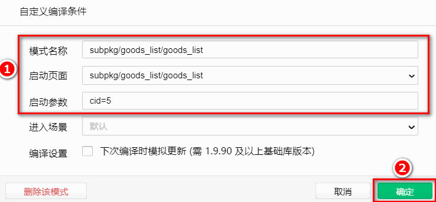
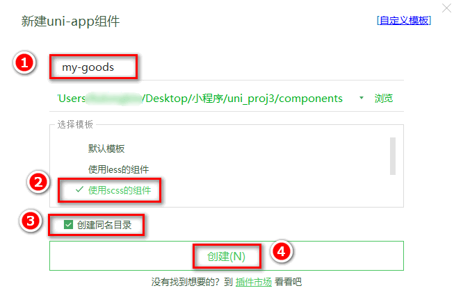

## 6. 商品列表

### 6.0 创建 goodslist 分支

运行如下的命令，基于 `master` 分支在本地创建 `goodslist` 子分支，用来开发商品列表相关的功能：

```bash
git checkout -b goodslist
```

### 6.1 定义请求参数对象

为了方便发起请求获取商品列表的数据，我们要根据接口的要求，事先定义一个请求参数对象：

```js
data() {
  return {
    // 请求参数对象
    queryObj: {
      // 查询关键词
      query: '',
      // 商品分类Id
      cid: '',
      // 页码值
      pagenum: 1,
      // 每页显示多少条数据
      pagesize: 10
    }
  }
}
```

将页面跳转时携带的参数，转存到 `queryObj` 对象中：

```js
onLoad(options) {
  // 将页面参数转存到 this.queryObj 对象中
  this.queryObj.query = options.query || ''
  this.queryObj.cid = options.cid || ''
}
```

为了方便开发商品分类页面，建议大家通过微信开发者工具，新建商品列表页面的编译模式：


### 6.2 获取商品列表数据

在 `data` 中新增如下的数据节点：

```js
data() {
  return {
    // 商品列表的数据
    goodsList: [],
    // 总数量，用来实现分页
    total: 0
  }
}
```

在 `onLoad` 生命周期函数中，调用 `getGoodsList` 方法获取商品列表数据：

```js
onLoad(options) {
  // 调用获取商品列表数据的方法
  this.getGoodsList()
}
```

在 `methods` 节点中，声明 `getGoodsList` 方法如下：

```js
methods: {
  // 获取商品列表数据的方法
  async getGoodsList() {
    // 发起请求
    const { data: res } = await uni.$http.get('/api/public/v1/goods/search', this.queryObj)
    if (res.meta.status !== 200) return uni.$showMsg()
    // 为数据赋值
    this.goodsList = res.message.goods
    this.total = res.message.total
  }
}
```

### 6.3 渲染商品列表结构

在页面中，通过 `v-for` 指令，循环渲染出商品的 `UI` 结构：

```html
<template>
  <view>
    <view class="goods-list">
      <block v-for="(goods, i) in goodsList" :key="i">
        <view class="goods-item">
          <!-- 商品左侧图片区域 -->
          <view class="goods-item-left">
            <image
              :src="goods.goods_small_logo || defaultPic"
              class="goods-pic"
            ></image>
          </view>
          <!-- 商品右侧信息区域 -->
          <view class="goods-item-right">
            <!-- 商品标题 -->
            <view class="goods-name">{{goods.goods_name}}</view>
            <view class="goods-info-box">
              <!-- 商品价格 -->
              <view class="goods-price">￥{{goods.goods_price}}</view>
            </view>
          </view>
        </view>
      </block>
    </view>
  </view>
</template>
```

为了防止某些商品的图片不存在，需要在 `data` 中定义一个默认的图片：

```js
data() {
  return {
    // 默认的空图片
    defaultPic: 'https://img3.doubanio.com/f/movie/8dd0c794499fe925ae2ae89ee30cd225750457b4/pics/movie/celebrity-default-medium.png'
  }
}
```

并在页面渲染时按需使用：

```html
<image :src="goods.goods_small_logo || defaultPic" class="goods-pic"></image>
```

美化商品列表的 `UI` 结构：

```scss
.goods-item {
  display: flex;
  padding: 10px 5px;
  border-bottom: 1px solid #f0f0f0;

  .goods-item-left {
    margin-right: 5px;

    .goods-pic {
      width: 100px;
      height: 100px;
      display: block;
    }
  }

  .goods-item-right {
    display: flex;
    flex-direction: column;
    justify-content: space-between;

    .goods-name {
      font-size: 13px;
    }

    .goods-price {
      font-size: 16px;
      color: #c00000;
    }
  }
}
```

### 6.4 把商品 item 项封装为自定义组件

在 `components` 目录上鼠标右键，选择 新建组件：


将 `goods_list` 页面中，关于商品 `item` 项相关的 `UI` 结构、样式、`data` 数据，封装到 `my-goods` 组件中：

```vue
<template>
  <view class="goods-item">
    <!-- 商品左侧图片区域 -->
    <view class="goods-item-left">
      <image
        :src="goods.goods_small_logo || defaultPic"
        class="goods-pic"
      ></image>
    </view>
    <!-- 商品右侧信息区域 -->
    <view class="goods-item-right">
      <!-- 商品标题 -->
      <view class="goods-name">{{ goods.goods_name }}</view>
      <view class="goods-info-box">
        <!-- 商品价格 -->
        <view class="goods-price">￥{{ goods.goods_price }}</view>
      </view>
    </view>
  </view>
</template>

<script>
export default {
  // 定义 props 属性，用来接收外界传递到当前组件的数据
  props: {
    // 商品的信息对象
    goods: {
      type: Object,
      defaul: {},
    },
  },
  data() {
    return {
      // 默认的空图片
      defaultPic:
        "https://img3.doubanio.com/f/movie/8dd0c794499fe925ae2ae89ee30cd225750457b4/pics/movie/celebrity-default-medium.png",
    };
  },
};
</script>

<style lang="scss">
.goods-item {
  display: flex;
  padding: 10px 5px;
  border-bottom: 1px solid #f0f0f0;

  .goods-item-left {
    margin-right: 5px;

    .goods-pic {
      width: 100px;
      height: 100px;
      display: block;
    }
  }

  .goods-item-right {
    display: flex;
    flex-direction: column;
    justify-content: space-between;

    .goods-name {
      font-size: 13px;
    }

    .goods-price {
      font-size: 16px;
      color: #c00000;
    }
  }
}
</style>
```

在 `goods_list` 组件中，循环渲染 `my-goods` 组件即可：

```html{3-4}
<view class="goods-list">
  <block v-for="(item, i) in goodsList" :key="i">
    <!-- 为 my-goods 组件动态绑定 goods 属性的值 -->
    <my-goods :goods="item"></my-goods>
  </block>
</view>
```

### 6.5 使用过滤器处理价格

在 `my-goods` 组件中，和 `data` 节点平级，声明 `filters` 过滤器节点如下：

```js
filters: {
  // 把数字处理为带两位小数点的数字
  tofixed(num) {
    return Number(num).toFixed(2)
  }
}
```

在渲染商品价格的时候，通过管道符 `|` 调用过滤器：

```html
<!-- 商品价格 -->
<view class="goods-price">￥{{goods.goods_price | tofixed}}</view>
```

### 6.6 上拉加载更多

#### 6.6.1 初步实现上拉加载更多

打开项目根目录中的 `pages.json` 配置文件，为 `subPackages` 分包中的 `goods_list` 页面配置上拉触底的距离：

```json{12}
 "subPackages": [
   {
     "root": "subpkg",
     "pages": [
       {
         "path": "goods_detail/goods_detail",
         "style": {}
       },
       {
         "path": "goods_list/goods_list",
         "style": {
           "onReachBottomDistance": 150
         }
       },
       {
         "path": "search/search",
         "style": {}
       }
     ]
   }
 ]
```

在 `goods_list` 页面中，和 `methods` 节点平级，声明 `onReachBottom` 事件处理函数，用来监听页面的上拉触底行为：

```js
// 触底的事件
onReachBottom() {
  // 让页码值自增 +1
  this.queryObj.pagenum += 1
  // 重新获取列表数据
  this.getGoodsList()
}
```

改造 `methods` 中的 `getGoodsList` 函数，当列表数据请求成功之后，进行新旧数据的拼接处理：

```js{7-8}
// 获取商品列表数据的方法
async getGoodsList() {
  // 发起请求
  const { data: res } = await uni.$http.get('/api/public/v1/goods/search', this.queryObj)
  if (res.meta.status !== 200) return uni.$showMsg()

  // 为数据赋值：通过展开运算符的形式，进行新旧数据的拼接
  this.goodsList = [...this.goodsList, ...res.message.goods]
  this.total = res.message.total
}
```

#### 6.6.2 通过节流阀防止发起额外的请求

在 `data` 中定义 `isloading` 节流阀如下：

```js{3-4}
data() {
  return {
    // 是否正在请求数据
    isloading: false
  }
}
```

修改 `getGoodsList` 方法，在请求数据前后，分别打开和关闭节流阀：

```js{3-4,7-8}
// 获取商品列表数据的方法
async getGoodsList() {
  // ** 打开节流阀
  this.isloading = true
  // 发起请求
  const { data: res } = await uni.$http.get('/api/public/v1/goods/search', this.queryObj)
  // ** 关闭节流阀
  this.isloading = false

  // 省略其它代码...
}
```

在 `onReachBottom` 触底事件处理函数中，根据节流阀的状态，来决定是否发起请求：

```js{3-4}
// 触底的事件
onReachBottom() {
  // 判断是否正在请求其它数据，如果是，则不发起额外的请求
  if (this.isloading) return

  this.queryObj.pagenum += 1
  this.getGoodsList()
}
```

#### 6.6.3 判断数据是否加载完毕

如果下面的公式成立，则证明没有下一页数据了：

```bash
当前的页码值 * 每页显示多少条数据 >= 总数条数
pagenum  *  pagesize >= total
```

修改 `onReachBottom` 事件处理函数如下：

```js{3-4}
// 触底的事件
onReachBottom() {
  // 判断是否还有下一页数据
  if (this.queryObj.pagenum * this.queryObj.pagesize >= this.total) return uni.$showMsg('数据加载完毕！')

  // 判断是否正在请求其它数据，如果是，则不发起额外的请求
  if (this.isloading) return

  this.queryObj.pagenum += 1
  this.getGoodsList()
}
```

### 6.7 下拉刷新

在 `pages.json` 配置文件中，为当前的 `goods_list` 页面单独开启下拉刷新效果：

```json{10-11}
"subPackages": [{
  "root": "subpkg",
  "pages": [{
    "path": "goods_detail/goods_detail",
    "style": {}
  }, {
    "path": "goods_list/goods_list",
    "style": {
      "onReachBottomDistance": 150,
      "enablePullDownRefresh": true,
      "backgroundColor": "#F8F8F8"
    }
  }, {
    "path": "search/search",
    "style": {}
  }]
}]
```

监听页面的 `onPullDownRefresh` 事件处理函数：

```js
// 下拉刷新的事件
onPullDownRefresh() {
  // 1. 重置关键数据
  this.queryObj.pagenum = 1
  this.total = 0
  this.isloading = false
  this.goodsList = []

  // 2. 重新发起请求
  this.getGoodsList(() => uni.stopPullDownRefresh())
}
```

修改 `getGoodsList` 函数，接收 `cb` 回调函数并按需进行调用：

```js{2,6-7}
// 获取商品列表数据的方法
async getGoodsList(cb) {
  this.isloading = true
  const { data: res } = await uni.$http.get('/api/public/v1/goods/search', this.queryObj)
  this.isloading = false
  // 只要数据请求完毕，就立即按需调用 cb 回调函数
  cb && cb()

  if (res.meta.status !== 200) return uni.$showMsg()
  this.goodsList = [...this.goodsList, ...res.message.goods]
  this.total = res.message.total
}
```

### 6.8 点击商品 item 项跳转到详情页面

将循环时的 `block` 组件修改为 `view` 组件，并绑定 `click` 点击事件处理函数：

```html{2,5}
<view class="goods-list">
  <view v-for="(item, i) in goodsList" :key="i" @click="gotoDetail(item)">
    <!-- 为 my-goods 组件动态绑定 goods 属性的值 -->
    <my-goods :goods="item"></my-goods>
  </view>
</view>
```

在 `methods` 节点中，定义 `gotoDetail` 事件处理函数：

```js
// 点击跳转到商品详情页面
gotoDetail(item) {
  uni.navigateTo({
    url: '/subpkg/goods_detail/goods_detail?goods_id=' + item.goods_id
  })
}
```

### 6.9 分支的合并与提交

1. 将 `goodslist` 分支进行本地提交：

```bash
git add .
git commit -m "完成了商品列表页面的开发"
```

2. 将本地的 goodslist 分支推送到码云：

```bash
git push -u origin goodslist
```

3. 将本地 goodslist 分支中的代码合并到 master 分支：

```bash
git checkout master
git merge goodslist
git push
```

4. 删除本地的 goodslist 分支：

```bash
git branch -d goodslist
```
