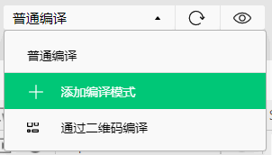
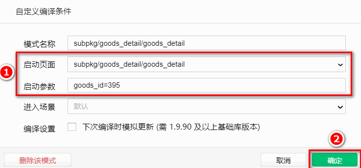
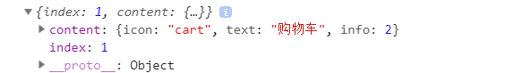

## 7. 商品详情

### 7.0 创建 goodsdetail 分支

运行如下的命令，基于 `master` 分支在本地创建 `goodsdetail` 子分支，用来开发商品详情页相关的功能：

```bash
git checkout -b goodsdetail
```

### 7.1 添加商品详情页的编译模式

在微信开发者工具中，点击工具栏上的编译模式下拉菜单，选择 `添加编译模式` 选项：


勾选 `启动页面` 的路径，并填写了 `启动参数` 之后，点击 `确定` 按钮，添加详情页面的编译模式：


### 7.2 获取商品详情数据

在 `data` 中定义商品详情的数据节点：

```js
data() {
  return {
    // 商品详情对象
    goods_info: {}
  }
}
```

在 `onLoad` 中获取商品的 `Id`，并调用请求商品详情的方法：

```js
onLoad(options) {
  // 获取商品 Id
  const goods_id = options.goods_id
  // 调用请求商品详情数据的方法
  this.getGoodsDetail(goods_id)
}
```

在 `methods` 中声明 `getGoodsDetail` 方法：

```js
methods: {
  // 定义请求商品详情数据的方法
  async getGoodsDetail(goods_id) {
    const { data: res } = await uni.$http.get('/api/public/v1/goods/detail', { goods_id })
    if (res.meta.status !== 200) return uni.$showMsg()
    // 为 data 中的数据赋值
    this.goods_info = res.message
  }
}
```

### 7.3 渲染商品详情页的 UI 结构

#### 7.3.1 渲染轮播图区域

使用 `v-for` 指令，循环渲染如下的轮播图 `UI` 结构：

```html
<!-- 轮播图区域 -->
<swiper
  :indicator-dots="true"
  :autoplay="true"
  :interval="3000"
  :duration="1000"
  :circular="true"
>
  <swiper-item v-for="(item, i) in goods_info.pics" :key="i">
    <image :src="item.pics_big"></image>
  </swiper-item>
</swiper>
```

美化轮播图的样式：

```scss
swiper {
  height: 750rpx;

  image {
    width: 100%;
    height: 100%;
  }
}
```

#### 7.3.2 实现轮播图预览效果

为轮播图中的 `image` 图片绑定 `click` 事件处理函数：

```html{2-3}
<swiper-item v-for="(item, i) in goods_info.pics" :key="i">
  <!-- 把当前点击的图片的索引，传递到 preview() 处理函数中 -->
  <image :src="item.pics_big" @click="preview(i)"></image>
</swiper-item>
```

在 `methods` 中定义 `preview` 事件处理函数：

```js
// 实现轮播图的预览效果
preview(i) {
  // 调用 uni.previewImage() 方法预览图片
  uni.previewImage({
    // 预览时，默认显示图片的索引
    current: i,
    // 所有图片 url 地址的数组
    urls: this.goods_info.pics.map(x => x.pics_big)
  })
}
```

#### 7.3.3 渲染商品信息区域

定义商品信息区域的 `UI` 结构如下：

```html
<!-- 商品信息区域 -->
<view class="goods-info-box">
  <!-- 商品价格 -->
  <view class="price">￥{{goods_info.goods_price}}</view>
  <!-- 信息主体区域 -->
  <view class="goods-info-body">
    <!-- 商品名称 -->
    <view class="goods-name">{{goods_info.goods_name}}</view>
    <!-- 收藏 -->
    <view class="favi">
      <uni-icons type="star" size="18" color="gray"></uni-icons>
      <text>收藏</text>
    </view>
  </view>
  <!-- 运费 -->
  <view class="yf">快递：免运费</view>
</view>
```

美化商品信息区域的样式：

```scss
// 商品信息区域的样式
.goods-info-box {
  padding: 10px;
  padding-right: 0;

  .price {
    color: #c00000;
    font-size: 18px;
    margin: 10px 0;
  }

  .goods-info-body {
    display: flex;
    justify-content: space-between;

    .goods-name {
      font-size: 13px;
      padding-right: 10px;
    }
    // 收藏区域
    .favi {
      width: 120px;
      font-size: 12px;
      display: flex;
      flex-direction: column;
      justify-content: center;
      align-items: center;
      border-left: 1px solid #efefef;
      color: gray;
    }
  }

  // 运费
  .yf {
    margin: 10px 0;
    font-size: 12px;
    color: gray;
  }
}
```

#### 7.3.4 渲染商品详情信息

在页面结构中，使用 `rich-text` 组件，将带有 `HTML` 标签的内容，渲染为小程序的页面结构：

```html
<!-- 商品详情信息 -->
<rich-text :nodes="goods_info.goods_introduce"></rich-text>
```

修改 `getGoodsDetail` 方法，从而解决图片底部 空白间隙 的问题：

```js{6-7}
// 定义请求商品详情数据的方法
async getGoodsDetail(goods_id) {
  const { data: res } = await uni.$http.get('/api/public/v1/goods/detail', { goods_id })
  if (res.meta.status !== 200) return uni.$showMsg()

  // 使用字符串的 replace() 方法，为 img 标签添加行内的 style 样式，从而解决图片底部空白间隙的问题
  res.message.goods_introduce = res.message.goods_introduce.replace(/
  <view v-if="goods_info.goods_name">
    <!-- 省略其它代码 -->
  </view>
</template>
```

### 7.4 渲染详情页底部的商品导航区域

#### 7.4.1 渲染商品导航区域的 UI 结构

基于 `uni-ui` 提供的 [`GoodsNav`](https://uniapp.dcloud.net.cn/component/uniui/uni-goods-nav.html) 组件来实现商品导航区域的效果

在 `data` 中，通过 `options` 和 `buttonGroup` 两个数组，来声明商品导航组件的按钮配置对象：

```js
data() {
  return {
    // 商品详情对象
    goods_info: {},
    // 左侧按钮组的配置对象
    options: [{
      icon: 'shop',
      text: '店铺'
    }, {
      icon: 'cart',
      text: '购物车',
      info: 2
    }],
    // 右侧按钮组的配置对象
    buttonGroup: [{
        text: '加入购物车',
        backgroundColor: '#ff0000',
        color: '#fff'
      },
      {
        text: '立即购买',
        backgroundColor: '#ffa200',
        color: '#fff'
      }
    ]
  }
}
```

在页面中使用 `uni-goods-nav` 商品导航组件：

```html
<!-- 商品导航组件 -->
<view class="goods_nav">
  <!-- fill 控制右侧按钮的样式 -->
  <!-- options 左侧按钮的配置项 -->
  <!-- buttonGroup 右侧按钮的配置项 -->
  <!-- click 左侧按钮的点击事件处理函数 -->
  <!-- buttonClick 右侧按钮的点击事件处理函数 -->
  <uni-goods-nav
    :fill="true"
    :options="options"
    :buttonGroup="buttonGroup"
    @click="onClick"
    @buttonClick="buttonClick"
  />
</view>
```

美化商品导航组件，使之固定在页面最底部：

```scss
.goods-detail-container {
  // 给页面外层的容器，添加 50px 的内padding，
  // 防止页面内容被底部的商品导航组件遮盖
  padding-bottom: 50px;
}

.goods_nav {
  // 为商品导航组件添加固定定位
  position: fixed;
  bottom: 0;
  left: 0;
  width: 100%;
}
```

#### 7.4.2 点击跳转到购物车页面

点击商品导航组件左侧的按钮，会触发 `uni-goods-nav` 的 `@click` 事件处理函数，事件对象 `e` 中会包含当前点击的按钮相关的信息：

```js
// 左侧按钮的点击事件处理函数
onClick(e) {
  console.log(e)
}
```

打印的按钮信息对象如下：


根据 `e.content.text` 的值，来决定进一步的操作：

```js
// 左侧按钮的点击事件处理函数
onClick(e) {
  if (e.content.text === '购物车') {
    // 切换到购物车页面
    uni.switchTab({
      url: '/pages/cart/cart'
    })
  }
}
```

### 7.5 分支的合并与提交

1. 将 `goodsdetail` 分支进行本地提交：

```bash
git add .
git commit -m "完成了商品详情页面的开发"
```

2. 将本地的 `goodsdetail` 分支推送到码云：

```bash
git push -u origin goodsdetail
```

3. 将本地 `goodsdetail` 分支中的代码合并到 master 分支：

```bash
git checkout master
git merge goodsdetail
git push
```

4. 删除本地的 `goodsdetail` 分支：

```bash
git branch -d goodsdetail
```
