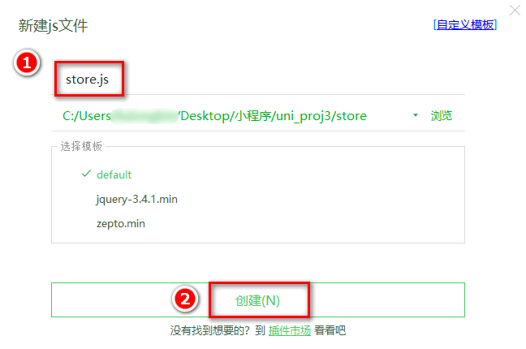
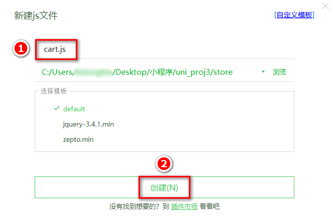

## 8. 加入购物车

### 8.0 创建 cart 分支

运行如下的命令，基于 `master` 分支在本地创建 `cart` 子分支，用来开发购物车相关的功能：

```bash
git checkout -b cart
```

### 8.1 配置 vuex

在项目根目录中创建 `store` 文件夹，专门用来存放 `vuex` 相关的模块

在 `store` 目录上鼠标右键，选择 `新建` -> `js文件`，新建 `store.js` 文件：


在 `store.js` 中按照如下 `4` 个步骤初始化 `Store` 的实例对象：

```js
// 1. 导入 Vue 和 Vuex
import Vue from "vue";
import Vuex from "vuex";

// 2. 将 Vuex 安装为 Vue 的插件
Vue.use(Vuex);

// 3. 创建 Store 的实例对象
const store = new Vuex.Store({
  // TODO：挂载 store 模块
  modules: {},
});

// 4. 向外共享 Store 的实例对象
export default store;
```

在 `main.js` 中导入 `store` 实例对象并挂载到 `Vue` 的实例上：

```js{1-2,8-9}
// 1. 导入 store 的实例对象
import store from "./store/store.js";

// 省略其它代码...

const app = new Vue({
  ...App,
  // 2. 将 store 挂载到 Vue 实例上
  store,
});
app.$mount();
```

### 8.2 创建购物车的 `store` 模块

在 `store` 目录上鼠标右键，选择 `新建` -> `js文件`，创建购物车的 `store` 模块，命名为 `cart.js`：


在 `cart.js` 中，初始化如下的 `vuex` 模块：

```js
export default {
  // 为当前模块开启命名空间
  namespaced: true,

  // 模块的 state 数据
  state: () => ({
    // 购物车的数组，用来存储购物车中每个商品的信息对象
    // 每个商品的信息对象，都包含如下 6 个属性：
    // { goods_id, goods_name, goods_price, goods_count, goods_small_logo, goods_state }
    cart: [],
  }),

  // 模块的 mutations 方法
  mutations: {},

  // 模块的 getters 属性
  getters: {},
};
```

在 `store/store.js` 模块中，导入并挂载购物车的 `vuex` 模块，示例代码如下：

```js{3-4,11-13}
import Vue from "vue";
import Vuex from "vuex";
// 1. 导入购物车的 vuex 模块
import moduleCart from "./cart.js";

Vue.use(Vuex);

const store = new Vuex.Store({
  // TODO：挂载 store 模块
  modules: {
    // 2. 挂载购物车的 vuex 模块，模块内成员的访问路径被调整为 m_cart，例如：
    //    购物车模块中 cart 数组的访问路径是 m_cart/cart
    m_cart: moduleCart,
  },
});

export default store;
```

### 8.3 在商品详情页中使用 Store 中的数据

在 `goods_detail.vue` 页面中，修改 `<script></script>` 标签中的代码如下：

```js{1-2,5-9}
// 从 vuex 中按需导出 mapState 辅助方法
import { mapState } from "vuex";

export default {
  computed: {
    // 调用 mapState 方法，把 m_cart 模块中的 cart 数组映射到当前页面中，作为计算属性来使用
    // ...mapState('模块的名称', ['要映射的数据名称1', '要映射的数据名称2'])
    ...mapState("m_cart", ["cart"]),
  },
  // 省略其它代码...
};
```

注意：今后无论映射 `mutations` 方法，还是 `getters` 属性，还是 `state` 中的数据，都需要指定模块的名称，才能进行映射。

在页面渲染时，可以直接使用映射过来的数据，例如：

```html
<!-- 运费 -->
<view class="yf">快递：免运费 -- {{cart.length}}</view>
```

### 8.4 实现加入购物车的功能

在 `store` 目录下的 `cart.js` 模块中，封装一个将商品信息加入购物车的 `mutations` 方法，命名为 `addToCart`。示例代码如下：

```js{15-27}
export default {
  // 为当前模块开启命名空间
  namespaced: true,

  // 模块的 state 数据
  state: () => ({
    // 购物车的数组，用来存储购物车中每个商品的信息对象
    // 每个商品的信息对象，都包含如下 6 个属性：
    // { goods_id, goods_name, goods_price, goods_count, goods_small_logo, goods_state }
    cart: [],
  }),

  // 模块的 mutations 方法
  mutations: {
    addToCart(state, goods) {
      // 根据提交的商品的Id，查询购物车中是否存在这件商品
      // 如果不存在，则 findResult 为 undefined；否则，为查找到的商品信息对象
      const findResult = state.cart.find((x) => x.goods_id === goods.goods_id);

      if (!findResult) {
        // 如果购物车中没有这件商品，则直接 push
        state.cart.push(goods);
      } else {
        // 如果购物车中有这件商品，则只更新数量即可
        findResult.goods_count++;
      }
    },
  },

  // 模块的 getters 属性
  getters: {},
};
```

在商品详情页面中，通过 `mapMutations` 这个辅助方法，把 `vuex` 中 `m_cart` 模块下的 `addToCart` 方法映射到当前页面：

```js{1-2,6-7}
// 按需导入 mapMutations 这个辅助方法
import { mapMutations } from "vuex";

export default {
  methods: {
    // 把 m_cart 模块中的 addToCart 方法映射到当前页面使用
    ...mapMutations("m_cart", ["addToCart"]),
  },
};
```

为商品导航组件 `uni-goods-nav` 绑定 `@buttonClick="buttonClick"` 事件处理函数：

```js
// 右侧按钮的点击事件处理函数
buttonClick(e) {
   // 1. 判断是否点击了 加入购物车 按钮
   if (e.content.text === '加入购物车') {

      // 2. 组织一个商品的信息对象
      const goods = {
         goods_id: this.goods_info.goods_id,       // 商品的Id
         goods_name: this.goods_info.goods_name,   // 商品的名称
         goods_price: this.goods_info.goods_price, // 商品的价格
         goods_count: 1,                           // 商品的数量
         goods_small_logo: this.goods_info.goods_small_logo, // 商品的图片
         goods_state: true                         // 商品的勾选状态
      }

      // 3. 通过 this 调用映射过来的 addToCart 方法，把商品信息对象存储到购物车中
      this.addToCart(goods)

   }
}
```

### 8.5 动态统计购物车中商品的总数量

在 `cart.js` 模块中，在 `getters` 节点下定义一个 `total` 方法，用来统计购物车中商品的总数量：

```js{3-9}
// 模块的 getters 属性
getters: {
   // 统计购物车中商品的总数量
   total(state) {
      let c = 0
      // 循环统计商品的数量，累加到变量 c 中
      state.cart.forEach(goods => c += goods.goods_count)
      return c
   }
}
```

在商品详情页面的 `script` 标签中，按需导入 `mapGetters` 方法并进行使用：

```js{1-2,5-8}
// 按需导入 mapGetters 这个辅助方法
import { mapGetters } from "vuex";

export default {
  computed: {
    // 把 m_cart 模块中名称为 total 的 getter 映射到当前页面中使用
    ...mapGetters("m_cart", ["total"]),
  },
};
```

通过 `watch` 侦听器，监听计算属性 `total` 值的变化，从而动态为购物车按钮的徽标赋值：

```js
export default {
  watch: {
    // 1. 监听 total 值的变化，通过第一个形参得到变化后的新值
    total(newVal) {
      // 2. 通过数组的 find() 方法，找到购物车按钮的配置对象
      const findResult = this.options.find((x) => x.text === "购物车");

      if (findResult) {
        // 3. 动态为购物车按钮的 info 属性赋值
        findResult.info = newVal;
      }
    },
  },
};
```

### 8.6 持久化存储购物车中的商品

在 `cart.js` 模块中，声明一个叫做 `saveToStorage` 的 `mutations` 方法，此方法负责将购物车中的数据持久化存储到本地：

```js
// 将购物车中的数据持久化存储到本地
saveToStorage(state) {
   uni.setStorageSync('cart', JSON.stringify(state.cart))
}
```

修改 `mutations` 节点中的 `addToCart` 方法，在处理完商品信息后，调用步骤 `1` 中定义的 `saveToStorage` 方法：

```js{14-15}
addToCart(state, goods) {
   // 根据提交的商品的Id，查询购物车中是否存在这件商品
   // 如果不存在，则 findResult 为 undefined；否则，为查找到的商品信息对象
   const findResult = state.cart.find(x => x.goods_id === goods.goods_id)

   if (!findResult) {
      // 如果购物车中没有这件商品，则直接 push
      state.cart.push(goods)
   } else {
      // 如果购物车中有这件商品，则只更新数量即可
      findResult.goods_count++
   }

   // 通过 commit 方法，调用 m_cart 命名空间下的 saveToStorage 方法
   this.commit('m_cart/saveToStorage')
}
```

修改 `cart.js` 模块中的 `state` 函数，读取本地存储的购物车数据，对 `cart` 数组进行初始化：

```js{6}
// 模块的 state 数据
state: () => ({
   // 购物车的数组，用来存储购物车中每个商品的信息对象
   // 每个商品的信息对象，都包含如下 6 个属性：
   // { goods_id, goods_name, goods_price, goods_count, goods_small_logo, goods_state }
   cart: JSON.parse(uni.getStorageSync('cart') || '[]')
}),
```

### 8.7 优化商品详情页的 total 侦听器

使用普通函数的形式定义的 `watch` 侦听器，在页面首次加载后不会被调用。因此导致了商品详情页在首次加载完毕之后，不会将商品的总数量显示到商品导航区域：

```js
watch: {
   // 页面首次加载完毕后，不会调用这个侦听器
   total(newVal) {
      const findResult = this.options.find(x => x.text === '购物车')
      if (findResult) {
         findResult.info = newVal
      }
   }
}
```

为了防止这个上述问题，可以使用对象的形式来定义 `watch` 侦听器（详细文档请参考 `Vue` 官方的 [`watch`](https://cn.vuejs.org/guide/essentials/watchers.html) 侦听器教程），示例代码如下：

```js{5,12}
watch: {
   // 定义 total 侦听器，指向一个配置对象
   total: {
      // handler 属性用来定义侦听器的 function 处理函数
      handler(newVal) {
         const findResult = this.options.find(x => x.text === '购物车')
         if (findResult) {
            findResult.info = newVal
         }
      },
      // immediate 属性用来声明此侦听器，是否在页面初次加载完毕后立即调用
      immediate: true
   }
}
```

### 8.8 动态为 tabBar 页面设置数字徽标

需求描述：从商品详情页面导航到购物车页面之后，需要为 `tabBar` 中的购物车动态设置数字徽标。

把 `Store` 中的 `total` 映射到 `cart.vue` 中使用：

```js{2,8-11}
// 按需导入 mapGetters 这个辅助方法
import { mapGetters } from "vuex";

export default {
  data() {
    return {};
  },
  computed: {
    // 将 m_cart 模块中的 total 映射为当前页面的计算属性
    ...mapGetters("m_cart", ["total"]),
  },
};
```

在页面刚显示出来的时候，立即调用 `setBadge` 方法，为 `tabBar` 设置数字徽标：

```js
onShow() {
   // 在页面刚展示的时候，设置数字徽标
   this.setBadge()
}
```

在 `methods` 节点中，声明 `setBadge` 方法如下，通过 `uni.setTabBarBadge()` 为 `tabBar` 设置数字徽标：

```js{2-8}
methods: {
   setBadge() {
      // 调用 uni.setTabBarBadge() 方法，为购物车设置右上角的徽标
      uni.setTabBarBadge({
         index: 2, // 索引
         text: this.total + '' // 注意：text 的值必须是字符串，不能是数字
      })
   }
}
```

### 8.9 将设置 tabBar 徽标的代码抽离为 mixins

注意：除了要在 `cart.vue` 页面中设置购物车的数字徽标，还需要在其它 `3` 个 `tabBar` 页面中，为购物车设置数字徽标。

此时可以使用 `Vue` 提供的 `mixins` 特性，提高代码的可维护性。

在项目根目录中新建 `mixins` 文件夹，并在 `mixins` 文件夹之下新建 `tabbar-badge.js` 文件，用来把设置 `tabBar` 徽标的代码封装为一个 `mixin` 文件：

```js
import { mapGetters } from "vuex";

// 导出一个 mixin 对象
export default {
  computed: {
    ...mapGetters("m_cart", ["total"]),
  },
  onShow() {
    // 在页面刚展示的时候，设置数字徽标
    this.setBadge();
  },
  methods: {
    setBadge() {
      // 调用 uni.setTabBarBadge() 方法，为购物车设置右上角的徽标
      uni.setTabBarBadge({
        index: 2,
        text: this.total + "", // 注意：text 的值必须是字符串，不能是数字
      });
    },
  },
};
```

修改 `home.vue`，`cate.vue`，`cart.vue`，`my.vue` 这 `4` 个 `tabBar` 页面的源代码，分别导入 `@/mixins/tabbar-badge.js` 模块并进行使用：

```js{2,6}
// 导入自己封装的 mixin 模块
import badgeMix from "@/mixins/tabbar-badge.js";

export default {
  // 将 badgeMix 混入到当前的页面中进行使用
  mixins: [badgeMix],
  // 省略其它代码...
};
```
