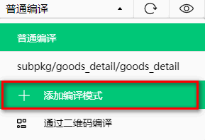
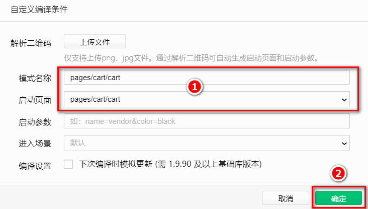
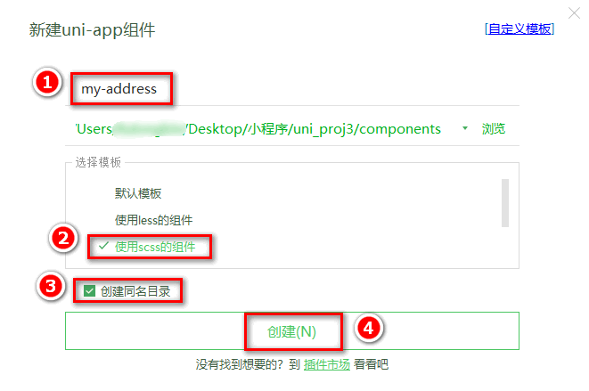
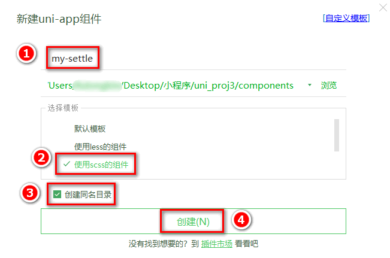

## 9. 购物车页面

### 9.0 创建购物车页面的编译模式

打开微信开发者工具，点击工具栏上的“`编译模式`”下拉菜单，选择“`添加编译模式`”：


勾选“`启动页面的路径`”之后，点击“`确定`”按钮，新增购物车页面的编译模式：


### 9.1 商品列表区域

#### 9.1.1 渲染购物车商品列表的标题区域

定义如下的 `UI` 结构：

```html
<!-- 购物车商品列表的标题区域 -->
<view class="cart-title">
  <!-- 左侧的图标 -->
  <uni-icons type="shop" size="18"></uni-icons>
  <!-- 描述文本 -->
  <text class="cart-title-text">购物车</text>
</view>
```

美化样式：

```scss
.cart-title {
  height: 40px;
  display: flex;
  align-items: center;
  font-size: 14px;
  padding-left: 5px;
  border-bottom: 1px solid #efefef;
  .cart-title-text {
    margin-left: 10px;
  }
}
```

#### 9.1.2 渲染商品列表区域的基本结构

通过 `mapState` 辅助函数，将 `Store` 中的 `cart` 数组映射到当前页面中使用：

```js{2-3,8-9}
import badgeMix from "@/mixins/tabbar-badge.js";
// 按需导入 mapState 这个辅助函数
import { mapState } from "vuex";

export default {
  mixins: [badgeMix],
  computed: {
    // 将 m_cart 模块中的 cart 数组映射到当前页面中使用
    ...mapState("m_cart", ["cart"]),
  },
  data() {
    return {};
  },
};
```

在 `UI` 结构中，通过 `v-for` 指令循环渲染自定义的 `my-goods` 组件：

```html
<!-- 商品列表区域 -->
<block v-for="(goods, i) in cart" :key="i">
  <my-goods :goods="goods"></my-goods>
</block>
```

#### 9.1.3 为 my-goods 组件封装 radio 勾选状态

打开 `my-goods.vue` 组件的源代码，为商品的左侧图片区域添加 `radio` 组件：

```html{3}
<!-- 商品左侧图片区域 -->
<view class="goods-item-left">
  <radio checked color="#C00000"></radio>
  <image :src="goods.goods_small_logo || defaultPic" class="goods-pic"></image>
</view>
```

给类名为 `goods-item-left` 的 `view` 组件添加样式，实现 `radio` 组件和 `image` 组件的左右布局：

```scss{3-5}
.goods-item-left {
  margin-right: 5px;
  display: flex;
  justify-content: space-between;
  align-items: center;

  .goods-pic {
    width: 100px;
    height: 100px;
    display: block;
  }
}
```

封装名称为 `showRadio` 的 `props` 属性，来控制当前组件中是否显示 `radio` 组件：

```js{9-14}
export default {
  // 定义 props 属性，用来接收外界传递到当前组件的数据
  props: {
    // 商品的信息对象
    goods: {
      type: Object,
      default: {},
    },
    // 是否展示图片左侧的 radio
    showRadio: {
      type: Boolean,
      // 如果外界没有指定 show-radio 属性的值，则默认不展示 radio 组件
      default: false,
    },
  },
};
```

使用 `v-if` 指令控制 `radio` 组件的按需展示：

```html{4}
<!-- 商品左侧图片区域 -->
<view class="goods-item-left">
  <!-- 使用 v-if 指令控制 radio 组件的显示与隐藏 -->
  <radio checked color="#C00000" v-if="showRadio"></radio>
  <image :src="goods.goods_small_logo || defaultPic" class="goods-pic"></image>
</view>
```

在 `cart.vue` 页面中的商品列表区域，指定 `:show-radio="true"` 属性，从而显示 `radio` 组件：

```html{3}
<!-- 商品列表区域 -->
<block v-for="(goods, i) in cart" :key="i">
  <my-goods :goods="goods" :show-radio="true"></my-goods>
</block>
```

修改 `my-goods.vue` 组件，动态为 `radio` 绑定选中状态：

```html{4}
<!-- 商品左侧图片区域 -->
<view class="goods-item-left">
  <!-- 存储在购物车中的商品，包含 goods_state 属性，表示商品的勾选状态 -->
  <radio :checked="goods.goods_state" color="#C00000" v-if="showRadio"></radio>
  <image :src="goods.goods_small_logo || defaultPic" class="goods-pic"></image>
</view>
```

#### 9.1.4 为 my-goods 组件封装 radio-change 事件

当用户点击 `radio` 组件，希望修改当前商品的勾选状态，此时用户可以为 `my-goods` 组件绑定 `@radio-change` 事件，从而获取当前商品的 `goods_id` 和 `goods_state`：

```html{4-8}
<!-- 商品列表区域 -->
<block v-for="(goods, i) in cart" :key="i">
  <!-- 在 radioChangeHandler 事件处理函数中，通过事件对象 e，得到商品的 goods_id 和 goods_state -->
  <my-goods
    :goods="goods"
    :show-radio="true"
    @radio-change="radioChangeHandler"
  ></my-goods>
</block>
```

定义 `radioChangeHandler` 事件处理函数如下：

```js
methods: {
  // 商品的勾选状态发生了变化
  radioChangeHandler(e) {
    console.log(e) // 输出得到的数据 -> {goods_id: 395, goods_state: false}
  }
}
```

在 `my-goods.vue` 组件中，为 `radio` 组件绑定 `@click` 事件处理函数如下：

```html{3-8}
<!-- 商品左侧图片区域 -->
<view class="goods-item-left">
  <radio
    :checked="goods.goods_state"
    color="#C00000"
    v-if="showRadio"
    @click="radioClickHandler"
  ></radio>
  <image :src="goods.goods_small_logo || defaultPic" class="goods-pic"></image>
</view>
```

在 `my-goods.vue` 组件的 `methods` 节点中，定义 `radioClickHandler` 事件处理函数：

```js
methods: {
  // radio 组件的点击事件处理函数
  radioClickHandler() {
    // 通过 this.$emit() 触发外界通过 @ 绑定的 radio-change 事件，
    // 同时把商品的 Id 和 勾选状态 作为参数传递给 radio-change 事件处理函数
    this.$emit('radio-change', {
      // 商品的 Id
      goods_id: this.goods.goods_id,
      // 商品最新的勾选状态
      goods_state: !this.goods.goods_state
    })
  }
}
```

#### 9.1.5 修改购物车中商品的勾选状态

在 `store/cart.js` 模块中，声明如下的 `mutations` 方法，用来修改对应商品的勾选状态：

```js
// 更新购物车中商品的勾选状态
updateGoodsState(state, goods) {
  // 根据 goods_id 查询购物车中对应商品的信息对象
  const findResult = state.cart.find(x => x.goods_id === goods.goods_id)

  // 有对应的商品信息对象
  if (findResult) {
    // 更新对应商品的勾选状态
    findResult.goods_state = goods.goods_state
    // 持久化存储到本地
    this.commit('m_cart/saveToStorage')
  }
}
```

在 `cart.vue` 页面中，导入 `mapMutations` 这个辅助函数，从而将需要的 `mutations` 方法映射到当前页面中使用：

```js{2,13-17}
import badgeMix from "@/mixins/tabbar-badge.js";
import { mapState, mapMutations } from "vuex";

export default {
  mixins: [badgeMix],
  computed: {
    ...mapState("m_cart", ["cart"]),
  },
  data() {
    return {};
  },
  methods: {
    ...mapMutations("m_cart", ["updateGoodsState"]),
    // 商品的勾选状态发生了变化
    radioChangeHandler(e) {
      this.updateGoodsState(e);
    },
  },
};
```

#### 9.1.6 为 my-goods 组件封装 NumberBox

注意：`NumberBox` 组件是 `uni-ui` 提供的

[uni-number-box](https://uniapp.dcloud.net.cn/component/uniui/uni-number-box.html)

修改 `my-goods.vue` 组件的源代码，在类名为 `goods-info-box` 的 `view` 组件内部渲染 `NumberBox` 组件的基本结构：

```html{4-5}
<view class="goods-info-box">
  <!-- 商品价格 -->
  <view class="goods-price">￥{{goods.goods_price | tofixed}}</view>
  <!-- 商品数量 -->
  <uni-number-box :min="1"></uni-number-box>
</view>
```

美化页面的结构：

```scss{3,11-15}
.goods-item-right {
  display: flex;
  flex: 1;
  flex-direction: column;
  justify-content: space-between;

  .goods-name {
    font-size: 13px;
  }

  .goods-info-box {
    display: flex;
    align-items: center;
    justify-content: space-between;
  }

  .goods-price {
    font-size: 16px;
    color: #c00000;
  }
}
```

在 `my-goods.vue` 组件中，动态为 `NumberBox` 组件绑定商品的数量值：

```html{4-5}
<view class="goods-info-box">
  <!-- 商品价格 -->
  <view class="goods-price">￥{{goods.goods_price | tofixed}}</view>
  <!-- 商品数量 -->
  <uni-number-box :min="1" :value="goods.goods_count"></uni-number-box>
</view>
```

在 `my-goods.vue` 组件中，封装名称为 `showNum` 的 `props` 属性，来控制当前组件中是否显示 `NumberBox` 组件：

```js{15-19}
export default {
  // 定义 props 属性，用来接收外界传递到当前组件的数据
  props: {
    // 商品的信息对象
    goods: {
      type: Object,
      defaul: {},
    },
    // 是否展示图片左侧的 radio
    showRadio: {
      type: Boolean,
      // 如果外界没有指定 show-radio 属性的值，则默认不展示 radio 组件
      default: false,
    },
    // 是否展示价格右侧的 NumberBox 组件
    showNum: {
      type: Boolean,
      default: false,
    },
  },
};
```

在 `my-goods.vue` 组件中，使用 `v-if` 指令控制 `NumberBox` 组件的按需展示：

```html{4-10}
<view class="goods-info-box">
  <!-- 商品价格 -->
  <view class="goods-price">￥{{goods.goods_price | tofixed}}</view>
  <!-- 商品数量 -->
  <uni-number-box
    :min="1"
    :value="goods.goods_count"
    @change="numChangeHandler"
    v-if="showNum"
  ></uni-number-box>
</view>
```

在 `cart.vue` 页面中的商品列表区域，指定 `:show-num="true"` 属性，从而显示 `NumberBox` 组件：

```html{3-8}
<!-- 商品列表区域 -->
<block v-for="(goods, i) in cart" :key="i">
  <my-goods
    :goods="goods"
    :show-radio="true"
    :show-num="true"
    @radio-change="radioChangeHandler"
  ></my-goods>
</block>
```

#### 9.1.7 为 my-goods 组件封装 num-change 事件

当用户修改了 `NumberBox` 的值以后，希望将最新的商品数量更新到购物车中，此时用户可以为 `my-goods` 组件绑定 `@num-change` 事件，从而获取当前商品的 `goods_id` 和 `goods_count`：

```html{3-9}
<!-- 商品列表区域 -->
<block v-for="(goods, i) in cart" :key="i">
  <my-goods
    :goods="goods"
    :show-radio="true"
    :show-num="true"
    @radio-change="radioChangeHandler"
    @num-change="numberChangeHandler"
  ></my-goods>
</block>
```

定义 `numberChangeHandler` 事件处理函数如下：

```js
// 商品的数量发生了变化
numberChangeHandler(e) {
  console.log(e)
}
```

在 `my-goods.vue` 组件中，为 `uni-number-box` 组件绑定 `@change` 事件处理函数如下：

```html{4-9}
<view class="goods-info-box">
  <!-- 商品价格 -->
  <view class="goods-price">￥{{goods.goods_price | tofixed}}</view>
  <!-- 商品数量 -->
  <uni-number-box
    :min="1"
    :value="goods.goods_count"
    @change="numChangeHandler"
  ></uni-number-box>
</view>
```

在 `my-goods.vue` 组件的 `methods` 节点中，定义 `numChangeHandler` 事件处理函数：

```js
methods: {
  // NumberBox 组件的 change 事件处理函数
  numChangeHandler(val) {
    // 通过 this.$emit() 触发外界通过 @ 绑定的 num-change 事件
    this.$emit('num-change', {
      // 商品的 Id
      goods_id: this.goods.goods_id,
      // 商品的最新数量
      goods_count: +val
    })
  }
}
```

#### 9.1.8 解决 NumberBox 数据不合法的问题

问题说明：当用户在 `NumberBox` 中输入字母等非法字符之后，会导致 `NumberBox` 数据紊乱的问题

打开项目根目录中 `components/uni-number-box/uni-number-box.vue` 组件，修改 `methods` 节点中的 `_onBlur` 函数如下：

```js{3,6,8-12}
_onBlur(event) {
  // 官方的代码没有进行数值转换，用户输入的 value 值可能是非法字符：
  // let value = event.detail.value;

  // 将用户输入的内容转化为整数
  let value = parseInt(event.detail.value);

  if (!value) {
    // 如果转化之后的结果为 NaN，则给定默认值为 1
    this.inputValue = 1;
    return;
  }

  // 省略其它代码...
}
```

修改完毕之后，用户输入小数会被转化为整数，用户输入非法字符会被替换为默认值 `1`

#### 9.1.9 完善 NumberBox 的 inputValue 侦听器

问题说明：在用户每次输入内容之后，都会触发 `inputValue` 侦听器，从而调用 `this.$emit("change", newVal)` 方法。这种做法可能会把不合法的内容传递出去！

打开项目根目录中 `components/uni-number-box/uni-number-box.vue` 组件，修改 `watch` 节点中的 `inputValue` 侦听器如下：

```js{6}
inputValue(newVal, oldVal) {
  // 官方提供的 if 判断条件，在用户每次输入内容时，都会调用 this.$emit("change", newVal)
  // if (+newVal !== +oldVal) {

  // 新旧内容不同 && 新值内容合法 && 新值中不包含小数点
  if (+newVal !== +oldVal && Number(newVal) && String(newVal).indexOf('.') === -1) {
    this.$emit("change", newVal);
  }
}
```

修改完毕之后，`NumberBox` 组件只会把合法的、且不包含小数点的新值传递出去

#### 9.1.10 修改购物车中商品的数量

在 `store/cart.js` 模块中，声明如下的 `mutations` 方法，用来修改对应商品的数量：

```js
// 更新购物车中商品的数量
updateGoodsCount(state, goods) {
  // 根据 goods_id 查询购物车中对应商品的信息对象
  const findResult = state.cart.find(x => x.goods_id === goods.goods_id)

  if(findResult) {
    // 更新对应商品的数量
    findResult.goods_count = goods.goods_count
    // 持久化存储到本地
    this.commit('m_cart/saveToStorage')
  }
}
```

在 `cart.vue` 页面中，通过 `mapMutations` 这个辅助函数，将需要的 `mutations` 方法映射到当前页面中使用：

```js{2,13,18-21}
import badgeMix from "@/mixins/tabbar-badge.js";
import { mapState, mapMutations } from "vuex";

export default {
  mixins: [badgeMix],
  computed: {
    ...mapState("m_cart", ["cart"]),
  },
  data() {
    return {};
  },
  methods: {
    ...mapMutations("m_cart", ["updateGoodsState", "updateGoodsCount"]),
    // 商品的勾选状态发生了变化
    radioChangeHandler(e) {
      this.updateGoodsState(e);
    },
    // 商品的数量发生了变化
    numberChangeHandler(e) {
      this.updateGoodsCount(e);
    },
  },
};
```

#### 9.1.11 渲染滑动删除的 UI 效果

滑动删除需要用到 `uni-ui` 的 `uni-swipe-action` 组件和 `uni-swipe-action-item`。详细的官方文档请参考 `SwipeAction` 滑动操作。
[uni-swipe-action](https://uniapp.dcloud.net.cn/component/uniui/uni-swipe-action.html)

改造 `cart.vue` 页面的 `UI` 结构，将商品列表区域的结构修改如下（可以使用 `uSwipeAction` 代码块快速生成基本的 `UI` 结构）：

```html{3,6-9,17,19}
<!-- 商品列表区域 -->
<!-- uni-swipe-action 是最外层包裹性质的容器 -->
<uni-swipe-action>
  <block v-for="(goods, i) in cart" :key="i">
    <!-- uni-swipe-action-item 可以为其子节点提供滑动操作的效果。需要通过 options 属性来指定操作按钮的配置信息
      新版用： :right-options="options"
     -->
    <uni-swipe-action-item
      :options="options"
      @click="swipeActionClickHandler(goods)"
    >
      <my-goods
        :goods="goods"
        :show-radio="true"
        :show-num="true"
        @radio-change="radioChangeHandler"
        @num-change="numberChangeHandler"
      ></my-goods>
    </uni-swipe-action-item>
  </block>
</uni-swipe-action>
```

在 `data` 节点中声明 `options` 数组，用来定义操作按钮的配置信息：

```js{3-8}
data() {
  return {
    options: [{
      text: '删除', // 显示的文本内容
      style: {
        backgroundColor: '#C00000' // 按钮的背景颜色
      }
    }]
  }
}
```

在 `methods` 中声明 `uni-swipe-action-item` 组件的 `@click` 事件处理函数：

```js
// 点击了滑动操作按钮
swipeActionClickHandler(goods) {
  console.log(goods)
}
```

美化 `my-goods.vue` 组件的样式：

```scss{2-5}
.goods-item {
  // 让 goods-item 项占满整个屏幕的宽度
  width: 750rpx;
  // 设置盒模型为 border-box
  box-sizing: border-box;
  display: flex;
  padding: 10px 5px;
  border-bottom: 1px solid #f0f0f0;
}
```

#### 9.1.12 实现滑动删除的功能

在 `store/cart.js` 模块的 `mutations` 节点中声明如下的方法，从而根据商品的 `Id` 从购物车中移除对应的商品：

```js
// 根据 Id 从购物车中删除对应的商品信息
removeGoodsById(state, goods_id) {
  // 调用数组的 filter 方法进行过滤
  state.cart = state.cart.filter(x => x.goods_id !== goods_id)
  // 持久化存储到本地
  this.commit('m_cart/saveToStorage')
}
```

在 `cart.vue` 页面中，使用 `mapMutations` 辅助函数，把需要的方法映射到当前页面中使用：

```js{2,11-14}
methods: {
  ...mapMutations('m_cart', ['updateGoodsState', 'updateGoodsCount', 'removeGoodsById']),
  // 商品的勾选状态发生了变化
  radioChangeHandler(e) {
    this.updateGoodsState(e)
  },
  // 商品的数量发生了变化
  numberChangeHandler(e) {
    this.updateGoodsCount(e)
  },
  // 点击了滑动操作按钮
  swipeActionClickHandler(goods) {
    this.removeGoodsById(goods.goods_id)
  }
}
```

### 9.2 收货地址区域

#### 9.2.1 创建收货地址组件

在 `components` 目录上鼠标右键，选择 `新建组件`，并填写组件相关的信息：


渲染收货地址组件的基本结构：

```html
<view>
  <!-- 选择收货地址的盒子 -->
  <view class="address-choose-box">
    <button type="primary" size="mini" class="btnChooseAddress">
      请选择收货地址+
    </button>
  </view>

  <!-- 渲染收货信息的盒子 -->
  <view class="address-info-box">
    <view class="row1">
      <view class="row1-left">
        <view class="username">收货人：<text>escook</text></view>
      </view>
      <view class="row1-right">
        <view class="phone">电话：<text>138XXXX5555</text></view>
        <uni-icons type="arrowright" size="16"></uni-icons>
      </view>
    </view>
    <view class="row2">
      <view class="row2-left">收货地址：</view>
      <view class="row2-right"
        >河北省邯郸市肥乡区xxx 河北省邯郸市肥乡区xxx 河北省邯郸市肥乡区xxx
        河北省邯郸市肥乡区xxx
      </view>
    </view>
  </view>

  <!-- 底部的边框线 -->
  <image src="/static/cart_border@2x.png" class="address-border"></image>
</view>
```

美化收货地址组件的样式：

```scss
// 底部边框线的样式
.address-border {
  display: block;
  width: 100%;
  height: 5px;
}

// 选择收货地址的盒子
.address-choose-box {
  height: 90px;
  display: flex;
  align-items: center;
  justify-content: center;
}

// 渲染收货信息的盒子
.address-info-box {
  font-size: 12px;
  height: 90px;
  display: flex;
  flex-direction: column;
  justify-content: center;
  padding: 0 5px;

  // 第一行
  .row1 {
    display: flex;
    justify-content: space-between;

    .row1-right {
      display: flex;
      align-items: center;

      .phone {
        margin-right: 5px;
      }
    }
  }

  // 第二行
  .row2 {
    display: flex;
    align-items: center;
    margin-top: 10px;

    .row2-left {
      white-space: nowrap;
    }
  }
}
```

在 `cart.vue` 中渲染收货地址组件：

```html
<view class="cart-container">
  <!-- 收货地址组件 -->
  <my-address></my-address>
</view>
```

## 报错问题：小程序调用收货地址 `API` 报错：`errMsg: "chooseAddress:fail the api need to be declared in …e requiredPrivateInfos field in app.json/ext.json"`，导致无法弹出选择收货地址界面

解决方案：

### 一、unipp项目

打开`uniapp`项目的配置文件`manifest.json`，选择“源码视图” 在 `mp-weixin` 下 添加配置 ：

```json
"mp-weixin": {
 "requiredPrivateInfos": [
      "chooseAddress",
    ]
  },
```

### 二、原生微信小程序

打开项目的配置文件`app.json`：

```json
{
  "pages": ["pages/index/index"],
  "requiredPrivateInfos": ["getLocation"]
}
```

#### 9.2.2 实现收货地址区域的按需展示

在 `data` 中定义收货地址的信息对象：

```js{4-5}
export default {
  data() {
    return {
      // 收货地址
      address: {},
    };
  },
};
```

使用 `v-if` 和 `v-else` 实现按需展示：

```html{2,9}
<!-- 选择收货地址的盒子 -->
<view class="address-choose-box" v-if="JSON.stringify(address) === '{}'">
  <button type="primary" size="mini" class="btnChooseAddress">
    请选择收货地址+
  </button>
</view>

<!-- 渲染收货信息的盒子 -->
<view class="address-info-box" v-else>
  <!-- 省略其它代码 -->
</view>
```

#### 9.2.3 实现选择收货地址的功能

为 `请选择收货地址+` 的 `button` 按钮绑定点击事件处理函数：

```html{3-10}
<!-- 选择收货地址的盒子 -->
<view class="address-choose-box" v-if="JSON.stringify(address) === '{}'">
  <button
    type="primary"
    size="mini"
    class="btnChooseAddress"
    @click="chooseAddress"
  >
    请选择收货地址+
  </button>
</view>
```

定义 `chooseAddress` 事件处理函数，调用小程序提供的 `chooseAddress() API` 实现选择收货地址的功能：

```js
methods: {
  // 选择收货地址
  async chooseAddress() {
    // 1. 调用小程序提供的 chooseAddress() 方法，即可使用选择收货地址的功能
    //    返回值是一个数组：第 1 项为错误对象；第 2 项为成功之后的收货地址对象
    const [err, succ] = await uni.chooseAddress().catch(err => err)

    // 2. 用户成功的选择了收货地址
    if (err === null && succ.errMsg === 'chooseAddress:ok') {
      // 为 data 里面的收货地址对象赋值
      this.address = succ
    }
  }
}
```

定义收货详细地址的计算属性：

```js
computed: {
  // 收货详细地址的计算属性
  addstr() {
    if (!this.address.provinceName) return ''

    // 拼接 省，市，区，详细地址 的字符串并返回给用户
    return this.address.provinceName + this.address.cityName + this.address.countyName + this.address.detailInfo
  }
}
```

渲染收货地址区域的数据：

```html{5,8,13-14}
<!-- 渲染收货信息的盒子 -->
<view class="address-info-box" v-else>
  <view class="row1">
    <view class="row1-left">
      <view class="username">收货人：<text>{{address.userName}}</text></view>
    </view>
    <view class="row1-right">
      <view class="phone">电话：<text>{{address.telNumber}}</text></view>
      <uni-icons type="arrowright" size="16"></uni-icons>
    </view>
  </view>
  <view class="row2">
    <view class="row2-left">收货地址：</view>
    <view class="row2-right">{{addstr}}</view>
  </view>
</view>
```

#### 9.2.4 将 address 信息存储到 vuex 中

在 `store` 目录中，创建用户相关的 `vuex` 模块，命名为 `user.js`：

```js
export default {
  // 开启命名空间
  namespaced: true,

  // state 数据
  state: () => ({
    // 收货地址
    address: {},
  }),

  // 方法
  mutations: {
    // 更新收货地址
    updateAddress(state, address) {
      state.address = address;
    },
  },

  // 数据包装器
  getters: {},
};
```

在 `store/store.js` 模块中，导入并挂载 `user.js` 模块：

```js{6-7,19-20}
// 1. 导入 Vue 和 Vuex
import Vue from "vue";
import Vuex from "vuex";
// 导入购物车的 vuex 模块
import moduleCart from "./cart.js";
// 导入用户的 vuex 模块
import moduleUser from "./user.js";

// 2. 将 Vuex 安装为 Vue 的插件
Vue.use(Vuex);

// 3. 创建 Store 的实例对象
const store = new Vuex.Store({
  // TODO：挂载 store 模块
  modules: {
    // 挂载购物车的 vuex 模块，模块内成员的访问路径被调整为 m_cart，例如：
    // 购物车模块中 cart 数组的访问路径是 m_cart/cart
    m_cart: moduleCart,
    // 挂载用户的 vuex 模块，访问路径为 m_user
    m_user: moduleUser,
  },
});

// 4. 向外共享 Store 的实例对象
export default store;
```

改造 `address.vue` 组件中的代码，使用 `vuex` 提供的 `address` 计算属性 替代 `data` 中定义的本地 `address` 对象：

```js{7-8,12-13,20-24,29-30}
// 1. 按需导入 mapState 和 mapMutations 这两个辅助函数
import { mapState, mapMutations } from "vuex";

export default {
  data() {
    return {
      // 2.1 注释掉下面的 address 对象，使用 2.2 中的代码替代之
      // address: {}
    };
  },
  methods: {
    // 3.1 把 m_user 模块中的 updateAddress 函数映射到当前组件
    ...mapMutations("m_user", ["updateAddress"]),
    // 选择收货地址
    async chooseAddress() {
      const [err, succ] = await uni.chooseAddress().catch((err) => err);

      // 用户成功的选择了收货地址
      if (err === null && succ.errMsg === "chooseAddress:ok") {
        // 3.2 把下面这行代码注释掉，使用 3.3 中的代码替代之
        // this.address = succ

        // 3.3 调用 Store 中提供的 updateAddress 方法，将 address 保存到 Store 里面
        this.updateAddress(succ);
      }
    },
  },
  computed: {
    // 2.2 把 m_user 模块中的 address 对象映射当前组件中使用，代替 data 中 address 对象
    ...mapState("m_user", ["address"]),
    // 收货详细地址的计算属性
    addstr() {
      if (!this.address.provinceName) return "";

      // 拼接 省，市，区，详细地址 的字符串并返回给用户
      return (
        this.address.provinceName +
        this.address.cityName +
        this.address.countyName +
        this.address.detailInfo
      );
    },
  },
};
```

#### 9.2.5 将 Store 中的 address 持久化存储到本地

修改 `store/user.js` 模块中的代码如下：

```js{7-8,17-18,20-23}
export default {
  // 开启命名空间
  namespaced: true,

  // state 数据
  state: () => ({
    // 3. 读取本地的收货地址数据，初始化 address 对象
    address: JSON.parse(uni.getStorageSync("address") || "{}"),
  }),

  // 方法
  mutations: {
    // 更新收货地址
    updateAddress(state, address) {
      state.address = address;

      // 2. 通过 this.commit() 方法，调用 m_user 模块下的 saveAddressToStorage 方法将 address 对象持久化存储到本地
      this.commit("m_user/saveAddressToStorage");
    },
    // 1. 定义将 address 持久化存储到本地 mutations 方法
    saveAddressToStorage(state) {
      uni.setStorageSync("address", JSON.stringify(state.address));
    },
  },

  // 数据包装器
  getters: {},
};
```

#### 9.2.6 将 addstr 抽离为 getters

目的：为了提高代码的复用性，可以把收货的详细地址抽离为 `getters`，方便在多个页面和组件之间实现复用。

剪切 `my-address.vue` 组件中的 `addstr` 计算属性的代码，粘贴到 `user.js` 模块中，作为一个 `getters` 节点：

```js
// 数据包装器
getters: {
  // 收货详细地址的计算属性
  addstr(state) {
    if (!state.address.provinceName) return ''

    // 拼接 省，市，区，详细地址 的字符串并返回给用户
    return state.address.provinceName + state.address.cityName + state.address.countyName + state.address.detailInfo
  }
}
```

改造 `my-address.vue` 组件中的代码，通过 `mapGetters` 辅助函数，将 `m_user` 模块中的 `addstr` 映射到当前组件中使用：

```js{1-2,8-9}
// 按需导入 mapGetters 辅助函数
import { mapState, mapMutations, mapGetters } from "vuex";

export default {
  // 省略其它代码
  computed: {
    ...mapState("m_user", ["address"]),
    // 将 m_user 模块中的 addstr 映射到当前组件中使用
    ...mapGetters("m_user", ["addstr"]),
  },
};
```

#### 9.2.7 重新选择收货地址

为 `class` 类名为 `address-info-box` 的盒子绑定 `click` 事件处理函数如下：

```html{2}
<!-- 渲染收货信息的盒子 -->
<view class="address-info-box" v-else @click="chooseAddress">
  <!-- 省略其它代码 -->
</view>
```

#### 9.2.8 解决收货地址授权失败的问题

如果在选择收货地址的时候，用户点击了取消授权，则需要进行特殊的处理，否则用户将无法再次选择收货地址！

改造 `chooseAddress` 方法如下：

```js{13-16}
// 选择收货地址
async chooseAddress() {
  // 1. 调用小程序提供的 chooseAddress() 方法，即可使用选择收货地址的功能
  //    返回值是一个数组：第1项为错误对象；第2项为成功之后的收货地址对象
  const [err, succ] = await uni.chooseAddress().catch(err => err)

  // 2. 用户成功的选择了收货地址
  if (succ && succ.errMsg === 'chooseAddress:ok') {
    // 更新 vuex 中的收货地址
    this.updateAddress(succ)
  }

  // 3. 用户没有授权
  if (err && err.errMsg === 'chooseAddress:fail auth deny') {
    this.reAuth() // 调用 this.reAuth() 方法，向用户重新发起授权申请
  }
}
```

在 `methods` 节点中声明 `reAuth` 方法如下：

```js
// 调用此方法，重新发起收货地址的授权
async reAuth() {
  // 3.1 提示用户对地址进行授权
  const [err2, confirmResult] = await uni.showModal({
    content: '检测到您没打开地址权限，是否去设置打开？',
    confirmText: "确认",
    cancelText: "取消",
  })

  // 3.2 如果弹框异常，则直接退出
  if (err2) return

  // 3.3 如果用户点击了 “取消” 按钮，则提示用户 “您取消了地址授权！”
  if (confirmResult.cancel) return uni.$showMsg('您取消了地址授权！')

  // 3.4 如果用户点击了 “确认” 按钮，则调用 uni.openSetting() 方法进入授权页面，让用户重新进行授权
  if (confirmResult.confirm) return uni.openSetting({
    // 3.4.1 授权结束，需要对授权的结果做进一步判断
    success: (settingResult) => {
      // 3.4.2 地址授权的值等于 true，提示用户 “授权成功”
      if (settingResult.authSetting['scope.address']) return uni.$showMsg('授权成功！请选择地址')
      // 3.4.3 地址授权的值等于 false，提示用户 “您取消了地址授权”
      if (!settingResult.authSetting['scope.address']) return uni.$showMsg('您取消了地址授权！')
    }
  })
}
```

#### 9.2.9 解决 iPhone 真机上无法重新授权的问题

问题说明：在 `iPhone` 设备上，当用户取消授权之后，再次点击选择收货地址按钮的时候，无法弹出授权的提示框！

导致问题的原因 - 用户取消授权后，再次点击 `“选择收货地址”` 按钮的时候：

在模拟器和安卓真机上，错误消息 `err.errMsg` 的值为 `chooseAddress:fail auth deny`

在 `iPhone` 真机上，错误消息 `err.errMsg` 的值为 `chooseAddress:fail authorize no response`

解决问题的方案 - 修改 `chooseAddress` 方法中的代码，进一步完善用户没有授权时的 `if` 判断条件即可：

```js{12}
async chooseAddress() {
  // 1. 调用小程序提供的 chooseAddress() 方法，即可使用选择收货地址的功能
  //    返回值是一个数组：第1项为错误对象；第2项为成功之后的收货地址对象
  const [err, succ] = await uni.chooseAddress().catch(err => err)

  // 2. 用户成功的选择了收货地址
  if (succ && succ.errMsg === 'chooseAddress:ok') {
    this.updateAddress(succ)
  }

  // 3. 用户没有授权
  if (err && (err.errMsg === 'chooseAddress:fail auth deny' || err.errMsg === 'chooseAddress:fail authorize no response')) {
    this.reAuth()
  }
}
```

### 9.3 结算区域

#### 9.3.1 把结算区域封装为组件

在 `components` 目录中，新建 `my-settle` 结算组件：


初始化 `my-settle` 组件的基本结构和样式：

```vue{2-5,17-26}
<template>
  <!-- 最外层的容器 -->
  <view class="my-settle-container">
    结算组件
  </view>
</template>

<script>
export default {
  data() {
    return {}
  },
}
</script>

<style lang="scss">
.my-settle-container {
  /* 底部固定定位 */
  position: fixed;
  bottom: 0;
  left: 0;
  /* 设置宽高和背景色 */
  width: 100%;
  height: 50px;
  background-color: cyan;
}
</style>
```

在 `cart.vue` 页面中使用自定义的 `my-settle` 组件，并美化页面样式，防止页面底部被覆盖：

```vue{2,9-11,15-17}
<template>
  <view class="cart-container">
    <!-- 使用自定义的 address 组件 -->

    <!-- 购物车商品列表的标题区域 -->

    <!-- 商品列表区域 -->

    <!-- 结算区域 -->
    <my-settle></my-settle>
  </view>
</template>

<style lang="scss">
.cart-container {
  padding-bottom: 50px;
}
</style>
```

#### 9.3.2 渲染结算区域的结构和样式

定义如下的 `UI` 结构：

```html{3-6,8-9,11-12}
<!-- 最外层的容器 -->
<view class="my-settle-container">
  <!-- 全选区域 -->
  <label class="radio">
    <radio color="#C00000" :checked="true" /><text>全选</text>
  </label>

  <!-- 合计区域 -->
  <view class="amount-box"> 合计:<text class="amount">￥1234.00</text> </view>

  <!-- 结算按钮 -->
  <view class="btn-settle">结算(0)</view>
</view>
```

美化样式：

```scss{7-13,15-18,20-22,24-32}
.my-settle-container {
  position: fixed;
  bottom: 0;
  left: 0;
  width: 100%;
  height: 50px;
  // 将背景色从 cyan 改为 white
  background-color: white;
  display: flex;
  justify-content: space-between;
  align-items: center;
  padding-left: 5px;
  font-size: 14px;

  .radio {
    display: flex;
    align-items: center;
  }

  .amount {
    color: #c00000;
  }

  .btn-settle {
    height: 50px;
    min-width: 100px;
    background-color: #c00000;
    color: white;
    line-height: 50px;
    text-align: center;
    padding: 0 10px;
  }
}
```

#### 9.3.3 动态渲染已勾选商品的总数量

在 `store/cart.js` 模块中，定义一个名称为 `checkedCount` 的 `getters`，用来统计已勾选商品的总数量：

```js
// 勾选的商品的总数量
checkedCount(state) {
  // 先使用 filter 方法，从购物车中过滤器已勾选的商品
  // 再使用 reduce 方法，将已勾选的商品总数量进行累加
  // reduce() 的返回值就是已勾选的商品的总数量
  return state.cart.filter(x => x.goods_state).reduce((total, item) => total += item.goods_count, 0)
}
```

在 `my-settle` 组件中，通过 `mapGetters` 辅助函数，将需要的 `getters` 映射到当前组件中使用：

```js{1,5}
import { mapGetters } from "vuex";

export default {
  computed: {
    ...mapGetters("m_cart", ["checkedCount"]),
  },
  data() {
    return {};
  },
};
```

将 `checkedCount` 的值渲染到页面中：

```html
<!-- 结算按钮 -->
<view class="btn-settle">结算({{checkedCount}})</view>
```

#### 9.3.4 动态渲染全选按钮的选中状态

使用 `mapGetters` 辅助函数，将商品的总数量映射到当前组件中使用，并定义一个叫做 `isFullCheck` 的计算属性：

```js{6,8-10}
import { mapGetters } from "vuex";

export default {
  computed: {
    // 1. 将 total 映射到当前组件中
    ...mapGetters("m_cart", ["checkedCount", "total"]),
    // 2. 是否全选
    isFullCheck() {
      return this.total === this.checkedCount;
    },
  },
  data() {
    return {};
  },
};
```

为 `radio` 组件动态绑定 `checked` 属性的值：

```html{3}
<!-- 全选区域 -->
<label class="radio">
  <radio color="#C00000" :checked="isFullCheck" /><text>全选</text>
</label>
```

#### 9.3.5 实现商品的全选/反选功能

在 `store/cart.js` 模块中，定义一个叫做 `updateAllGoodsState` 的 `mutations` 方法，用来修改所有商品的勾选状态：

```js
// 更新所有商品的勾选状态
updateAllGoodsState(state, newState) {
  // 循环更新购物车中每件商品的勾选状态
  state.cart.forEach(x => x.goods_state = newState)
  // 持久化存储到本地
  this.commit('m_cart/saveToStorage')
}
```

在 `my-settle` 组件中，通过 `mapMutations` 辅助函数，将需要的 `mutations` 方法映射到当前组件中使用：

```js{1-2,7-8}
// 1. 按需导入 mapMutations 辅助函数
import { mapGetters, mapMutations } from "vuex";

export default {
  // 省略其它代码
  methods: {
    // 2. 使用 mapMutations 辅助函数，把 m_cart 模块提供的 updateAllGoodsState 方法映射到当前组件中使用
    ...mapMutations("m_cart", ["updateAllGoodsState"]),
  },
};
```

为 `UI` 中的 `label` 组件绑定 `click` 事件处理函数：

```html{2}
<!-- 全选区域 -->
<label class="radio" @click="changeAllState">
  <radio color="#C00000" :checked="isFullCheck" /><text>全选</text>
</label>
```

在 `my-settle` 组件的 `methods` 节点中，声明 `changeAllState` 事件处理函数：

```js{4-8}
methods: {
  ...mapMutations('m_cart', ['updateAllGoodsState']),
  // label 的点击事件处理函数
  changeAllState() {
    // 修改购物车中所有商品的选中状态
    // !this.isFullCheck 表示：当前全选按钮的状态取反之后，就是最新的勾选状态
    this.updateAllGoodsState(!this.isFullCheck)
  }
}
```

#### 9.3.6 动态渲染已勾选商品的总价格

在 `store/cart.js` 模块中，定义一个叫做 `checkedGoodsAmount` 的 `getters`，用来统计已勾选商品的总价格：

```js
// 已勾选的商品的总价
checkedGoodsAmount(state) {
  // 先使用 filter 方法，从购物车中过滤器已勾选的商品
  // 再使用 reduce 方法，将已勾选的商品数量 * 单价之后，进行累加
  // reduce() 的返回值就是已勾选的商品的总价
  // 最后调用 toFixed(2) 方法，保留两位小数
  return state.cart.filter(x => x.goods_state)
                   .reduce((total, item) => total += item.goods_count * item.goods_price, 0)
                   .toFixed(2)
}
```

在 `my-settle` 组件中，使用 `mapGetters` 辅助函数，把需要的 `checkedGoodsAmount` 映射到当前组件中使用：

```js
...mapGetters('m_cart', ['total', 'checkedCount', 'checkedGoodsAmount'])
```

在组件的 `UI` 结构中，渲染已勾选的商品的总价：

```html{3}
<!-- 合计区域 -->
<view class="amount-box">
  合计:<text class="amount">￥{{checkedGoodsAmount}}</text>
</view>
```

#### 9.3.7 动态计算购物车徽标的数值

问题说明：当修改购物车中商品的数量之后，`tabBar` 上的数字徽标不会自动更新。

解决方案：改造 `mixins/tabbar-badge.js` 中的代码，使用 `watch` 侦听器，监听 `total` 总数量的变化，从而动态为 `tabBar` 的徽标赋值：

```js{8-14}
import { mapGetters } from "vuex";

// 导出一个 mixin 对象
export default {
  computed: {
    ...mapGetters("m_cart", ["total"]),
  },
  watch: {
    // 监听 total 值的变化
    total() {
      // 调用 methods 中的 setBadge 方法，重新为 tabBar 的数字徽章赋值
      this.setBadge();
    },
  },
  onShow() {
    // 在页面刚展示的时候，设置数字徽标
    this.setBadge();
  },
  methods: {
    setBadge() {
      // 调用 uni.setTabBarBadge() 方法，为购物车设置右上角的徽标
      uni.setTabBarBadge({
        index: 2,
        text: this.total + "", // 注意：text 的值必须是字符串，不能是数字
      });
    },
  },
};
```

#### 9.3.8 渲染购物车为空时的页面结构

将 资料 目录中的 `cart_empty@2x.png` 图片复制到项目的 `/static/` 目录中

改造 `cart.vue` 页面的 `UI` 结构，使用 `v-if` 和 `v-else` 控制购物车区域和空白购物车区域的按需展示：

```html{2,12-16}
<template>
  <view class="cart-container" v-if="cart.length !== 0">
    <!-- 使用自定义的 address 组件 -->

    <!-- 购物车商品列表的标题区域 -->

    <!-- 商品列表区域 -->

    <!-- 结算区域 -->
  </view>

  <!-- 空白购物车区域 -->
  <view class="empty-cart" v-else>
    <image src="/static/cart_empty@2x.png" class="empty-img"></image>
    <text class="tip-text">空空如也~</text>
  </view>
</template>
```

美化空白购物车区域的样式：

```scss
.empty-cart {
  display: flex;
  flex-direction: column;
  align-items: center;
  padding-top: 150px;

  .empty-img {
    width: 90px;
    height: 90px;
  }

  .tip-text {
    font-size: 12px;
    color: gray;
    margin-top: 15px;
  }
}
```

### 9.4 分支的合并与提交

1. 将 `cart` 分支进行本地提交：

```bash
git add .
git commit -m "完成了购物车的开发"
```

2. 将本地的 `cart` 分支推送到码云：

```bash
git push -u origin cart
```

3. 将本地 `cart` 分支中的代码合并到 `master` 分支：

```bash
git checkout master
git merge cart
git push
```

4. 删除本地的 `cart` 分支：

```bash
git branch -d cart
```
