# uniapp - 黑马优购

## 1.起步

### 1.1 uni-app 简介

`uni-app` 是一个使用 `Vue.js` 开发所有前端应用的框架。开发者编写一套代码，可发布到 `iOS`、`Android`、`H5`、以及各种小程序（微信/支付宝/百度/头条/QQ/钉钉/淘宝）、快应用等多个平台。
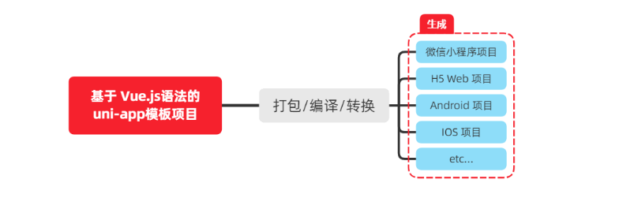

> 详细的 `uni-app` 官方文档，请翻阅 `https://uniapp.dcloud.net.cn/`

## 1.2 开发工具

`uni-app` 官方推荐使用 `HBuilderX` 来开发 `uni-app` 类型的项目。主要好处：

- 模板丰富
- 完善的智能提示
- 一键运行

当然，你依然可以根据自己的喜好，选择使用 `VS Code`、`Sublime`、`记事本`... 等自己喜欢的编辑器！

### 1.2.1 下载 HBuilderX

1. 访问 `HBuilderX` 的官网首页 `https://www.dcloud.io/hbuilderx.html`
2. 点击首页的 `DOWNLOAD` 按钮
3. 选择下载 正式版 -> App 开发版

### 1.2.2 安装 HBuilderX

1. 将下载的 `zip包` 进行解压缩
2. 将解压之后的文件夹，存放到纯英文的目录中（且不能包含括号等特殊字符）
3. 双击 `HBuilderX.exe` 即可启动 `HBuilderX`

### 1.2.3 安装 scss/sass 编译

为了方便编写样式（例如：`<style lang="scss"></style>`），建议安装 `scss/sass` 编译 插件。插件下载地址：

> https://ext.dcloud.net.cn/plugin?name=compile-node-sass

进入插件下载页面之后，点击右上角的 使用 `HBuilderX` 导入插件 按钮进行自动安装，截图如下：

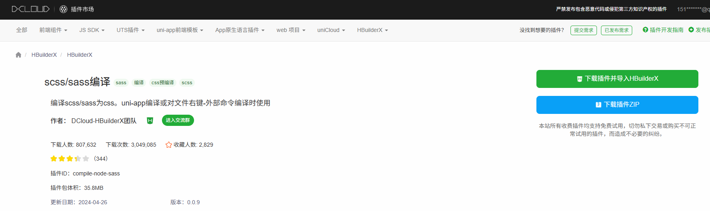

### 1.2.4 快捷键方案切换

操作步骤：工具 -> 预设快捷键方案切换 -> `VS Code`
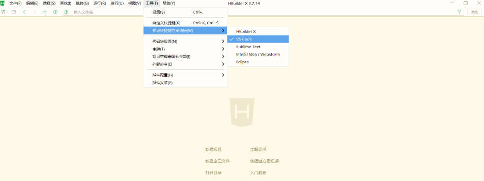

### 1.2.5 修改编辑器的基本设置

操作步骤：工具 -> 设置 -> 打开 `Settings.json` 按需进行配置
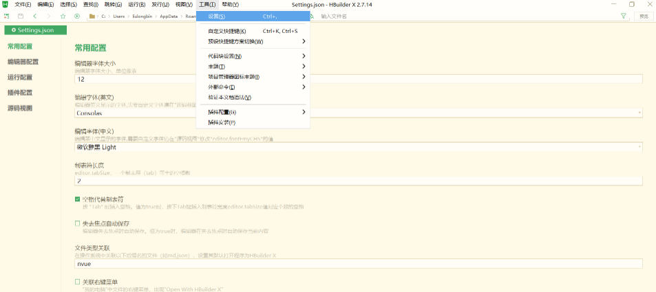

源码视图下可用的参考配置：

```json
{
  "editor.colorScheme": "Default",
  "editor.fontSize": 12,
  "editor.fontFamily": "Consolas",
  "editor.fontFmyCHS": "微软雅黑 Light",
  "editor.insertSpaces": true,
  "editor.lineHeight": "1.5",
  "editor.minimap.enabled": false,
  "editor.mouseWheelZoom": true,
  "editor.onlyHighlightWord": false,
  "editor.tabSize": 2,
  "editor.wordWrap": true,
  "explorer.iconTheme": "vs-seti",
  "editor.codeassist.px2rem.enabel": false,
  "editor.codeassist.px2upx.enabel": false
}
```

Tips：可以使用 `Ctrl + 鼠标滚轮` 缩放编辑器

## 1.3 新建 uni-app 项目

1. 文件 -> 新建 -> 项目
   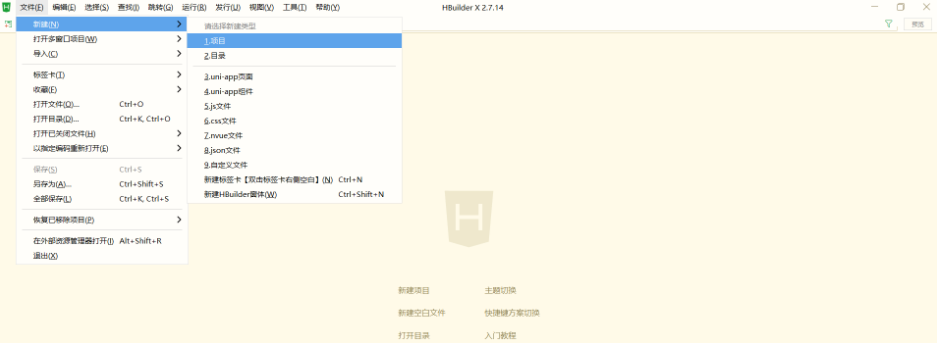

2. 填写项目基本信息
   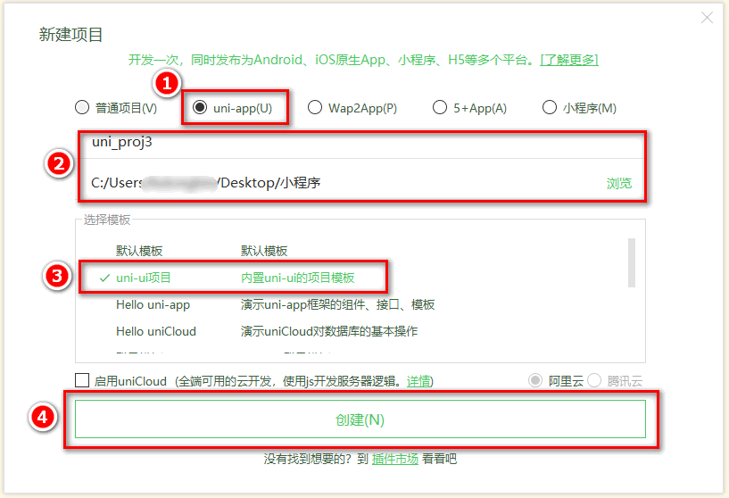

3. 项目创建成功
   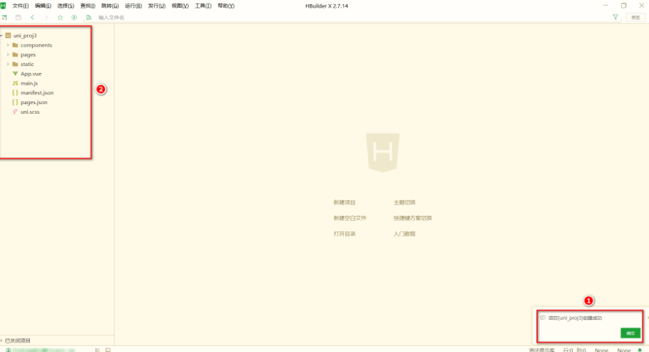

## 1.4 目录结构

一个 `uni-app` 项目，默认包含如下目录及文件：

```bash
┌─components            uni-app组件目录
│  └─comp-a.vue         可复用的a组件
├─pages                 业务页面文件存放的目录
│  ├─index
│  │  └─index.vue       index页面
│  └─list
│     └─list.vue        list页面
├─static                存放应用引用静态资源（如图片、视频等）的目录，注意：静态资源只能存放于此
├─main.js               Vue初始化入口文件
├─App.vue               应用配置，用来配置小程序的全局样式、生命周期函数等
├─manifest.json         配置应用名称、appid、logo、版本等打包信息
└─pages.json            配置页面路径、页面窗口样式、tabBar、navigationBar 等页面类信息
```

## 1.5 把项目运行到微信开发者工具

1. 填写自己的微信小程序的 `AppID`：
   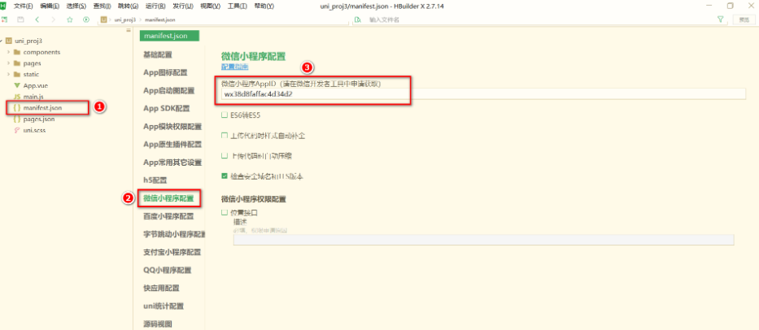

2. 在 `HBuilderX` 中，配置“微信开发者工具”的安装路径：
   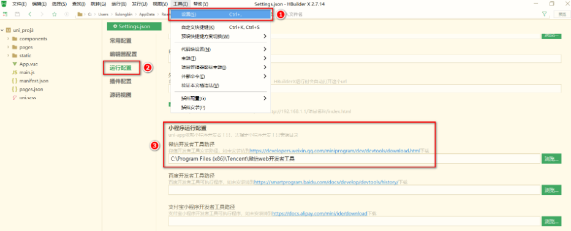

3. 在微信开发者工具中，通过 `设置 -> 安全设置` 面板，开启“微信开发者工具”的服务端口：
   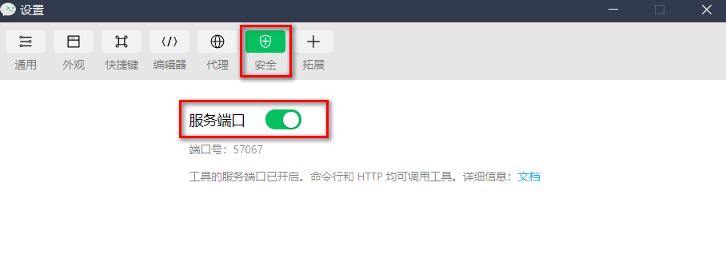

4. 在 `HBuilderX` 中，点击菜单栏中的 `运行 -> 运行到小程序模拟器 -> 微信开发者工具`，将当前 `uni-app` 项目编译之后，自动运行到微信开发者工具中，从而方便查看项目效果与调试：

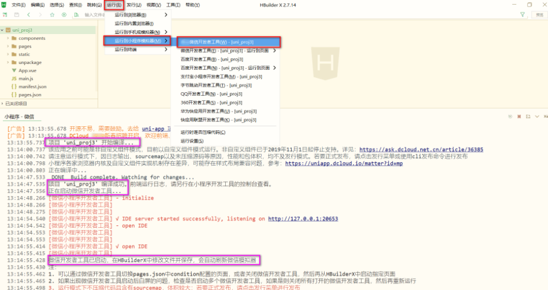

5. 初次运行成功之后的项目效果：
   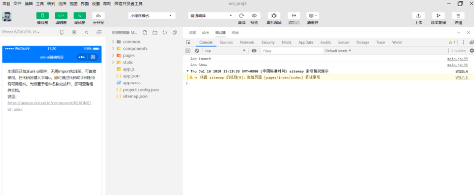

## 1.6 使用 Git 管理项目

### 1.6.1 本地管理

1. 在项目根目录中新建 `.gitignore` 忽略文件，并配置如下：

```bash
# 忽略 node_modules 目录
/node_modules
/unpackage/dist
```

> 注意：由于我们忽略了 `unpackage` 目录中仅有的 `dist` 目录，因此默认情况下， `unpackage` 目录不会被 `Git` 追踪

> 此时，为了让 `Git` 能够正常追踪 `unpackage` 目录，按照惯例，我们可以在 `unpackage` 目录下创建一个叫做 `.gitkeep` 的文件进行占位

2. 打开终端，切换到项目根目录中，运行如下的命令，初始化本地 `Git` 仓库：

```bash
git init
```

3. 将所有文件都加入到暂存区：

```bash
git add .
```

4. 本地提交更新：

```bash
git commit -m "init project"
```

### 1.6.2 把项目托管到码云

1. 注册并激活 码云账号（ 注册页面地址：https://gitee.com/signup ）
2. 生成并配置 `SSH` 公钥
3. 创建空白的码云仓库
4. 把本地项目上传到码云对应的空白仓库中

## 2. tabBar

### 2.0 创建 tabBar 分支

运行如下的命令，基于 `master` 分支在本地创建 `tabBar` 子分支，用来开发和 `tabBar` 相关的功能：

```bash
git checkout -b tabbar
```

### 2.1 创建 tabBar 页面

在 `pages` 目录中，创建首页(`home`)、分类(`cate`)、购物车(`cart`)、我的(`my`) 这 4 个 `tabBar` 页面。在 `HBuilderX` 中，可以通过如下的两个步骤，快速新建页面：

在 `pages` 目录上鼠标右键，选择新建页面

在弹出的窗口中，填写页面的名称、勾选 `scss` 模板之后，点击创建按钮。截图如下：
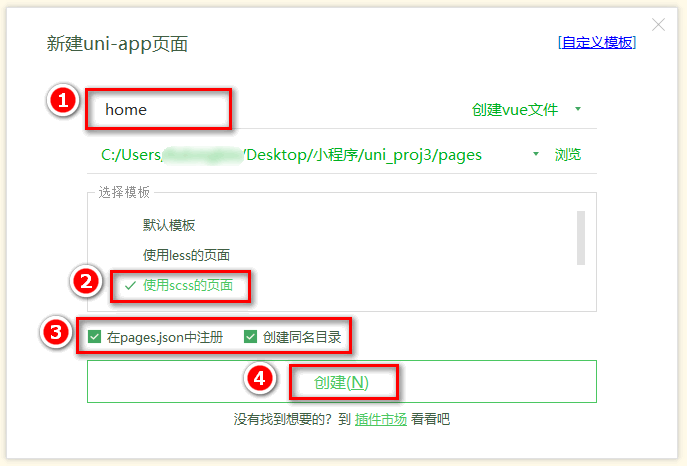

### 2.2 配置 tabBar 效果

1. 将 资料 目录下的 `static` 文件夹 拷贝一份，替换掉项目根目录中的 `static` 文件夹

2. 修改项目根目录中的 `pages.json` 配置文件，新增 `tabBar` 的配置节点如下：

```json
{
  "tabBar": {
    "selectedColor": "#C00000",
    "list": [
      {
        "pagePath": "pages/home/home",
        "text": "首页",
        "iconPath": "static/tab_icons/home.png",
        "selectedIconPath": "static/tab_icons/home-active.png"
      },
      {
        "pagePath": "pages/cate/cate",
        "text": "分类",
        "iconPath": "static/tab_icons/cate.png",
        "selectedIconPath": "static/tab_icons/cate-active.png"
      },
      {
        "pagePath": "pages/cart/cart",
        "text": "购物车",
        "iconPath": "static/tab_icons/cart.png",
        "selectedIconPath": "static/tab_icons/cart-active.png"
      },
      {
        "pagePath": "pages/my/my",
        "text": "我的",
        "iconPath": "static/tab_icons/my.png",
        "selectedIconPath": "static/tab_icons/my-active.png"
      }
    ]
  }
}
```

### 2.3 删除默认的 index 首页

1. 在 `HBuilderX` 中，把 `pages` 目录下的 `index`首页文件夹 删除掉

2. 同时，把 `page.json` 中记录的 `index` 首页 路径删除掉

3. 为了防止小程序运行失败，在微信开发者工具中，手动删除 `pages` 目录下的 `index` 首页文件夹

4. 同时，把 `components` 目录下的 `uni-link` 组件文件夹 删除掉

### 2.4 修改导航条的样式效果

1. 打开 `pages.json` 这个全局的配置文件

2. 修改 `globalStyle` 节点如下：

```json
{
  "globalStyle": {
    "navigationBarTextStyle": "white",
    "navigationBarTitleText": "黑马优购",
    "navigationBarBackgroundColor": "#C00000",
    "backgroundColor": "#FFFFFF"
  }
}
```

### 2.5 分支的提交与合并

1. 将本地的 `tabbar` 分支进行本地的 `commit` 提交：

```bash
git add .
git commit -m "完成了 tabBar 的开发"
```

2. 将本地的 `tabbar` 分支推送到远程仓库进行保存：

```bash
git push -u origin tabbar
```

3. 将本地的 `tabbar` 分支合并到本地的 `master` 分支：

```bash
git checkout master
git merge tabbar
```

4. 删除本地的 `tabbar` 分支：

```bash
git branch -d tabbar
```

## 3. 首页

### 3.0 创建 home 分支

运行如下的命令，基于 `master` 分支在本地创建 `home` 子分支，用来开发和 `home` 首页相关的功能：

```bash
git checkout -b home
```

### 3.1 配置网络请求

由于平台的限制，小程序项目中不支持 `axios`，而且原生的 `wx.request() API` 功能较为简单，不支持拦截器等全局定制的功能。因此，建议在 `uni-app` 项目中使用 `@escook/request-miniprogram` 第三方包发起网络数据请求。

> 请参考 `@escook/request-miniprogram` 的官方文档进行安装、配置、使用

> 官方文档：https://www.npmjs.com/package/@escook/request-miniprogram

```bash
npm init
npm install @escook/request-miniprogram
```

最终，在项目的 `main.js` 入口文件中，通过如下的方式进行配置：

```js
import { $http } from "@escook/request-miniprogram";

uni.$http = $http;
// 配置请求根路径
$http.baseUrl = "https://www.uinav.com";

// 请求开始之前做一些事情
$http.beforeRequest = function (options) {
  uni.showLoading({
    title: "数据加载中...",
  });
};

// 请求完成之后做一些事情
$http.afterRequest = function () {
  uni.hideLoading();
};
```

### 3.2 轮播图区域

#### 3.2.1 请求轮播图的数据

实现步骤：

1. 在 `data` 中定义轮播图的数组
2. 在 `onLoad` 生命周期函数中调用获取轮播图数据的方法
3. 在 `methods` 中定义获取轮播图数据的方法

示例代码：

```js
export default {
  data() {
    return {
      // 1. 轮播图的数据列表，默认为空数组
      swiperList: [],
    };
  },
  onLoad() {
    // 2. 在小程序页面刚加载的时候，调用获取轮播图数据的方法
    this.getSwiperList();
  },
  methods: {
    // 3. 获取轮播图数据的方法
    async getSwiperList() {
      // 3.1 发起请求
      const { data: res } = await uni.$http.get(
        "/api/public/v1/home/swiperdata",
      );
      // 3.2 请求失败
      if (res.meta.status !== 200) {
        return uni.showToast({
          title: "数据请求失败！",
          duration: 1500,
          icon: "none",
        });
      }
      // 3.3 请求成功，为 data 中的数据赋值
      this.swiperList = res.message;
    },
  },
};
```

#### 3.2.2 渲染轮播图的 UI 结构

渲染 `UI` 结构：

```html
<template>
  <view>
    <!-- 轮播图区域 -->
    <swiper
      :indicator-dots="true"
      :autoplay="true"
      :interval="3000"
      :duration="1000"
      :circular="true"
    >
      <!-- 循环渲染轮播图的 item 项 -->
      <swiper-item v-for="(item, i) in swiperList" :key="i">
        <view class="swiper-item">
          <!-- 动态绑定图片的 src 属性 -->
          <image :src="item.image_src"></image>
        </view>
      </swiper-item>
    </swiper>
  </view>
</template>
```

美化 `UI` 结构：

```scss
<style lang="scss">
swiper {
 height: 330rpx;

 .swiper-item,
 image {
   width: 100%;
   height: 100%;
 }
}
</style>
```

#### 3.2.3 配置小程序分包

分包可以减少小程序首次启动时的加载时间

为此，我们在项目中，把 `tabBar` 相关的 4 个页面放到主包中，其它页面（例如：商品详情页、商品列表页）放到分包中。在 `uni-app` 项目中，配置分包的步骤如下：

在项目根目录中，创建分包的根目录，命名为 `subpkg`

在 `pages.json` 中，和 `pages` 节点平级的位置声明 `subPackages` 节点，用来定义分包相关的结构：

```json{20-25}
{
  "pages": [
    {
      "path": "pages/home/home",
      "style": {}
    },
    {
      "path": "pages/cate/cate",
      "style": {}
    },
    {
      "path": "pages/cart/cart",
      "style": {}
    },
    {
      "path": "pages/my/my",
      "style": {}
    }
  ],
  "subPackages": [
    {
      "root": "subpkg",
      "pages": []
    }
  ]
}
```

在 `subpkg` 目录上鼠标右键，点击 新建页面 选项，并填写页面的相关信息：
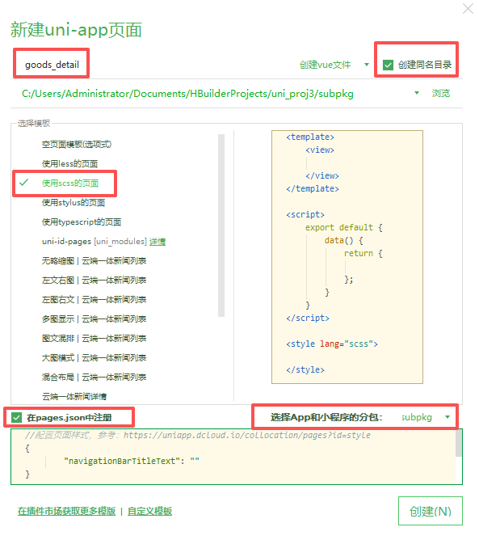

#### 3.2.4 点击轮播图跳转到商品详情页面

将 `<swiper-item></swiper-item>` 节点内的 `view` 组件，改造为 `navigator` 导航组件，并动态绑定 `url` 属性 的值。

改造之前的 `UI` 结构：

```html
<swiper-item v-for="(item, i) in swiperList" :key="i">
  <view class="swiper-item">
    <!-- 动态绑定图片的 src 属性 -->
    <image :src="item.image_src"></image>
  </view>
</swiper-item>
```

改造之后的 `UI` 结构：

```html{2,5}
<swiper-item v-for="(item, i) in swiperList" :key="i">
  <navigator class="swiper-item" :url="'/subpkg/goods_detail/goods_detail?goods_id=' + item.goods_id">
    <!-- 动态绑定图片的 src 属性 -->
    <image :src="item.image_src"></image>
  </navigator>
</swiper-item>
```

#### 3.2.5 封装 uni.$showMsg() 方法

当数据请求失败之后，经常需要调用 `uni.showToast({ /* 配置对象 */ })` 方法来提示用户。此时，可以在全局封装一个 `uni.$showMsg()` 方法，来简化 `uni.showToast()` 方法的调用。具体的改造步骤如下：

在 `main.js` 中，为 `uni` 对象挂载自定义的 `$showMsg()` 方法：

```js
// 封装的展示消息提示的方法
uni.$showMsg = function (title = "数据加载失败！", duration = 1500) {
  uni.showToast({
    title,
    duration,
    icon: "none",
  });
};
```

今后，在需要提示消息的时候，直接调用 `uni.$showMsg()` 方法即可：

```js{3}
async getSwiperList() {
   const { data: res } = await uni.$http.get('/api/public/v1/home/swiperdata')
   if (res.meta.status !== 200) return uni.$showMsg()
   this.swiperList = res.message
}
```

### 3.3 分类导航区域

#### 3.3.1 获取分类导航的数据

实现思路：

1. 定义 `data` 数据
2. 在 `onLoad` 中调用获取数据的方法
3. 在 `methods` 中定义获取数据的方法

示例代码如下：

```js{5,10,14-18}
export default {
  data() {
    return {
      // 1. 分类导航的数据列表
      navList: [],
    };
  },
  onLoad() {
    // 2. 在 onLoad 中调用获取数据的方法
    this.getNavList();
  },
  methods: {
    // 3. 在 methods 中定义获取数据的方法
    async getNavList() {
      const { data: res } = await uni.$http.get("/api/public/v1/home/catitems");
      if (res.meta.status !== 200) return uni.$showMsg();
      this.navList = res.message;
    },
  },
};
```

#### 3.3.2 渲染分类导航的 `UI` 结构

定义如下的 `UI` 结构：

```html
<!-- 分类导航区域 -->
<view class="nav-list">
  <view class="nav-item" v-for="(item, i) in navList" :key="i">
    <image :src="item.image_src" class="nav-img"></image>
  </view>
</view>
```

通过如下的样式美化页面结构：

```scss
.nav-list {
  display: flex;
  justify-content: space-around;
  margin: 15px 0;

  .nav-img {
    width: 128rpx;
    height: 140rpx;
  }
}
```

#### 3.3.2 点击第一项，切换到分类页面

为 `nav-item` 绑定点击事件处理函数：

```html
<!-- 分类导航区域 -->
<view class="nav-list">
  <view
    class="nav-item"
    v-for="(item, i) in navList"
    :key="i"
    @click="navClickHandler(item)"
  >
    <image :src="item.image_src" class="nav-img"></image>
  </view>
</view>
```

定义 `navClickHandler` 事件处理函数：

```js
// nav-item 项被点击时候的事件处理函数
navClickHandler(item) {
  // 判断点击的是哪个 nav
  if (item.name === '分类') {
    uni.switchTab({
      url: '/pages/cate/cate'
    })
  }
}
```

### 3.4 楼层区域

#### 3.4.1 获取楼层数据

实现思路：

1. 定义 `data` 数据
2. 在 `onLoad` 中调用获取数据的方法
3. 在 `methods` 中定义获取数据的方法

示例代码如下：

```js{5,10,14-20}
export default {
  data() {
    return {
      // 1. 楼层的数据列表
      floorList: [],
    };
  },
  onLoad() {
    // 2. 在 onLoad 中调用获取楼层数据的方法
    this.getFloorList();
  },
  methods: {
    // 3. 定义获取楼层列表数据的方法
    async getFloorList() {
      const { data: res } = await uni.$http.get(
        "/api/public/v1/home/floordata",
      );
      if (res.meta.status !== 200) return uni.$showMsg();
      this.floorList = res.message;
    },
  },
};
```

#### 3.4.2 渲染楼层的标题

定义如下的 `UI` 结构：

```html
<!-- 楼层区域 -->
<view class="floor-list">
  <!-- 楼层 item 项 -->
  <view class="floor-item" v-for="(item, i) in floorList" :key="i">
    <!-- 楼层标题 -->
    <image :src="item.floor_title.image_src" class="floor-title"></image>
  </view>
</view>
```

美化楼层标题的样式：

```scss
.floor-title {
  height: 60rpx;
  width: 100%;
  display: flex;
}
```

#### 3.4.3 渲染楼层里的图片

定义楼层图片区域的 `UI` 结构：

```html
<!-- 楼层图片区域 -->
<view class="floor-img-box">
  <!-- 左侧大图片的盒子 -->
  <view class="left-img-box">
    <image
      :src="item.product_list[0].image_src"
      :style="{width: item.product_list[0].image_width + 'rpx'}"
      mode="widthFix"
    ></image>
  </view>
  <!-- 右侧 4 个小图片的盒子 -->
  <view class="right-img-box">
    <view
      class="right-img-item"
      v-for="(item2, i2) in item.product_list"
      :key="i2"
      v-if="i2 !== 0"
    >
      <image
        :src="item2.image_src"
        mode="widthFix"
        :style="{width: item2.image_width + 'rpx'}"
      ></image>
    </view>
  </view>
</view>
```

美化楼层图片区域的样式：

```scss
.right-img-box {
  display: flex;
  flex-wrap: wrap;
  justify-content: space-around;
}

.floor-img-box {
  display: flex;
  padding-left: 10rpx;
}
```

#### 3.4.4 点击楼层图片跳转到商品列表页

在 `subpkg` 分包中，新建 `goods_list` 页面
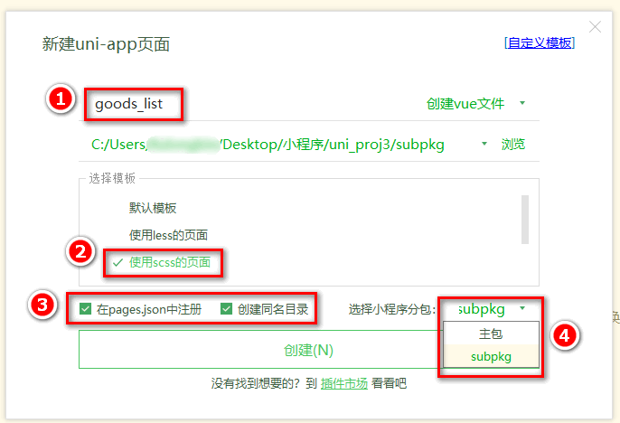

楼层数据请求成功之后，通过双层 `forEach` 循环，处理 `URL` 地址：

```js{6-11}
// 获取楼层列表数据
async getFloorList() {
  const { data: res } = await uni.$http.get('/api/public/v1/home/floordata')
  if (res.meta.status !== 200) return uni.$showMsg()

  // 通过双层 forEach 循环，处理 URL 地址
  res.message.forEach(floor => {
    floor.product_list.forEach(prod => {
      prod.url = '/subpkg/goods_list/goods_list?' + prod.navigator_url.split('?')[1]
    })
  })

  this.floorList = res.message
}
```

把图片外层的 `view` 组件，改造为 `navigator` 组件，并动态绑定 `url` 属性 的值：

```html{4,10,13-19,25}
<!-- 楼层图片区域 -->
<view class="floor-img-box">
  <!-- 左侧大图片的盒子 -->
  <navigator class="left-img-box" :url="item.product_list[0].url">
    <image
      :src="item.product_list[0].image_src"
      :style="{width: item.product_list[0].image_width + 'rpx'}"
      mode="widthFix"
    ></image>
  </navigator>
  <!-- 右侧 4 个小图片的盒子 -->
  <view class="right-img-box">
    <navigator
      class="right-img-item"
      v-for="(item2, i2) in item.product_list"
      :key="i2"
      v-if="i2 !== 0"
      :url="item2.url"
    >
      <image
        :src="item2.image_src"
        mode="widthFix"
        :style="{width: item2.image_width + 'rpx'}"
      ></image>
    </navigator>
  </view>
</view>
```

### 3.5 分支的合并与提交

1. 将本地的 `home` 分支进行本地的 `commit` 提交：

```bash
git add .
git commit -m "完成了 home 首页的开发"
```

2. 将本地的 `home` 分支推送到远程仓库进行保存：

```bash
git push -u origin home
```

3. 将本地的 `home` 分支合并到本地的 master 分支：

```bash
git checkout master
git merge home
```

4. 删除本地的 `home` 分支：

```bash
git branch -d home
```

## 4. 分类

### 4.0 创建 cate 分支

运行如下的命令，基于 `master` 分支在本地创建 `cate` 子分支，用来开发分类页面相关的功能：

```bash
git checkout -b cate
```

### 4.1 渲染分类页面的基本结构

定义页面结构如下：

```html
<template>
  <view>
    <view class="scroll-view-container">
      <!-- 左侧的滚动视图区域 -->
      <scroll-view
        class="left-scroll-view"
        scroll-y
        :style="{height: wh + 'px'}"
      >
        <view class="left-scroll-view-item active">xxx</view>
        <view class="left-scroll-view-item">xxx</view>
        <view class="left-scroll-view-item">xxx</view>
        <view class="left-scroll-view-item">xxx</view>
        <view class="left-scroll-view-item">xxx</view>
        <view class="left-scroll-view-item"
          >多复制一些节点，演示纵向滚动效果...</view
        >
      </scroll-view>
      <!-- 右侧的滚动视图区域 -->
      <scroll-view
        class="right-scroll-view"
        scroll-y
        :style="{height: wh + 'px'}"
      >
        <view class="left-scroll-view-item">zzz</view>
        <view class="left-scroll-view-item">zzz</view>
        <view class="left-scroll-view-item">zzz</view>
        <view class="left-scroll-view-item">zzz</view>
        <view class="left-scroll-view-item"
          >多复制一些节点，演示纵向滚动效果</view
        >
      </scroll-view>
    </view>
  </view>
</template>
```

动态计算窗口的剩余高度：

```js{5-6,10-13}
<script>
  export default {
    data() {
      return {
        // 窗口的可用高度 = 屏幕高度 - navigationBar高度 - tabBar 高度
        wh: 0
      };
    },
    onLoad() {
      // 获取当前系统的信息
      const sysInfo = uni.getSystemInfoSync()
      // 为 wh 窗口可用高度动态赋值
      this.wh = sysInfo.windowHeight
    }
  }
</script>
```

美化页面结构：

```scss
.scroll-view-container {
  display: flex;

  .left-scroll-view {
    width: 120px;

    .left-scroll-view-item {
      line-height: 60px;
      background-color: #f7f7f7;
      text-align: center;
      font-size: 12px;

      // 激活项的样式
      &.active {
        background-color: #ffffff;
        position: relative;

        // 渲染激活项左侧的红色指示边线
        &::before {
          content: " ";
          display: block;
          width: 3px;
          height: 30px;
          background-color: #c00000;
          position: absolute;
          left: 0;
          top: 50%;
          transform: translateY(-50%);
        }
      }
    }
  }
}
```

### 4.2 获取分类数据

在 `data` 中定义分类数据节点：

```js{3-4}
data() {
  return {
    // 分类数据列表
    cateList: []
  }
}
```

调用获取分类列表数据的方法：

```js{2-3}
onLoad() {
  // 调用获取分类列表数据的方法
  this.getCateList()
}
```

定义获取分类列表数据的方法：

```js{2-9}
methods: {
  async getCateList() {
    // 发起请求
    const { data: res } = await uni.$http.get('/api/public/v1/categories')
    // 判断是否获取失败
    if (res.meta.status !== 200) return uni.$showMsg()
    // 转存数据
    this.cateList = res.message
  }
}
```

### 4.3 动态渲染左侧的一级分类列表

循环渲染列表结构：

```html
<!-- 左侧的滚动视图区域 -->
<scroll-view class="left-scroll-view" scroll-y :style="{height: wh + 'px'}">
  <block v-for="(item, i) in cateList" :key="i">
    <view class="left-scroll-view-item">{{item.cat_name}}</view>
  </block>
</scroll-view>
```

在 `data` 中定义默认选中项的索引：

```js{3-4}
data() {
  return {
    // 当前选中项的索引，默认让第一项被选中
    active: 0
  }
}
```

循环渲染结构时，为选中项动态添加 `.active` 类名：

```html{2}
<block v-for="(item, i) in cateList" :key="i">
  <view :class="['left-scroll-view-item', i === active ? 'active' : '']"
    >{{item.cat_name}}</view
  >
</block>
```

为一级分类的 `Item` 项绑定点击事件处理函数 `activeChanged`：

```html{4}
<block v-for="(item, i) in cateList" :key="i">
  <view
    :class="['left-scroll-view-item', i === active ? 'active' : '']"
    @click="activeChanged(i)"
    >{{item.cat_name}}</view
  >
</block>
```

定义 `activeChanged` 事件处理函数，动态修改选中项的索引：

```js{2-5}
methods: {
  // 选中项改变的事件处理函数
  activeChanged(i) {
    this.active = i
  }
}
```

### 4.4 动态渲染右侧的二级分类列表

在 `data` 中定义二级分类列表的数据节点：

```js{3-4}
data() {
  return {
    // 二级分类列表
    cateLevel2: []
  }
}
```

修改 `getCateList` 方法，在请求到数据之后，为二级分类列表数据赋值：

```js{5-6}
async getCateList() {
  const { data: res } = await uni.$http.get('/api/public/v1/categories')
  if (res.meta.status !== 200) return uni.$showMsg()
  this.cateList = res.message
  // 为二级分类赋值
  this.cateLevel2 = res.message[0].children
}
```

修改 `activeChanged` 方法，在一级分类选中项改变之后，为二级分类列表数据重新赋值：

```js{3-4}
activeChanged(i) {
  this.active = i
  // 为二级分类列表重新赋值
  this.cateLevel2 = this.cateList[i].children
}
```

循环渲染右侧二级分类列表的 `UI` 结构：

```html
<!-- 右侧的滚动视图区域 -->
<scroll-view class="right-scroll-view" scroll-y :style="{height: wh + 'px'}">
  <view class="cate-lv2" v-for="(item2, i2) in cateLevel2" :key="i2">
    <view class="cate-lv2-title">/ {{item2.cat_name}} /</view>
  </view>
</scroll-view>
```

美化二级分类的标题样式：

```scss
.cate-lv2-title {
  font-size: 12px;
  font-weight: bold;
  text-align: center;
  padding: 15px 0;
}
```

### 4.5 动态渲染右侧的三级分类列表

在二级分类的 `<view>` 组件中，循环渲染三级分类的列表结构：

```html{5-18}
<!-- 右侧的滚动视图区域 -->
<scroll-view class="right-scroll-view" scroll-y :style="{height: wh + 'px'}">
  <view class="cate-lv2" v-for="(item2, i2) in cateLevel2" :key="i2">
    <view class="cate-lv2-title">/ {{item2.cat_name}} /</view>
    <!-- 动态渲染三级分类的列表数据 -->
    <view class="cate-lv3-list">
      <!-- 三级分类 Item 项 -->
      <view
        class="cate-lv3-item"
        v-for="(item3, i3) in item2.children"
        :key="i3"
      >
        <!-- 图片 -->
        <image :src="item3.cat_icon"></image>
        <!-- 文本 -->
        <text>{{item3.cat_name}}</text>
      </view>
    </view>
  </view>
</scroll-view>
```

美化三级分类的样式：

```scss
.cate-lv3-list {
  display: flex;
  flex-wrap: wrap;

  .cate-lv3-item {
    width: 33.33%;
    margin-bottom: 10px;
    display: flex;
    flex-direction: column;
    align-items: center;

    image {
      width: 60px;
      height: 60px;
    }

    text {
      font-size: 12px;
    }
  }
}
```

### 4.6 切换一级分类后重置滚动条的位置

在 `data` 中定义 滚动条距离顶部的距离：

```js{3-4}
data() {
  return {
    // 滚动条距离顶部的距离
    scrollTop: 0
  }
}
```

动态为右侧的 `<scroll-view>` 组件绑定 `scroll-top` 属性的值：

```html{6}
<!-- 右侧的滚动视图区域 -->
<scroll-view
  class="right-scroll-view"
  scroll-y
  :style="{height: wh + 'px'}"
  :scroll-top="scrollTop"
></scroll-view>
```

切换一级分类时，动态设置 `scrollTop` 的值：

```js{6-10}
// 选中项改变的事件处理函数
activeChanged(i) {
  this.active = i
  this.cateLevel2 = this.cateList[i].children

  // 让 scrollTop 的值在 0 与 1 之间切换
  this.scrollTop = this.scrollTop === 0 ? 1 : 0

  // 可以简化为如下的代码：
  // this.scrollTop = this.scrollTop ? 0 : 1
}
```

### 为什么不能直接赋值 0？

> `<scroll-view>` 组件的 `scroll-top` 是一个受控属性，只有当它的值发生变化时，才会触发滚动行为。
> 如果连续两次点击（比如点击同一分类两次），第一次点击时已经将 `scrollTop` 设为 `0`，第二次点击时 `scrollTop` 仍然是 `0`，值没有变化，组件就不会重新滚动到顶部。
> 同理，即使点击不同分类，如果当前 `scrollTop` 恰好已经是 `0`（例如之前某次滚动后没有变化），再次设为 `0` 也不会触发滚动。

> 这种写法存在问题，因为 `scrollTop` 的值在第一次点击时是 `0`，第二次点击时是 `1`，第三次点击时是 `0`，第四次点击时是 `1`，以此类推。连续点击同一个分类时，页面会有1px的跳动，导致用户体验感差。

### 使用 scroll-into-view（推荐）

此方案利用 `scroll-view` 的 `scroll-into-view` 属性，通过滚动到指定 `id` 的元素来实现精确回到顶部，不会有任何多余位移。

实现步骤

1. 在右侧 `scroll-view` 顶部添加一个隐藏的锚点元素,给它设置一个固定的 `id`，例如 "`top`"。

2. 将 `scroll-into-view` 属性绑定到一个动态变量（如 `intoView`）。

3. 切换分类时，先清空 `intoView`，再在下一帧设置为锚点 `id`，触发滚动。

代码修改
模板部分：

```html{4-6}
<scroll-view class="right-scroll-view"
              scroll-y
              :style="{height: wh + 'px'}"
              :scroll-into-view="intoView">   <!-- 使用 scroll-into-view -->
  <!-- 顶部锚点（不可见） -->
  <view id="top" style="height: 0; width: 0;"></view>

  <!-- 原有的分类内容 -->
  <view class="cate-lv2" v-for="...">...</view>
</scroll-view>
```

脚本部分：

```js{4,12-17}
data() {
  return {
    // ... 原有数据
    intoView: '',  // 控制滚动到的元素 id
  };
},
methods: {
  activeChanged(i) {
    this.active = i;
    this.cateLevel2 = this.cateList[i].children;

    // 先清空，确保下次设置能触发变化
    this.intoView = '';
    this.$nextTick(() => {
      // 滚动到顶部锚点
      this.intoView = 'top';
    });
  }
}
```

原理

- `scroll-into-view` 属性值变化时，`scroll-view` 会滚动到对应 `id` 的元素位置。

- 先清空再赋值，保证每次切换都能触发滚动（即使两次点击同一个分类）。

- 锚点元素高度为 `0`，不影响布局，且滚动目标就是顶部，没有 `1px` 偏移。

### 4.7 点击三级分类跳转到商品列表页面

为三级分类的 `Item` 项绑定点击事件处理函数如下：

```html{5}
<view
  class="cate-lv3-item"
  v-for="(item3, i3) in item2.children"
  :key="i3"
  @click="gotoGoodsList(item3)"
>
  <image :src="item3.cat_icon"></image>
  <text>{{item3.cat_name}}</text>
</view>
```

定义事件处理函数如下：

```js{1-6}
// 点击三级分类项跳转到商品列表页面
gotoGoodsList(item3) {
  uni.navigateTo({
    url: '/subpkg/goods_list/goods_list?cid=' + item3.cat_id
  })
}
```

### 4.8 分支的合并与提交

1. 将 `cate` 分支进行本地提交：

```bash
git add .
git commit -m "完成了分类页面的开发"
```

2. 将本地的 `cate` 分支推送到码云：

```bash
git push -u origin cate
```

3. 将本地 `cate` 分支中的代码合并到 `master` 分支：

```bash
git checkout master
git merge cate
git push
```

4. 删除本地的 `cate` 分支：

```bash
git branch -d cate
```

## 5. 搜索

### 5.0 创建 search 分支

运行如下的命令，基于 `master` 分支在本地创建 `search` 子分支，用来开发搜索相关的功能：

```bash
git checkout -b search
```

### 5.1 自定义搜索组件

#### 5.1.1 自定义 my-search 组件

在项目根目录的 `components` 目录上，鼠标右键，选择 `新建组件`，填写组件信息后，最后点击 `创建` 按钮：


在分类页面的 `UI` 结构中，直接以标签的形式使用 `my-search` 自定义组件：

```html
<!-- 使用自定义的搜索组件 -->
<my-search></my-search>
```

定义 `my-search` 组件的 `UI` 结构如下：

```html
<template>
  <view class="my-search-container">
    <!-- 使用 view 组件模拟 input 输入框的样式 -->
    <view class="my-search-box">
      <uni-icons type="search" size="17"></uni-icons>
      <text class="placeholder">搜索</text>
    </view>
  </view>
</template>
```

注意：在当前组件中，我们使用 `view` 组件模拟 `input` 输入框的效果；并不会在页面上渲染真正的 `input` 输入框

美化自定义 `search` 组件的样式：

```scss
.my-search-container {
  background-color: #c00000;
  height: 50px;
  padding: 0 10px;
  display: flex;
  align-items: center;
}

.my-search-box {
  height: 36px;
  background-color: #ffffff;
  border-radius: 15px;
  width: 100%;
  display: flex;
  align-items: center;
  justify-content: center;

  .placeholder {
    font-size: 15px;
    margin-left: 5px;
  }
}
```

由于自定义的 `my-search` 组件高度为 `50px`，因此，需要重新计算分类页面窗口的可用高度：

```js{3-4}
onLoad() {
  const sysInfo = uni.getSystemInfoSync()
  // 可用高度 = 屏幕高度 - navigationBar高度 - tabBar高度 - 自定义的search组件高度
  this.wh = sysInfo.windowHeight - 50
}
```

#### 5.1.2 通过自定义属性增强组件的通用性

为了增强组件的通用性，我们允许使用者自定义搜索组件的 背景颜色 和 圆角尺寸。

通过 `props` 定义 `bgcolor` 和 `radius` 两个属性，并指定值类型和属性默认值：

```js
props: {
  // 背景颜色
  bgcolor: {
    type: String,
    default: '#C00000'
  },
  // 圆角尺寸
  radius: {
    type: Number,
    // 单位是 px
    default: 18
  }
}
```

通过属性绑定的形式，为 `.my-search-container` 盒子和 `.my-search-box` 盒子动态绑定 `style` 属性：

```html{1-2}
<view class="my-search-container" :style="{'background-color': bgcolor}">
  <view class="my-search-box" :style="{'border-radius': radius + 'px'}">
    <uni-icons type="search" size="17"></uni-icons>
    <text class="placeholder">搜索</text>
  </view>
</view>
```

移除对应 `scss` 样式中的 背景颜色 和 圆角尺寸：

```scss{2-3,13-14}
.my-search-container {
  // 移除背景颜色，改由 props 属性控制
  // background-color: #C00000;
  height: 50px;
  padding: 0 10px;
  display: flex;
  align-items: center;
}

.my-search-box {
  height: 36px;
  background-color: #ffffff;
  // 移除圆角尺寸，改由 props 属性控制
  // border-radius: 15px;
  width: 100%;
  display: flex;
  align-items: center;
  justify-content: center;

  .placeholder {
    font-size: 15px;
    margin-left: 5px;
  }
}
```

#### 5.1.3 为自定义组件封装 click 事件

在 `my-search` 自定义组件内部，给类名为 `.my-search-box` 的 `view` 绑定 `click` 事件处理函数：

```html{4}
<view
  class="my-search-box"
  :style="{'border-radius': radius + 'px'}"
  @click="searchBoxHandler"
>
  <uni-icons type="search" size="17"></uni-icons>
  <text class="placeholder">搜索</text>
</view>
```

在 `my-search` 自定义组件的 `methods` 节点中，声明事件处理函数如下：

```js
methods: {
  // 点击了模拟的 input 输入框
  searchBoxHandler() {
  // 触发外界通过 @click 绑定的 click 事件处理函数
  this.$emit('click')
  }
}
```

在分类页面中使用 `my-search` 自定义组件时，即可通过 `@click` 为其绑定点击事件处理函数：

```html{2}
<!-- 使用自定义的搜索组件 -->
<my-search @click="gotoSearch"></my-search>
```

同时在分类页面中，定义 `gotoSearch` 事件处理函数如下：

```js
methods: {
  // 跳转到分包中的搜索页面
  gotoSearch() {
    uni.navigateTo({
      url: '/subpkg/search/search'
    })
  }
}
```

#### 5.1.4 实现首页搜索组件的吸顶效果

在 `home` 首页定义如下的 `UI` 结构：

```html
<!-- 使用自定义的搜索组件 -->
<view class="search-box">
  <my-search @click="gotoSearch"></my-search>
</view>
```

在 `home` 首页定义如下的事件处理函数：

```js
gotoSearch() {
  uni.navigateTo({
    url: '/subpkg/search/search'
  })
}
```

通过如下的样式实现吸顶的效果：

```scss
.search-box {
  // 设置定位效果为“吸顶”
  position: sticky;
  // 吸顶的“位置”
  top: 0;
  // 提高层级，防止被轮播图覆盖
  z-index: 999;
}
```

### 5.2 搜索建议

#### 5.2.1 渲染搜索页面的基本结构

新建 `search` 页面


在 项目中 导入 `uni-ui`的组件， `uni-search-bar` 组件：

定义如下的 `UI` 结构：

```html
<view class="search-box">
  <!-- 使用 uni-ui 提供的搜索组件 -->
  <uni-search-bar
    @input="input"
    :radius="100"
    cancelButton="none"
  ></uni-search-bar>
</view>
```

修改 `components` -> `uni-search-bar` -> `uni-search-bar.vue` 组件，将默认的白色搜索背景改为 `#C00000 `的红色背景：

```scss
.uni-searchbar {
  /* #ifndef APP-NVUE */
  display: flex;
  /* #endif */
  flex-direction: row;
  position: relative;
  padding: 16rpx;
  /* 将默认的 #FFFFFF 改为 #C00000 */
  background-color: #c00000;
}
```

实现搜索框的吸顶效果：

```scss
.search-box {
  position: sticky;
  top: 0;
  z-index: 999;
}
```

定义如下的 `input` 事件处理函数：

```js
methods: {
  input(e) {
    // e.value 是最新的搜索内容
    console.log(e.value)
  }
}
```

#### 5.2.2 实现搜索框自动获取焦点

修改 `components` -> `uni-search-bar` -> `uni-search-bar.vue` 组件，把 `data` 数据中的 `show` 和 `showSync` 的值，从默认的 `false` 改为 `true` 即可：

```js{3-4}
data() {
  return {
    show: true,
    showSync: true,
    searchVal: ""
  }
}
```

使用手机扫码预览，即可在真机上查看效果。

#### 5.2.3 实现搜索框的防抖处理

在 `data` 中定义防抖的延时器 `timerId` 如下：

```js
data() {
  return {
    // 延时器的 timerId
    timer: null,
    // 搜索关键词
    kw: ''
  }
}
```

修改 `input` 事件处理函数如下：

```js
input(e) {
  // 清除 timer 对应的延时器
  clearTimeout(this.timer)
  // 重新启动一个延时器，并把 timerId 赋值给 this.timer
  this.timer = setTimeout(() => {
    // 如果 500 毫秒内，没有触发新的输入事件，则为搜索关键词赋值
    this.kw = e
    console.log(this.kw)
  }, 500)
}
```

#### 5.2.4 根据关键词查询搜索建议列表

在 `data` 中定义如下的数据节点，用来存放搜索建议的列表数据：

```js
data() {
  return {
    // 搜索结果列表
    searchResults: []
  }
}
```

在防抖的 `setTimeout` 中，调用 `getSearchList` 方法获取搜索建议列表：

```js{3-4}
this.timer = setTimeout(() => {
  this.kw = e;
  // 根据关键词，查询搜索建议列表
  this.getSearchList();
}, 500);
```

在 `methods` 中定义 `getSearchList` 方法如下：

```js
// 根据搜索关键词，搜索商品建议列表
async getSearchList() {
  // 判断关键词是否为空
  if (this.kw === '') {
    this.searchResults = []
    return
  }
  // 发起请求，获取搜索建议列表
  const { data: res } = await uni.$http.get('/api/public/v1/goods/qsearch', { query: this.kw })
  if (res.meta.status !== 200) return uni.$showMsg()
  this.searchResults = res.message
}
```

#### 5.2.5 渲染搜索建议列表

定义如下的 `UI` 结构：

```html
<!-- 搜索建议列表 -->
<view class="sugg-list">
  <view
    class="sugg-item"
    v-for="(item, i) in searchResults"
    :key="i"
    @click="gotoDetail(item.goods_id)"
  >
    <view class="goods-name">{{item.goods_name}}</view>
    <uni-icons type="arrowright" size="16"></uni-icons>
  </view>
</view>
```

美化搜索建议列表：

```scss
.sugg-list {
  padding: 0 5px;

  .sugg-item {
    font-size: 12px;
    padding: 13px 0;
    border-bottom: 1px solid #efefef;
    display: flex;
    align-items: center;
    justify-content: space-between;

    .goods-name {
      // 文字不允许换行（单行文本）
      white-space: nowrap;
      // 溢出部分隐藏
      overflow: hidden;
      // 文本溢出后，使用 ... 代替
      text-overflow: ellipsis;
      margin-right: 3px;
    }
  }
}
```

点击搜索建议的 `Item` 项，跳转到商品详情页面：

```js
gotoDetail(goods_id) {
  uni.navigateTo({
    // 指定详情页面的 URL 地址，并传递 goods_id 参数
    url: '/subpkg/goods_detail/goods_detail?goods_id=' + goods_id
  })
}
```

### 5.3 搜索历史

#### 5.3.1 渲染搜索历史记录的基本结构

在 `data` 中定义搜索历史的假数据：

```js{3-4}
data() {
  return {
    // 搜索关键词的历史记录
    historyList: ['a', 'app', 'apple']
  }
}
```

渲染搜索历史区域的 `UI` 结构：

```html
<!-- 搜索历史 -->
<view class="history-box">
  <!-- 标题区域 -->
  <view class="history-title">
    <text>搜索历史</text>
    <uni-icons type="trash" size="17"></uni-icons>
  </view>
  <!-- 列表区域 -->
  <view class="history-list">
    <uni-tag :text="item" v-for="(item, i) in historyList" :key="i"></uni-tag>
  </view>
</view>
```

美化搜索历史区域的样式：

```scss
.history-box {
  padding: 0 5px;

  .history-title {
    display: flex;
    justify-content: space-between;
    align-items: center;
    height: 40px;
    font-size: 13px;
    border-bottom: 1px solid #efefef;
  }

  .history-list {
    display: flex;
    flex-wrap: wrap;

    .uni-tag {
      margin-top: 5px;
      margin-right: 5px;
    }
  }
}
```

#### 5.3.2 实现搜索建议和搜索历史的按需展示

当搜索结果列表的长度不为 0 的时候（`searchResults.length !== 0`），需要展示搜索建议区域，隐藏搜索历史区域

当搜索结果列表的长度等于 0 的时候（`searchResults.length === 0`），需要隐藏搜索建议区域，展示搜索历史区域

使用 `v-if` 和 `v-else` 控制这两个区域的显示和隐藏，示例代码如下：

```html{2,7}
<!-- 搜索建议列表 -->
<view class="sugg-list" v-if="searchResults.length !== 0">
  <!-- 省略其它代码... -->
</view>

<!-- 搜索历史 -->
<view class="history-box" v-else>
  <!-- 省略其它代码... -->
</view>
```

#### 5.3.3 将搜索关键词存入 historyList

直接将搜索关键词 `push` 到 `historyList` 数组中即可

```js{7,10-13}
methods: {
  // 根据搜索关键词，搜索商品建议列表
  async getSearchList() {
    // 省略其它不必要的代码...

    // 1. 查询到搜索建议之后，调用 saveSearchHistory() 方法保存搜索关键词
    this.saveSearchHistory()
  },
  // 2. 保存搜索关键词的方法
  saveSearchHistory() {
    // 2.1 直接把搜索关键词 push 到 historyList 数组中
    this.historyList.push(this.kw)
  }
}
```

上述实现思路存在的问题：

关键词前后顺序的问题（可以调用数组的 `reverse()` 方法对数组进行反转）

关键词重复的问题（可以使用 `Set` 对象进行去重操作）

#### 5.3.4 解决关键字前后顺序的问题

`data` 中的 `historyList` 不做任何修改，依然使用 `push` 进行末尾追加

定义一个计算属性 `historys`，将 `historyList` 数组 `reverse` 反转之后，就是此计算属性的值：

```js{5}
computed: {
  historys() {
    // 注意：由于数组是引用类型，所以不要直接基于原数组调用 reverse 方法，以免修改原数组中元素的顺序
    // 而是应该新建一个内存无关的数组，再进行 reverse 反转
    return [...this.historyList].reverse()
  }
}
```

页面中渲染搜索关键词的时候，不再使用 `data` 中的 `historyList`，而是使用计算属性 `historys`：

```html{2}
<view class="history-list">
  <uni-tag :text="item" v-for="(item, i) in historys" :key="i"></uni-tag>
</view>
```

#### 5.3.5 解决关键词重复的问题

修改 `saveSearchHistory` 方法如下：

```js
// 保存搜索关键词为历史记录
saveSearchHistory() {
  // this.historyList.push(this.kw)

  // 1. 将 Array 数组转化为 Set 对象
  const set = new Set(this.historyList)
  // 2. 调用 Set 对象的 delete 方法，移除对应的元素
  set.delete(this.kw)
  // 3. 调用 Set 对象的 add 方法，向 Set 中添加元素
  set.add(this.kw)
  // 4. 将 Set 对象转化为 Array 数组
  this.historyList = Array.from(set)
}
```

#### 5.3.6 将搜索历史记录持久化存储到本地

修改 `saveSearchHistory` 方法如下：

```js{7-8}
// 保存搜索关键词为历史记录
saveSearchHistory() {
  const set = new Set(this.historyList)
  set.delete(this.kw)
  set.add(this.kw)
  this.historyList = Array.from(set)
  // 调用 uni.setStorageSync(key, value) 将搜索历史记录持久化存储到本地
  uni.setStorageSync('kw', JSON.stringify(this.historyList))
}
```

在 `onLoad` 生命周期函数中，加载本地存储的搜索历史记录：

```js{2}
onLoad() {
		this.historyList = JSON.parse(uni.getStorageSync('kw') || '[]')
},
```

### 5.3.7 清空搜索历史记录

为清空的图标按钮绑定 `click` 事件：

```html
<uni-icons type="trash" size="17" @click="cleanHistory"></uni-icons>
```

在 `methods` 中定义 `cleanHistory` 处理函数：

```js
// 清空搜索历史记录
cleanHistory() {
  // 清空 data 中保存的搜索历史
  this.historyList = []
  // 清空本地存储中记录的搜索历史
  uni.setStorageSync('kw', '[]')
}
```

#### 5.3.8 点击搜索历史跳转到商品列表页面

为搜索历史的 `Item` 项绑定 `click` 事件处理函数：

```html
<uni-tag
  :text="item"
  v-for="(item, i) in historys"
  :key="i"
  @click="gotoGoodsList(item)"
></uni-tag>
```

在 `methods` 中定义 `gotoGoodsList` 处理函数：

```js
// 点击跳转到商品列表页面
gotoGoodsList(kw) {
  uni.navigateTo({
    url: '/subpkg/goods_list/goods_list?query=' + kw
  })
},
```

### 5.4 分支的合并与提交

1. 将 `search` 分支进行本地提交：

```bash
git add .
git commit -m "完成了搜索功能的开发"
```

2. 将本地的 `search` 分支推送到码云：

```bash
git push -u origin search
```

3. 将本地 `search` 分支中的代码合并到 `master` 分支：

```bash
git checkout master
git merge search
git push
```

4. 删除本地的 `search` 分支：

```bash
git branch -d search
```
