# uni-app Android 离线打包实战：证书申请、SDK 配置、APK 生成一站式教程

官方地址：https://nativesupport.dcloud.net.cn/AppDocs/usesdk/android.html

## 一、写在前面

很多 `uni-app` 开发者在项目开发完成后，都会面临应用打包的需求。官方提供的云打包虽然操作简单，但存在`打包排队`、`打包次数限制`、`无法深度自定义原生配置`、`隐私合规整改需修改原生代码`等问题。相比之下，`Android 本地离线打包`提供了更灵活、更自由的解决方案。

本文将从零开始，完整梳理 `uni-app` 项目 `Android 本地离线打包`的全流程，涵盖`环境准备`、`证书申请`、`资源配置`、`打包编译`及常见问题解决等环节。即使没有 `Android` 开发经验的前端开发者，也可以参照本文步骤顺利完成打包。

## 二、前置环境准备

开始打包前，请确保以下环境已就绪，以避免后续操作中出现环境兼容性问题：

- **HBuilderX 正式版**：建议使用最新稳定版，必须与后续下载的离线 `SDK` 版本完全匹配。二者的版本号若不一致，应用启动时可能弹出版本不匹配的提示。`SDK` 下载地址：https://nativesupport.dcloud.net.cn/AppDocs/download/android.html

- **Android Studio 最新稳定版**：用于原生项目的配置与打包编译。

- J**DK 11 及以上版本**：`Android Studio` 通常自带对应版本，无需额外手动安装。

- **有效的 DCloud 开发者账号**：用于申请 `AppID`、`签名证书`、`dcloud_key` 等核心配置。

## 三、申请应用标识与签名证书

### 3.1 获取 DCloud AppID

`AppID` 是 `uni-app` 应用的唯一标识，是所有配置的核心。获取步骤如下：

1. 登录 [DCloud 开发者中心](https://dev.dcloud.net.cn/)；

2. 进入`「我的应用」`页面，点击`「创建应用」`，填写应用名称并选择应用类型；
   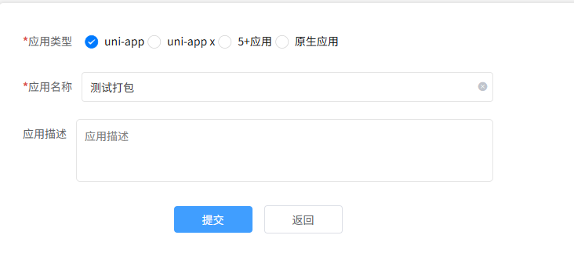

3. 创建完成后，在应用详情页即可获取到 `AppID`（格式为 `__UNI__XXXXXXX`），请妥善保存。
   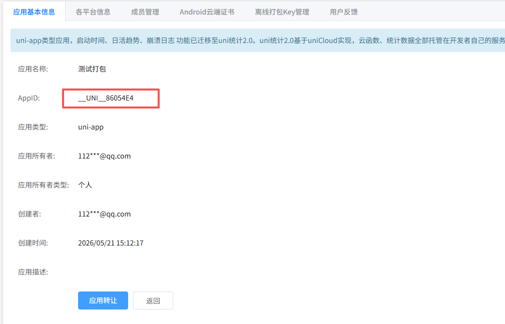

### 3.2 生成并下载 Android 签名证书

签名证书是 `Android` 应用的唯一身份凭证，上架应用市场必须使用正式签名证书。`DCloud` 平台可直接生成，无需手动执行 `keytool` 命令：

1. 在应用详情页，点击「证书管理」→「创建证书」；
   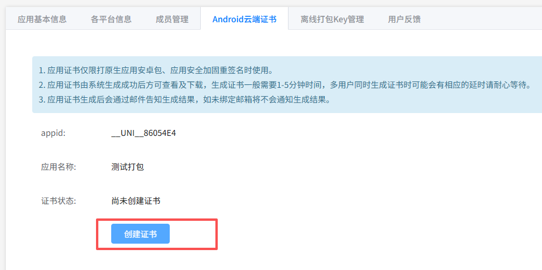

2. 填写证书相关信息（别名、密码、姓名、组织等）(这些是手动生成证书需要填写，DCloud平台会自动生成)，务必记住证书别名和密码，后续打包必须使用；

3. 点击创建，等待约 1 分钟后刷新页面，证书生成完成后点击「下载证书」，将后缀为 `.keystore` 的证书文件保存到本地；
   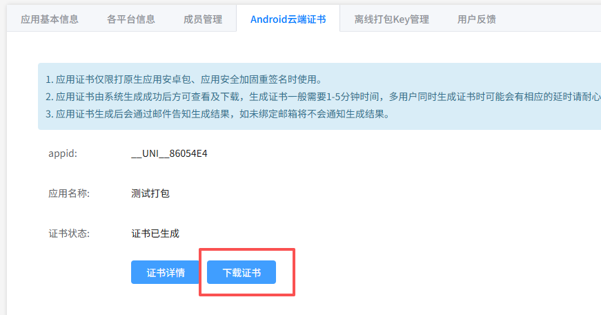

4. 点击「查看证书」，复制证书的 `MD5`、`SHA1`、`SHA256` 值，后续申请 `dcloud_key` 时会用到。
   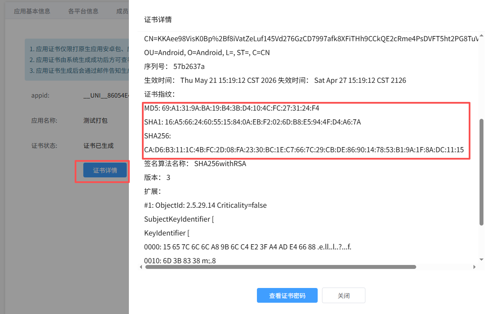

### 3.3 申请 dcloud_key

`dcloud_key` 是 `uni-app` 离线打包的必备配置，用于校验应用的合法性。申请步骤如下：

1. 在 `DCloud` 开发者中心的应用详情页，点击「各平台信息」→「新增」；
   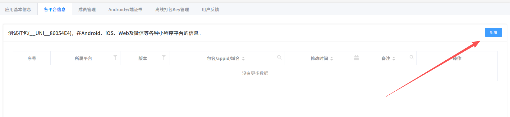

2. 平台选择`「Android」`，填写刚才生成证书的 `SHA1` 值和应用包名（包名格式一般为 `com.xxx.xxx`，全小写无特殊字符，后续所有配置中的包名必须与此处完全一致）；
   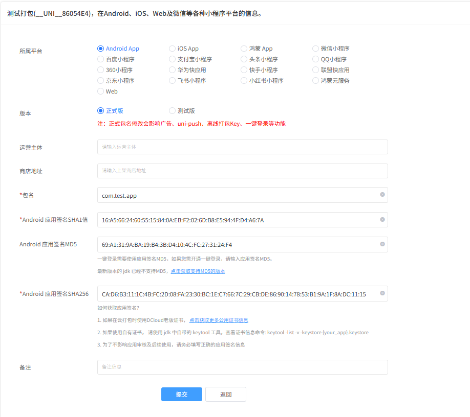

3. 点击保存，即可生成 `Android` 平台的 `dcloud_key`，复制并妥善保存。
   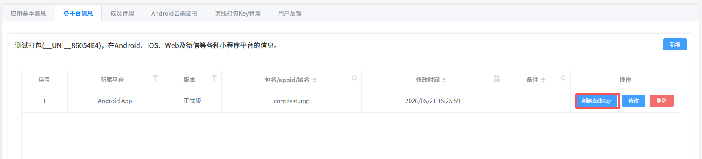
   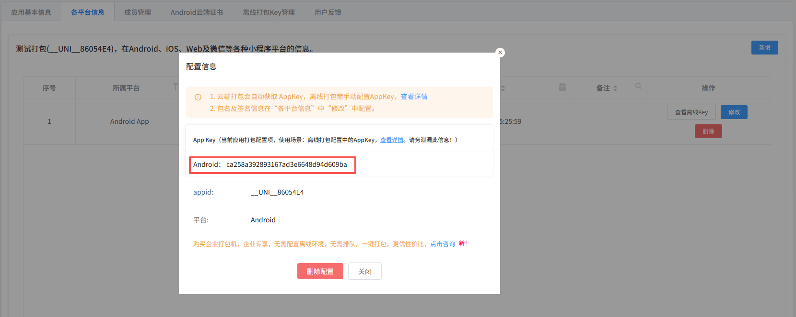

> 提示：如果后续校验失败，请检查包名与申请 `AppKey` 时的包名是否一致，以及离线项目中 `dcloud_control.xml` 中的 `appid` 是否与申请 `AppKey` 时的 `appid` 一致。

## 四、打包前置资源准备

### 4.1 生成 uni-app 本地打包资源

1. 打开 `HBuilderX`，进入你的 `uni-app` 项目，打开 `manifest.json` 文件，确认「基础配置」中的 `AppID` 已填写为刚才申请的 `DCloud AppID`；
   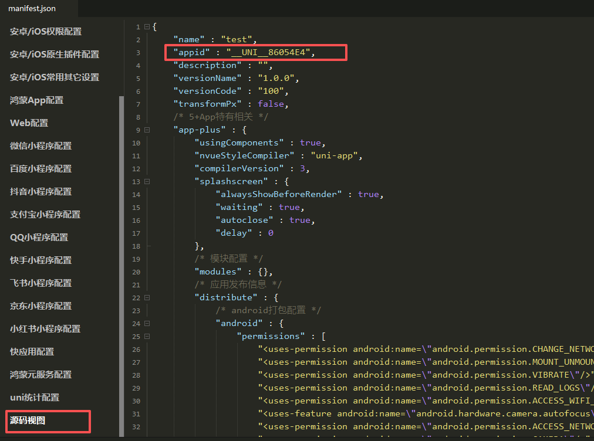

2. 在项目根目录右键，选择「发行」→「原生 `App` - 本地打包」→「生成本地打包 `App` 资源」；
   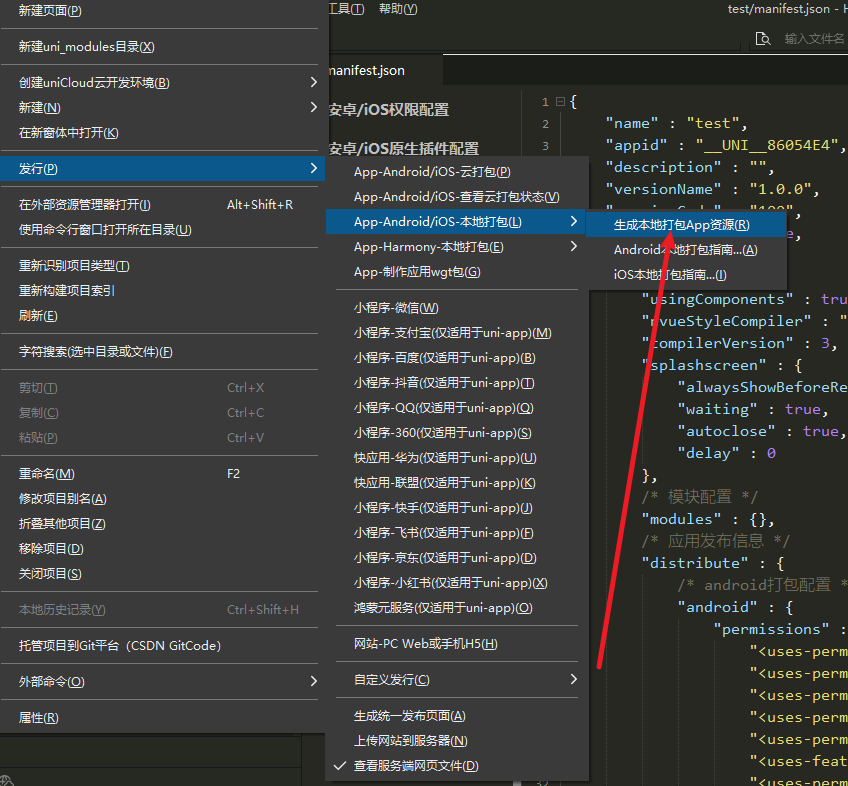

3. 等待编译完成，`HBuilderX` 控制台会输出资源生成路径。打开该路径，会看到一个以 `AppID` 命名的文件夹，这就是需要的本地打包资源。
   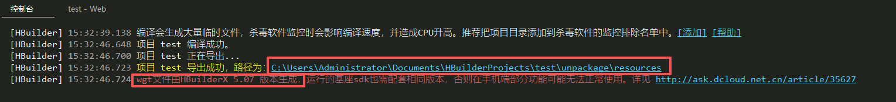
   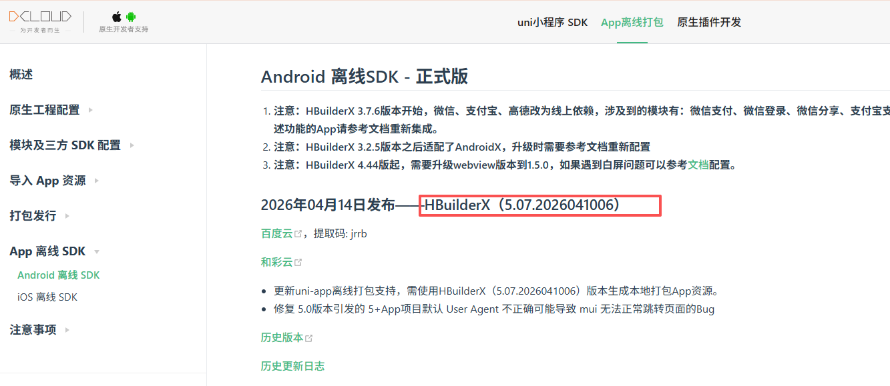

> 关键提示：`HBuilderX `版本必须与后续下载的离线 `SDK` 版本完全一致，否则可能出现应用闪退、资源加载失败等问题。

### 4.2 下载 uni-app Android 离线 SDK

1. 访问 `uni-app` 官方离线 `SDK` 下载页:https://nativesupport.dcloud.net.cn/AppDocs/download/android.html；

2. 下载与 `HBuilderX` 版本完全匹配的 `Android` 平台 `SDK`；

3. 下载完成后解压压缩包，解压后的文件夹中，核心使用 `HBuilder-Integrate-AS` 官方集成示例项目，后续所有配置均基于该项目修改。

## 五、Android Studio 端全流程配置

### 5.1 导入示例项目

打开 `Android Studio`，点击`「Open」`，选择刚才解压出的 `HBuilder-Integrate-AS` 文件夹，点击确定导入项目。
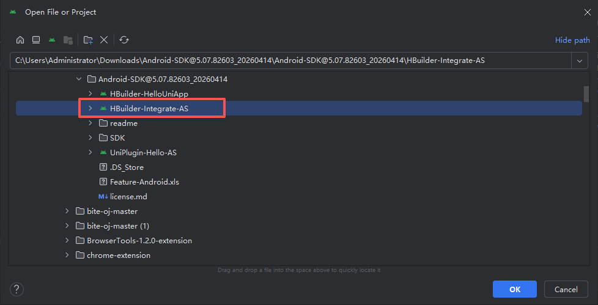

首次导入时项目会自动同步 `gradle` 依赖。若出现下载慢或同步失败的问题，可修改项目根目录的 `build.gradle` 文件，添加阿里云国内镜像源：

```groovy
buildscript {
    repositories {
        maven { url 'https://maven.aliyun.com/repository/google' }
        maven { url 'https://maven.aliyun.com/repository/public' }
        maven { url 'https://maven.aliyun.com/repository/gradle-plugin' }
        google()
        mavenCentral()
    }
    dependencies {
        classpath "com.android.tools.build:gradle:7.0.0"
    }
}

allprojects {
    repositories {
        maven { url 'https://maven.aliyun.com/repository/google' }
        maven { url 'https://maven.aliyun.com/repository/public' }
        google()
        mavenCentral()
        maven { url "https://maven.dcloud.net.cn" }
    }
}
```

### 5.2 替换本地打包资源

在 `Android Studio` 的项目视图中，进入 `simpleDemo → src → main → assets → apps` 文件夹，将文件夹内原有的示例文件全部删除，再把 `HBuilderX` 生成、以 `AppID` 命名的文件夹完整复制到 `apps` 文件夹下。
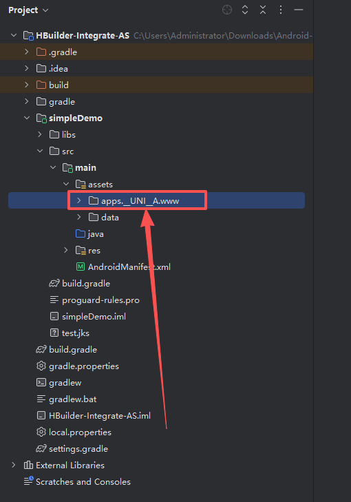
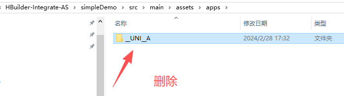
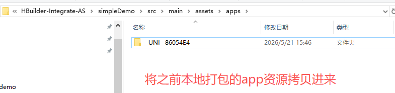

### 5.3 校验 AppID 一致性

> 务必保证以下三处的 `AppID` 完全一致，否则极易出现应用启动闪退或资源加载失败的问题。

1. 复制到 `apps` 文件夹下的资源文件夹名称；

2.` HBuilderX` 项目中 `manifest.json` 文件里配置的 `AppID`；

3. 项目中 `app → src → main → assets → data → dcloud_control.xml` 文件中的 `appid` 配置。
   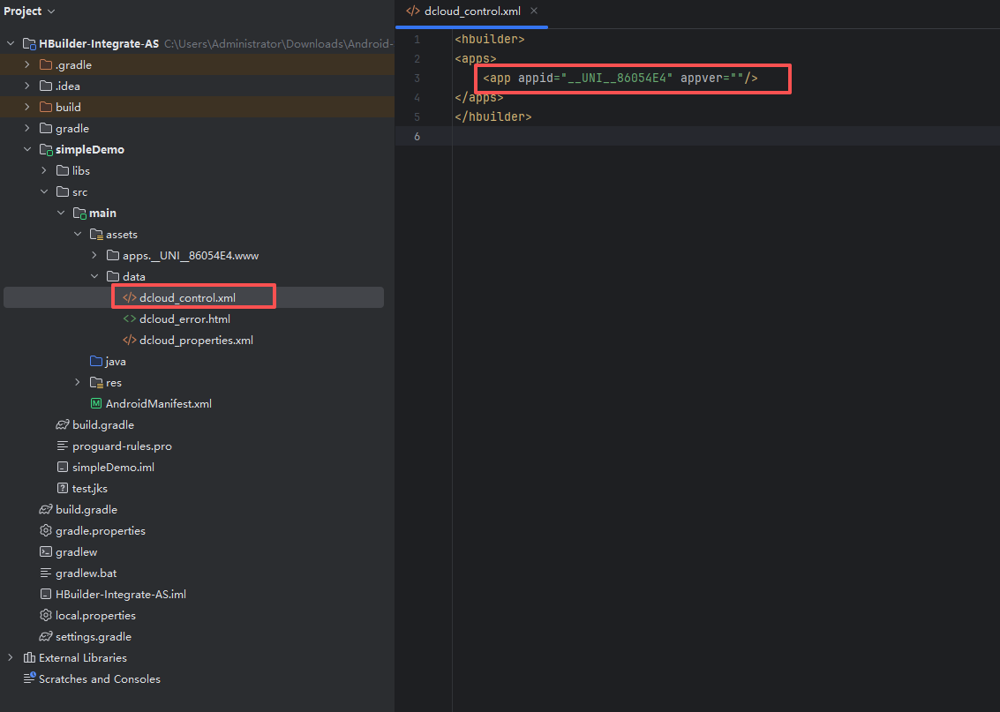

4. 打开 `dcloud_control.xml`，修改配置如下：

```xml
<hbuilder>
    <apps>
        <app appid="__UNI__86054E4" appver=""/>
    </apps>
</hbuilder>
```

### 5.4 配置应用包名

打开项目 `simpleDemo` 目录下的 `build.gradle` 文件，修改 `defaultConfig` 中的 `applicationId` 为申请 `dcloud_key` 时填写的包名：

```groovy
defaultConfig {
    applicationId "com.yourname.appname"   // 替换为你的包名
    minSdkVersion 21
    targetSdkVersion 33                    // Google Play 要求 33 及以上，国内市场 30 以上即可
    versionCode 1
    versionName "1.0.0"
}
```

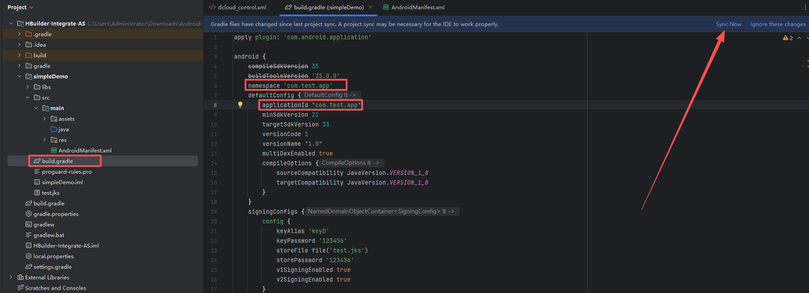

> 注意：此处的包名必须与申请 `dcloud_key` 时的包名完全一致，否则会导致 `dcloud_key` 校验失败，应用无法正常启动。

### 5.5 配置 dcloud_key

打开项目 `simpleDemo → src → main` 目录下的 `AndroidManifest.xml` 文件，找到 `meta-data` 标签中 `name` 为 `dcloud_appkey` 的配置，将 `value` 替换为申请的 `dcloud_key`：

```xml
<meta-data
    android:name="dcloud_appkey"
    android:value="你申请的dcloud_key" />
```

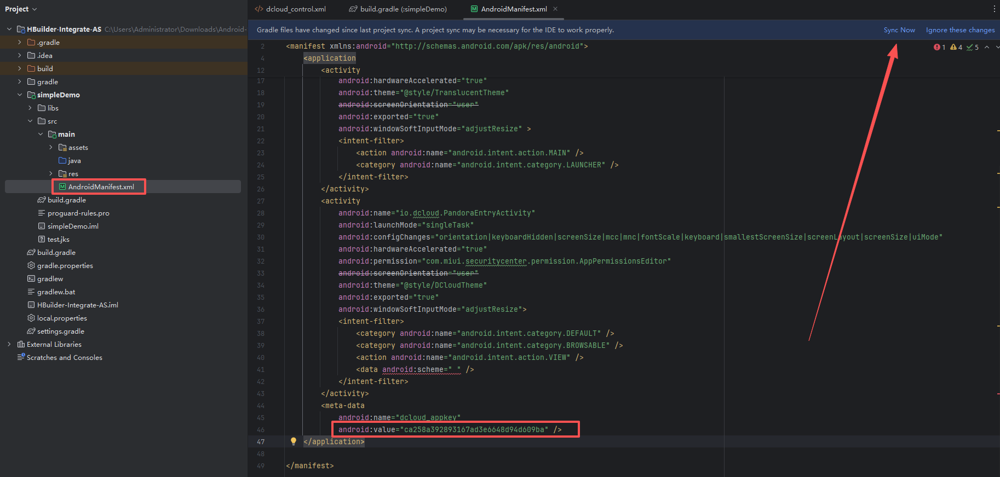

### 5.6 配置签名证书

1. 将之前下载的 `.keystore` 签名证书文件复制到项目的 `simpleDemo` 目录下；
   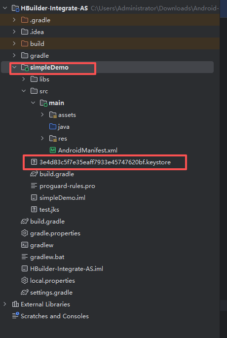

2. 打开 `simpleDemo` 目录下的 `build.gradle` 文件，在 `android` 节点下添加签名配置：

```groovy
android {
    signingConfigs {
        config {
            keyAlias '你的证书别名'                 // 替换为你的证书别名
            keyPassword '你的证书密码'              // 替换为你的证书别名密码
            storeFile file('your-cert.keystore')   // 替换为你的证书文件名
            storePassword '你的证书密码'            // 替换为你的证书密码
        }
    }
}
```

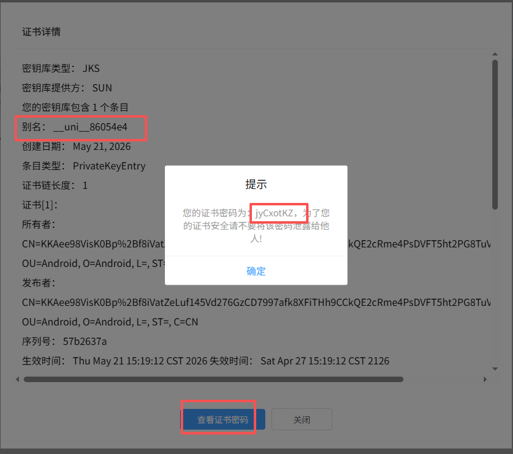
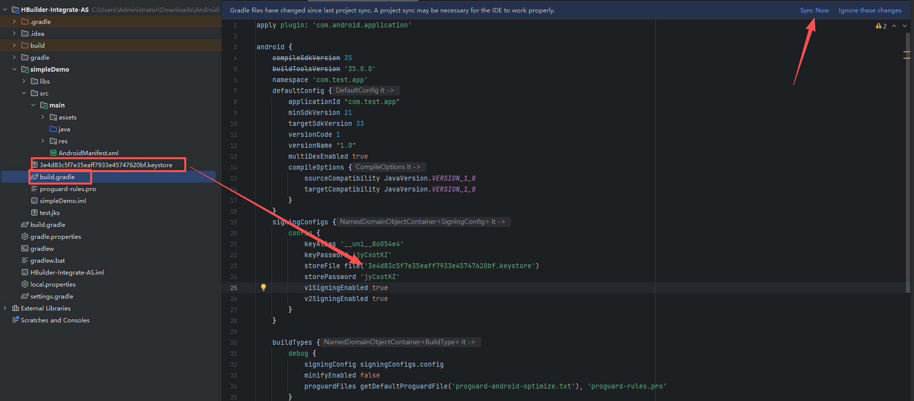

## 六、执行打包，生成正式 APK

1. 所有配置完成后，点击 `Android Studio` 顶部的`「Sync Project with Gradle Files」`按钮同步配置，确保无报错；
   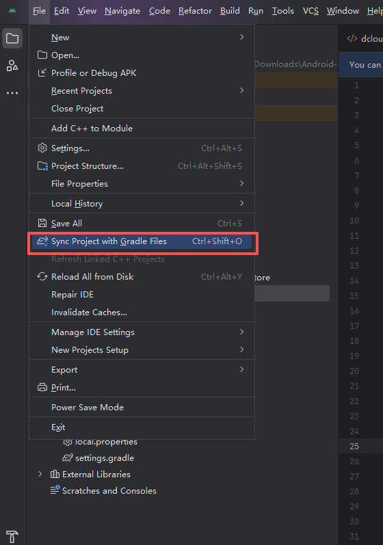

2. 点击顶部菜单栏的`「Build」→「Generate Signed App Bundle or APK」`；
   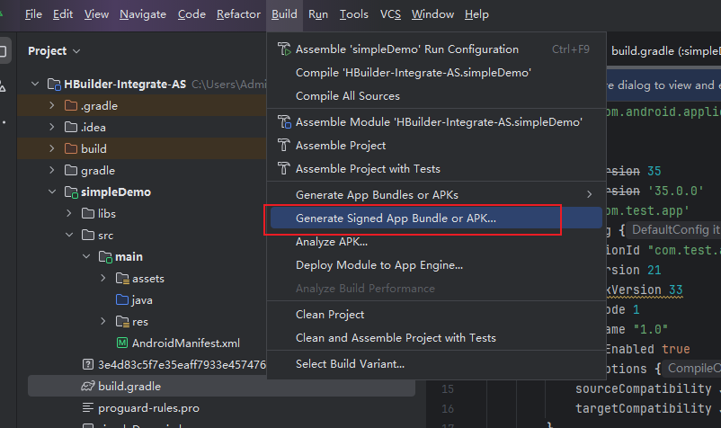

3. 在弹出的窗口中，选择`「APK」`，点击 `Next`；
   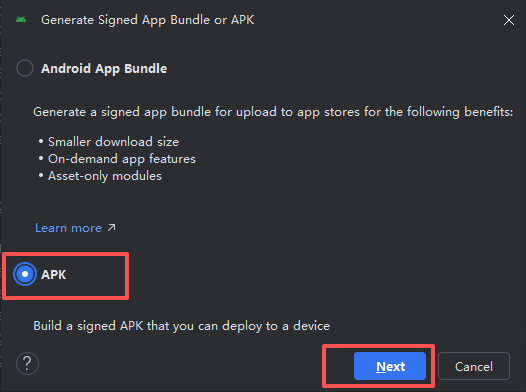
4. 选择已配置的 `release` 签名，填写证书密码、别名等信息，点击 `Next`；
   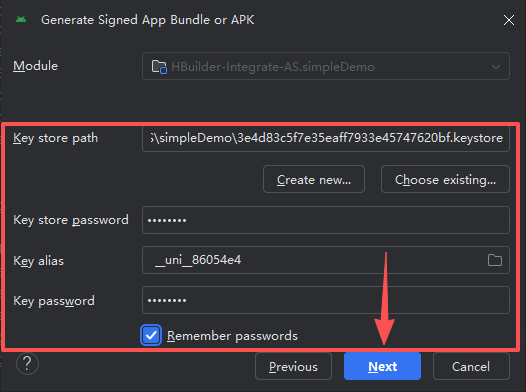
   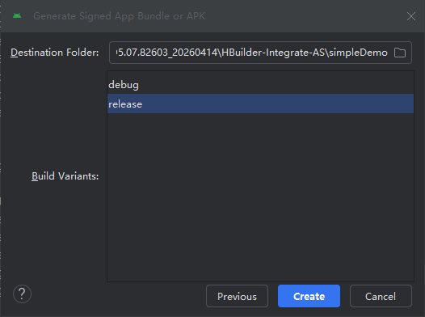

5. 等待打包完成，`Android Studio` 右下角会提示打包成功。点击`「locate」`即可打开生成的 `APK` 文件所在文件夹，该 `APK` 即为可安装到安卓手机的正式安装包。
   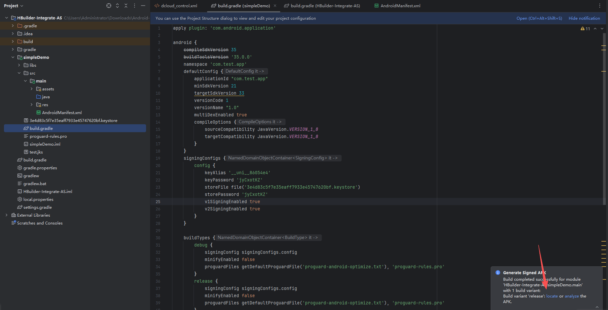
   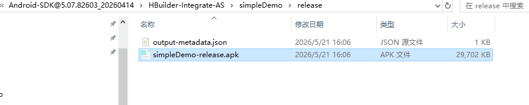

6. 修改 启动页面，icon图片，通知栏图标
   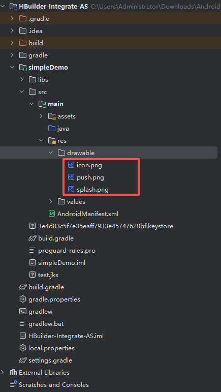

7. 修改应用名字
   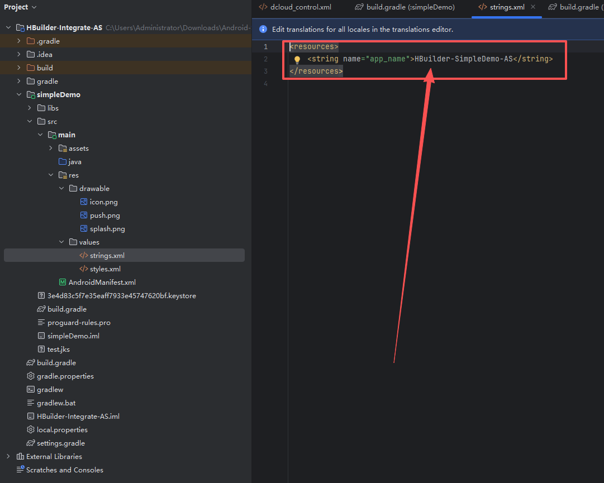

## 七、常见问题与解决方案

| 问题现象                                              | 核心解决方案                                                                                                                                                          |
| ----------------------------------------------------- | --------------------------------------------------------------------------------------------------------------------------------------------------------------------- |
| 应用安装后启动直接闪退                                | 1. 校验三处 AppID 是否完全一致；<br>2. 确认 HBuilderX 版本与离线 SDK 版本完全匹配；<br>3. 检查 dcloud_key 是否与包名、证书匹配；<br>4. 查看 Logcat 日志定位具体报错。 |
| gradle 同步失败、依赖下载慢                           | 1. 替换为阿里云国内镜像源；<br>2. 检查 gradle 版本与 Android Studio 版本是否兼容。                                                                                    |
| 打包报错：Google Play 要求 target API level 33 或更高 | 将 `build.gradle` 中的 `targetSdkVersion`、`compileSdkVersion` 修改为 33 或更高版本。Google Play 已要求 target API level 不低于 35。                                  |
| 应用启动白屏、资源加载失败                            | 1. 检查本地打包资源是否完整复制到 `apps` 文件夹；<br>2. 确认 AppID 配置正确；<br>3. 重新生成本地打包资源并替换。                                                      |
| dcloud_key 校验失败                                   | 1. 检查包名是否与申请 key 时的包名完全一致；<br>2. 确认证书 SHA1 值与申请 key 时填写的一致；<br>3. 检查 dcloud_key 是否复制错误或含有多余空格。                       |

## 八、总结与拓展

本文完整梳理了 `uni-app` `Android 本地离线打包`的全流程，从`环境准备`、`证书申请`、`资源配置`到 `APK 生成`，覆盖了新手遇到的核心问题。

本地打包不仅可以摆脱云打包的次数限制，还支持自定义原生代码、修改权限配置、集成第三方原生 `SDK`，从而满足更多个性化需求。后续如果需要上架应用市场，还可以对生成的 `APK` 进行加固、对齐、重签名等操作，以提升应用的安全性。
