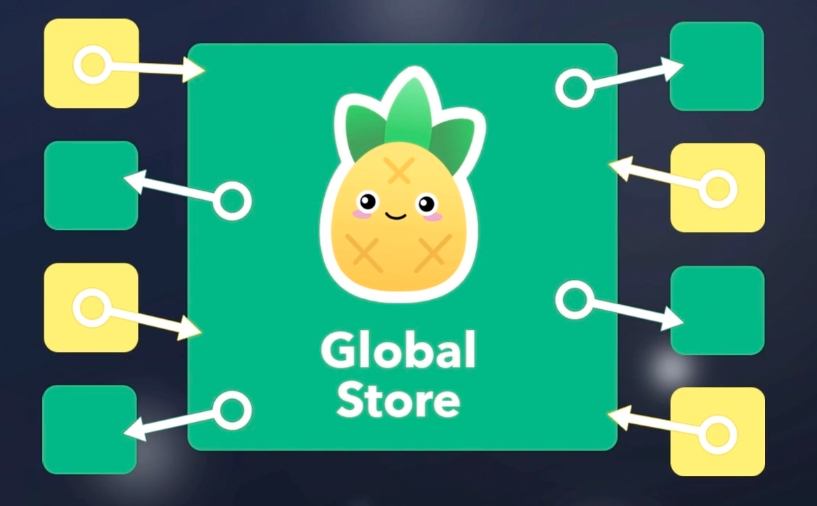

# Pinia 介绍


官方文档：[https://pinia.web3doc.top/](https://pinia.web3doc.top/)

## What is Pinia ?

- `Pinia` 是一个状态管理工具，它和 `Vuex` 一样为 `Vue` 应用程序提供共享状态管理能力。
- 语法和 `Vue3` 一样，它实现状态管理有两种语法：`选项式API` 与 `组`合式 API`，我们学习`组合式 API`语法。
- 它也支持 `Vue2` 也支持 `devtools`，当然它也是类型安全的，支持 `TypeScript`

## Why should I use Pinia?

- `Pinia`的数据流转图
  

- 可以创建多个全局仓库，不用像 `Vuex` 一个`store`嵌套多个`modules`，结构复杂。
- 语法简单，不像`Vuex`需要记忆太多的`API`。

## Pinia 15 分钟上手

> 掌握：实用`Pinia`使用，管理计数器的状态

使用步骤：

1. 安装`Pinia`

```bash
npm i pinia
```

2. 导入，实例化，当做插件使用，和其他插件使用套路相同

```js
import { createApp } from "vue";
import { createPinia } from "pinia"; //[!code ++]
import App from "./App.vue";

const app = createApp(App);

const pinia = createPinia(); //[!code ++]
app.use(pinia); //[!code ++]

app.mount("#app");
```

3. 创建仓库&使用仓库

```js
import { defineStore } from "pinia";
import { computed, ref } from "vue";

export const useCounterStore = defineStore("counter", () => {
  return {};
});
```

```js
<script setup lang="ts">
  import {useCounterStore} from "./store/counter" // store中有状态和函数 const
  store = useCounterStore()
</script>
```

4. 进行状态管理

```js
const count = ref(100);

const doubleCount = computed(() => count.value * 2);

const update = () => count.value++;

const asyncUpdate = () => {
  setTimeout(() => {
    count.value++;
  }, 1000);
};
return { count, doubleCount, update, asyncUpdate };
```

```vue
<template>
  APP {{ store.count }} {{ store.doubleCount }}
  <button @click="store.update()">count++</button>
  <button @click="store.asyncUpdate()">async update</button>
</template>
```

总结：

通过 `const useXxxStore = defineStore('id',函数)` 创建仓库得到使用仓库的函数

| Vuex                 | Pinia                            |
| -------------------- | -------------------------------- |
| state                | ref 和 reactive 创建的响应式数据 |
| getters              | computed 创建的计算属性          |
| mutations 和 actions | 普通函数，同步异步均可           |

使用`Pinia`与在组件中维护数据大体相同，这就是 `Pinia` 的状态管理基本使用

## storeToRefs 的使用

> 掌握：使用 `storeToRefs` 解决 解构仓库状态丢失响应式的问题

问题：

- 当我们想解构 `store` 提供的数据时候，发现数据是没有响应式的。

回忆：

- 在学习 `vue` 组合式`API`创建的响应式数据的时候，使用 `toRefs` 保持解构后数据的响应式

方案：

- 使用 `storeToRefs` 解决解构仓库状态丢失响应式的问题

```js
import { storeToRefs } from "pinia";

const store = useCounterStore();
const { count, doubleCount } = storeToRefs(store);
```

小结：

当你想从 `store` 中解构对应的状态使用，需要使用 `storeToRefs`
